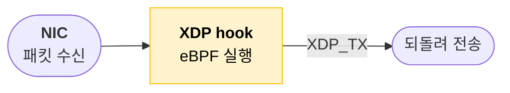

# CLAUDE.md

이 저장소는 Obsidian 기반 기술 블로그/노트 vault다. 글을 쓰거나 다듬을 때 아래 스타일을 따른다.

## 글쓰기 원칙

- **텍스트는 최소, 그림이 먼저.** 설명을 길게 풀지 말고 다이어그램·표·코드블록으로 직관적으로 보여준다. 산문은 다이어그램을 잇는 한두 줄 정도로 짧게.
- **동기(why)부터.** 각 주제는 "왜 필요한가"를 먼저 깔고 들어간다. 가끔 독자의 반론을 질문으로 던진다. (예: `> 그냥 L7(ALB)로 다 처리하면 되는거 아닌가?`)
- **평어체.** 문장은 `~다 / ~한다 / ~된다`로 끝내는 declarative 톤. 존댓말 쓰지 않는다.
- **영문 기술 용어는 그대로.** VIP, backend, encap, lookup, real server, 5-tuple 등은 번역하지 않고 한글 문장에 섞어 쓴다.
- **핵심은 `>` 인용구로.** 다이어그램이나 표 바로 뒤에 한 줄짜리 통찰/요약을 blockquote로 박는다. (예: `> 한 연결 = 한 CPU.`)

## 문서 구조

```text
짧은 인트로 (1~2줄, 무엇을/왜)
---
## 섹션            ← 다이어그램 + (선택) 비교 표 + > 요약 한 줄
---
## 섹션
...
---
## 정리            ← 마지막에 전체 흐름을 mermaid 한 장으로 묶기
---
## 참고            ← 링크 목록
```

- 섹션 사이는 `---`로 구분한다.
- 시리즈는 `(1편)`, `(2편)`처럼 나누고, 서로 흐름을 예고/연결한다.
- 비교는 거의 항상 표로 (`| 항목 | A | B |`).

## 다이어그램

기본은 **mermaid**. 노드 라벨은 백틱+마크다운으로 쓰고, **굵게**와 줄바꿈을 활용한다.



- 노드 라벨 안에서는 **실제 줄바꿈**을 쓴다. `\n`은 **엣지 라벨**(`-->|"a\nb"|`)에서만 쓴다.
- 색 팔레트(의미 고정):
  - 노랑 `fill:#fff3cd,stroke:#ffc107,color:#000` — 핵심 처리/판단 지점
  - 초록 `fill:#d4edda,stroke:#28a745,color:#000` — 결과/저장/성공 경로
  - 파랑 `fill:#d1ecf1,stroke:#17a2b8,color:#000` — 중간 단계/유저 공간
  - 빨강 `fill:#f8d7da,stroke:#dc3545,color:#000` — drop/실패/거부
  - 회색 `fill:#6c757d,stroke:#495057,color:#fff` — NIC/외부 경계
  - 보라 `fill:#e2d9f3,stroke:#6f42c1,color:#000` — 로컬 프로세스/앱
- 패킷·헤더·플로우의 before/after는 ```` ```text ```` 코드블록에 ASCII로 정렬해 보여준다.
- **before/after 비교는 표보다 정렬된 코드블록을 선호**한다. monospace 컬럼을 맞추고 `= / x / C` 같은 마커 한 줄로 결과를 표시. (legend도 블록 안에)
- drawio 임베드를 쓸 때도 mermaid로 핵심 흐름을 한 번 더 보여주면 좋다.

## 외부 플랫폼 발행용

별도 플랫폼에 올릴 글은 Obsidian 문법이 렌더링되지 않으니 자립형으로 만든다.

- `[[위키링크]]` 금지 → 필요한 내용은 본문에 직접 녹이거나 평문/실제 URL로.
- `![[임베드]]` 금지 → 표준 마크다운 ``으로 바꾸고, 참조한 이미지 파일을 글 폴더에 같은 이름으로 복사해 둔다.
- **아직 외부에 발행 안 된 개인 글은 참조하지 않는다.** 참고 목록은 독자가 실제로 열 수 있는 공개 자료(논문, 공식 문서, GitHub 등)로 채운다.
- mermaid는 플랫폼이 지원하면 그대로 두고, 아니면 이미지로 export.

## 정확성

- 코드/구현을 리뷰하는 글은 **실제 소스를 확인하고 쓴다** (예: Katran은 `balancer_maps.h`의 map 타입을 직접 대조). 추측한 부분은 "대략", "이상적으로는"처럼 단서를 단다.
