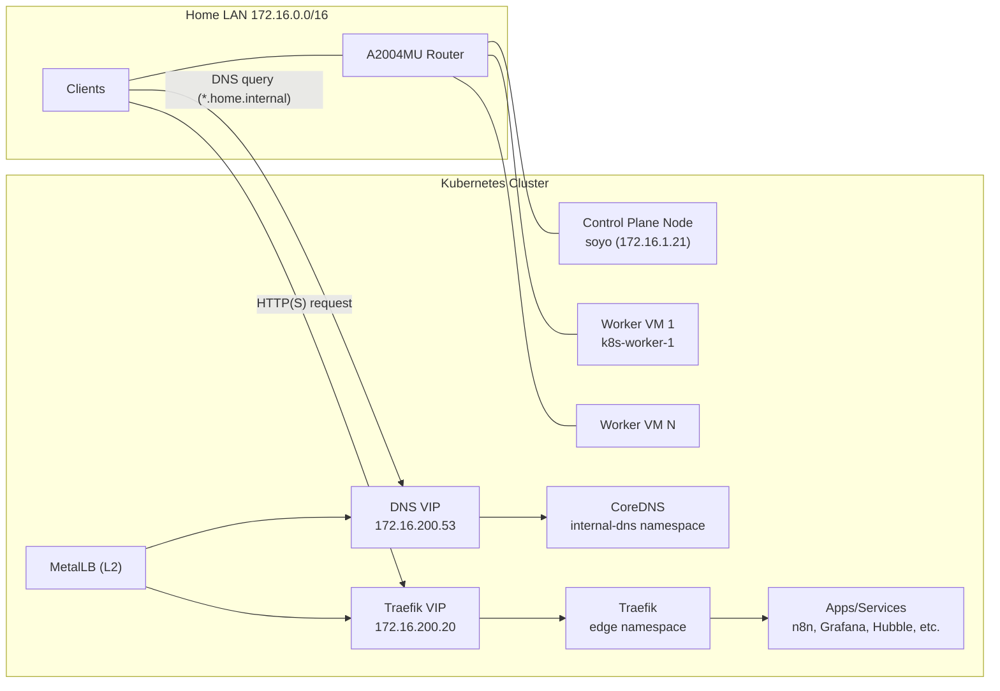

```mermaid

flowchart LR

subgraph LAN["Home LAN 172.16.0.0/16"]

C["Clients"]

R["A2004MU Router"]

end

  

subgraph K8S["Kubernetes Cluster"]

CP["Control Plane Node<br/>soyo (172.16.1.21)"]

W1["Worker VM 1<br/>k8s-worker-1"]

WN["Worker VM N"]

  

MB["MetalLB (L2)"]

DNSVIP["DNS VIP<br/>172.16.200.53"]

TRAEFIKVIP["Traefik VIP<br/>172.16.200.20"]

  

COREDNS["CoreDNS<br/>internal-dns namespace"]

TRAEFIK["Traefik<br/>edge namespace"]

APPS["Apps/Services<br/>n8n, Grafana, Hubble, etc."]

end

  

C --- R

R --- CP

R --- W1

R --- WN

  

MB --> DNSVIP

MB --> TRAEFIKVIP

  

C -->|"DNS query (*.home.internal)"| DNSVIP

DNSVIP --> COREDNS

  

C -->|"HTTP(S) request"| TRAEFIKVIP

TRAEFIKVIP --> TRAEFIK

TRAEFIK --> APPS

```