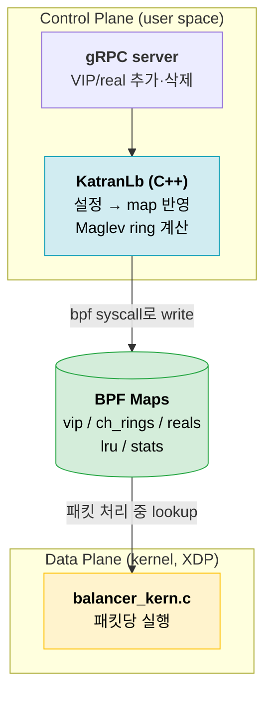
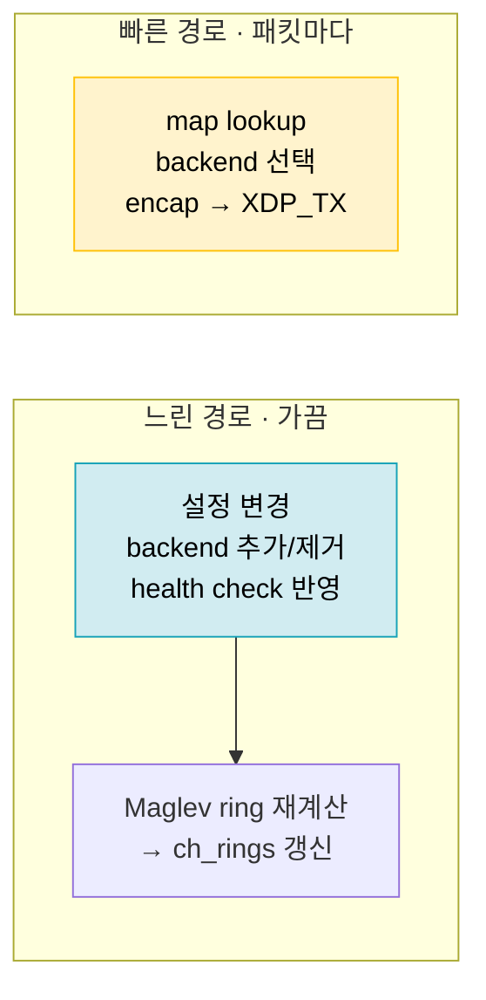
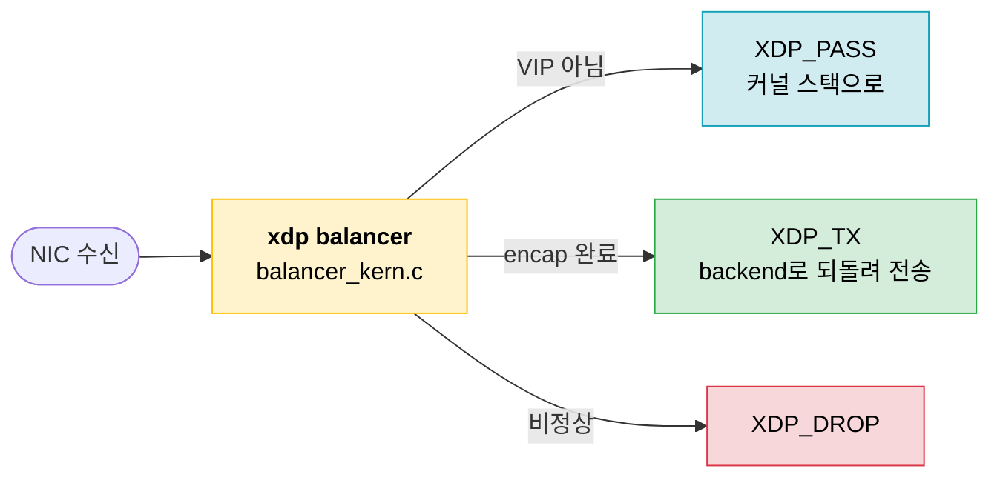
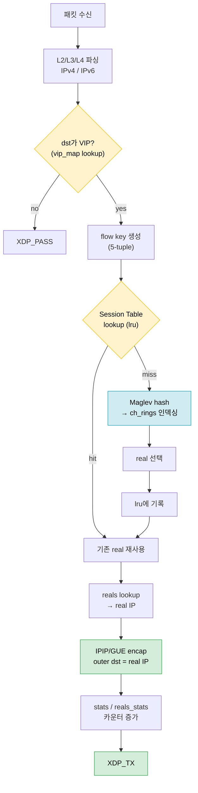
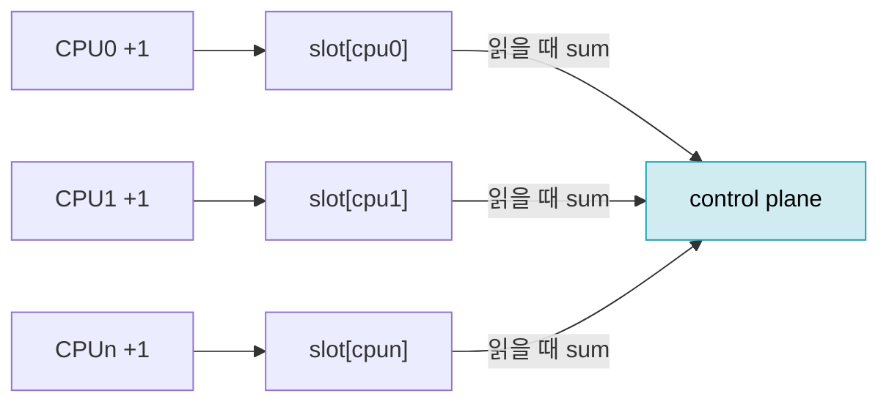
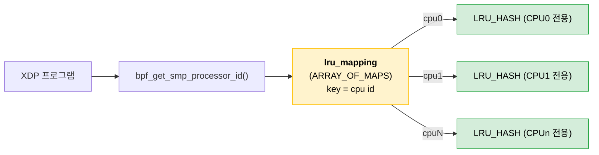
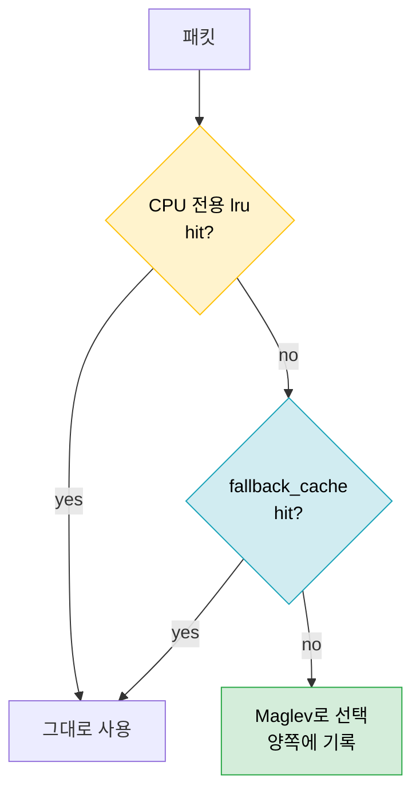
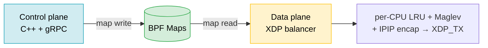

# Katran 코드 리뷰 (2편)

[[SW LB를 위한 배경 1편]]에서 본 조각들 — XDP, DSR/IPIP, RSS, Session Table, Maglev — 이 실제 코드에서 어떻게 맞물리는지 Meta의 **Katran**으로 본다.

> Katran = XDP/eBPF로 만든 L4 Load Balancer. 데이터 평면은 한 개의 XDP 프로그램, 제어 평면은 C++ 라이브러리 + gRPC.

---

## Katran 한눈에



> 둘은 **BPF Map을 사이에 두고만 만난다**. control plane은 map을 쓰고, data plane은 map을 읽는다.

---

## Control plane vs Data plane 구조



| | Control Plane | Data Plane |
| --- | --- | --- |
| 위치 | user space (C++) | kernel (XDP) |
| 언어 | C++ / libbpf | C → BPF bytecode |
| 빈도 | 설정 변경 시 | 패킷마다 |
| 역할 | map 작성, ring 계산, 통계 수집 | lookup, 선택, encap, 전송 |
| 상태 | 갖지 않음(전부 map) | 갖지 않음(전부 map) |

> 패킷 처리 로직에는 **분기와 lookup만** 있고 정책/설정은 없다. 무엇을 할지는 control plane이 map에 미리 적어둔다.

---

## XDP hook

진입점은 NIC 드라이버에 attach된 XDP 프로그램 하나다. 반환값으로 패킷의 운명이 정해진다.



> DSR이므로 응답 경로는 없다. LB가 하는 건 요청을 encap해서 `XDP_TX`로 backend에 쏘는 것까지다. 응답은 Real Server가 Client로 직접 보낸다.

---

## Dataplane 패킷 처리 flow

배경 1편의 Session Table → Maglev 흐름이 여기서 그대로 코드가 된다.



```text
요약: parse → VIP? → 연결 있으면 재사용 / 없으면 Maglev로 선택 → encap → XDP_TX
```

> 정상 트래픽의 절대다수는 **lru hit** 경로로 빠진다. Maglev 계산은 새 연결(또는 lru miss)일 때만 탄다.

---

## ebpf map 종류

Katran의 map은 크게 **포워딩용**과 **통계용**으로 나뉜다. (실제 `balancer_maps.h` 기준)

### 포워딩 (lookup으로 backend를 찾는다)

| Map | 타입 | 저장 내용 |
| --- | --- | --- |
| `vip_map` | `HASH` | VIP → vip 메타(번호, flag) |
| `ch_rings` | `ARRAY` | **Maglev ring**: (vip, hash) → real index |
| `reals` | `ARRAY` | real index → real 서버 IP/flag |
| `lru_mapping` | `ARRAY_OF_MAPS` | **CPU별 Session Table**(아래에서 자세히) |
| `fallback_cache` | `LRU_HASH` | per-CPU lru가 빗나갈 때의 공용 백업 |
| `ctl_array` | `ARRAY` | mac 등 제어값 |

### 통계 (전부 `PERCPU_ARRAY`)

| Map | 타입 | 저장 내용 |
| --- | --- | --- |
| `stats` | `PERCPU_ARRAY` | VIP 단위 패킷/바이트 |
| `reals_stats` | `PERCPU_ARRAY` | real 단위 패킷/바이트 |
| `lru_miss_stats` | `PERCPU_ARRAY` | lru miss 카운트 |

> **통계가 전부 `PERCPU_ARRAY`인 이유**: CPU마다 자기 복사본에 락 없이 더하기만 하면 된다. 합산은 user space(control plane)가 읽을 때 한 번에 한다. 패킷당 atomic/lock이 없다.



---

## PER-CPU session table

여기가 Katran 설계에서 제일 재밌는 부분이다.

연결 추적 테이블은 **CPU마다 따로** 둔다. 단, 흔한 오해와 달리 `LRU_PERCPU_HASH`가 아니라, **`ARRAY_OF_MAPS` 바깥 + 각 칸에 일반 `LRU_HASH`** 구조다.



```text
cpu = bpf_get_smp_processor_id();
lru = lookup(lru_mapping, cpu);   // 이 CPU 전용 LRU_HASH
real = lookup(lru, flow_key);     // 그 안에서 연결 조회
```

### 왜 CPU별로 쪼개나

[[SW LB를 위한 배경 1편]]의 **RSS**가 답이다. NIC이 5-tuple을 해시해 연결을 CPU에 고정하므로, **한 연결의 패킷은 항상 같은 CPU = 같은 inner LRU**로 온다. 그래서 CPU끼리 테이블을 공유할 필요가 없다.


### 왜 `LRU_PERCPU_HASH`가 아닌가

| 구조 | key | value | 문제/이점 |
| --- | --- | --- | --- |
| `LRU_PERCPU_HASH` | 모든 CPU 공유 | **CPU마다 별도** | 한 연결의 value가 CPU 수만큼 복제 → 메모리 ×N, 의미상 불필요 |
| `ARRAY_OF_MAPS` + `LRU_HASH` (Katran) | 바깥에서 CPU별 분리 | 단일 값 | 이미 CPU 전용이라 value 복제 불필요, "한 연결 → 한 real"이 그대로 단일 값 |

- 바깥(`ARRAY_OF_MAPS`)에서 이미 **CPU별로 인스턴스가 분리**돼 있다 → 안쪽까지 per-CPU일 이유가 없다.
- `LRU_PERCPU_HASH`라면 key는 공유하면서 value를 CPU 수만큼 들고 있어, 정작 그 연결을 만지는 CPU는 하나인데 **메모리만 N배** 쓴다.
- 우리가 원하는 값은 "이 연결이 가야 할 real **하나**"다. 일반 `LRU_HASH`의 단일 value가 정확히 그 의미다.

### fallback_cache가 증거다

RSS 가정이 깨질 수 있다 — 큐 재해시, CPU 수 초과, `XDP_REDIRECT`로 CPU가 바뀌는 경우. 그래서 **공용 `fallback_cache (LRU_HASH)`** 를 둔다.



> per-CPU 테이블은 **속도(락 없음)** 를 위해, fallback은 **정확성(연결이 다른 CPU로 가도 유지)** 을 위해 둔다. 이 이중 구조가 "per-CPU지만 PERCPU_HASH는 아닌" 설계의 이유를 그대로 보여준다.

---

## 정리



- control / data plane은 **BPF map으로만** 결합한다.
- data plane은 상태가 없다. **lookup → 선택 → encap → XDP_TX**가 전부다.
- 통계는 `PERCPU_ARRAY`로 락 없이 더하고, 합산은 user space에서.
- session table은 **RSS로 연결을 CPU에 고정**한 위에서 CPU별 `LRU_HASH`로 쪼갠다. `LRU_PERCPU_HASH`가 아닌 이유는 바깥에서 이미 CPU별로 나뉘었기 때문이고, `fallback_cache`가 RSS 가정이 깨질 때의 안전망이다.

---

## 참고

- [[SW LB를 위한 배경 1편]] — 이 글의 배경 (XDP, RSS, Session Table, Maglev)
- [facebookincubator/katran](https://github.com/facebookincubator/katran) — 소스
- [Open-sourcing Katran (Meta Engineering)](https://engineering.fb.com/2018/05/22/open-source/open-sourcing-katran-a-scalable-network-load-balancer/)
- [The Linux Kernel - BPF map types](https://docs.kernel.org/bpf/maps.html)
