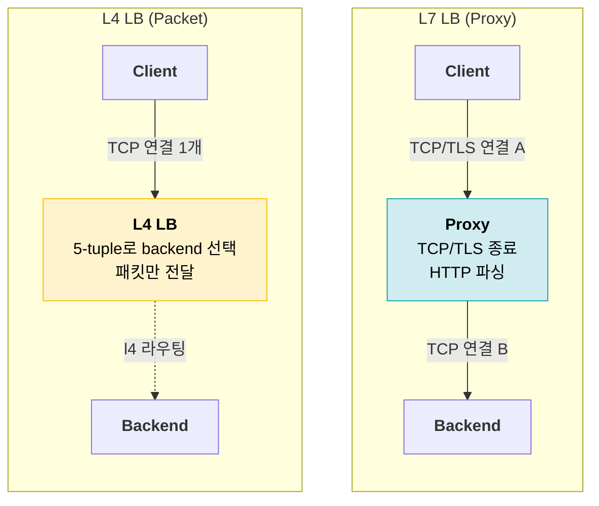
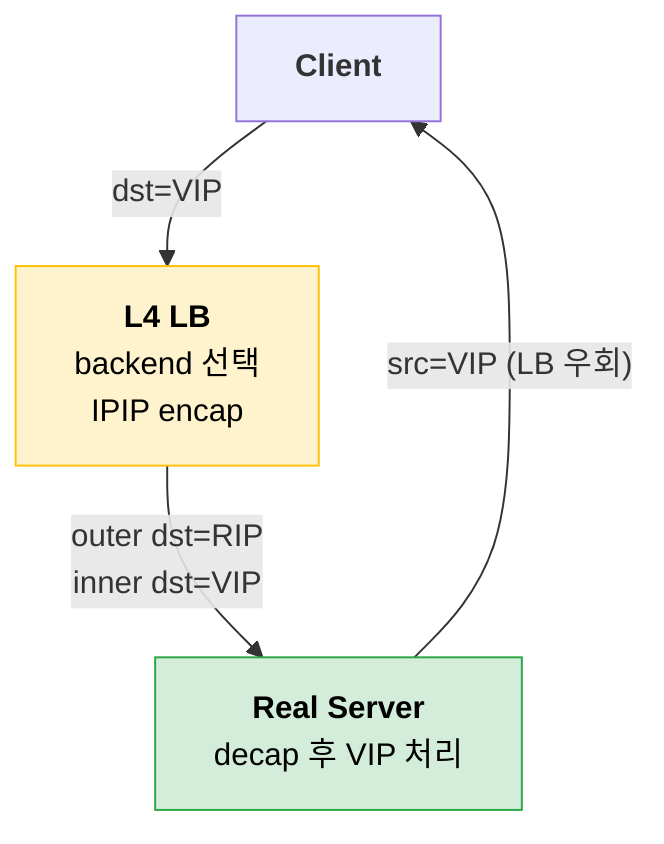
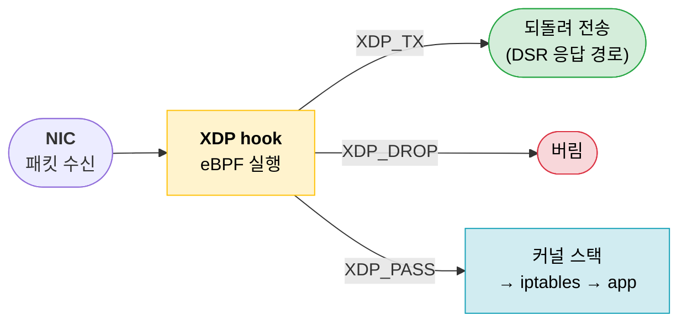
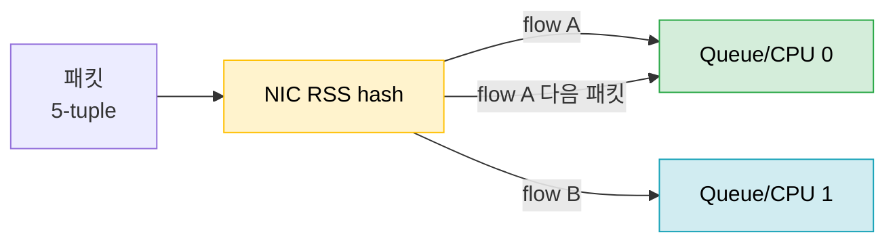
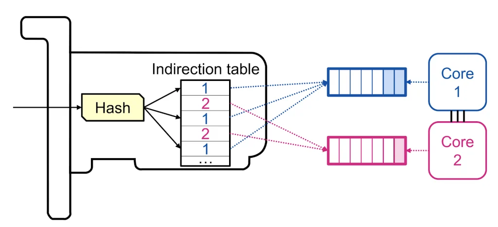
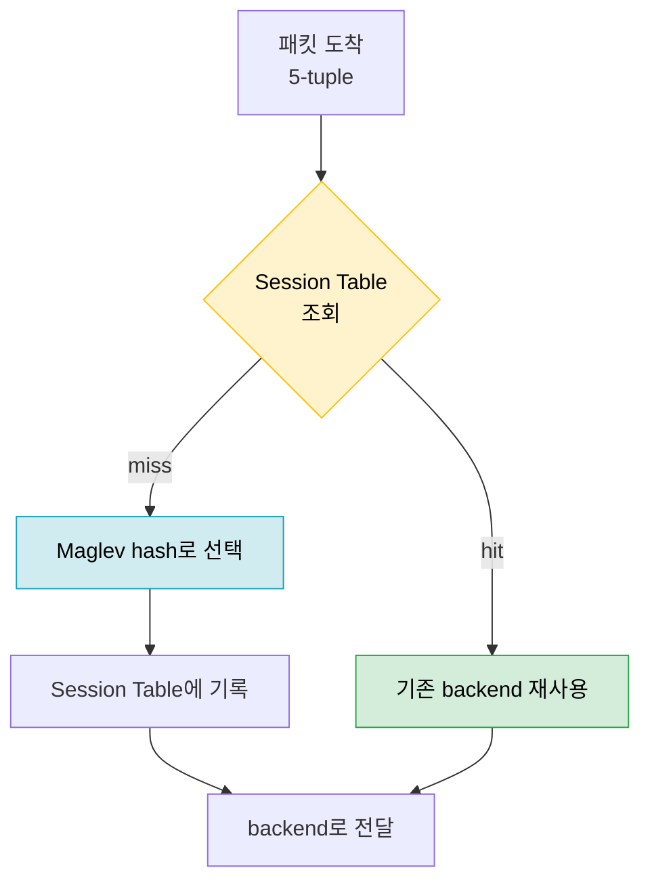
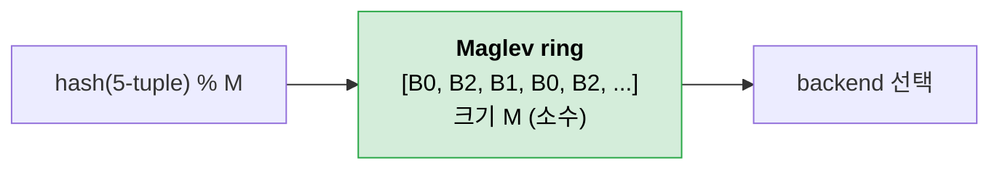

L4 Load Balancer를 소프트웨어로 구현하려면 필요한 부분을 정리해보자

## L7 vs L4 LB
가장 큰 차이는 **연결을 끊는가, 패킷을 흘려보내는가**다.



| 항목       | L7 LB                                 | L4 LB                 |
| -------- | ------------------------------------- | --------------------- |
| 보는 정보    | HTTP header, path, cookie             | IP/Port (5-tuple)     |
| 연결       | Client↔LB, LB↔Backend **2개**          | Client↔Backend **1개** |
| 할 수 있는 일 | 라우팅, TLS offload, WAF, header rewrite | 분산, 그대로 전달            |
| 비용       | 패킷마다 user space overhead              | 커널/NIC 레벨에서 처리 가능     |

> 그냥 L7(ALB)로 다 처리하면 되는거 아닌가?
 
 WAS 와 같은 client -> Backend의 분산을 위해선 해당 아키텍처가 맞을 수 있다.

TLS offload를 결국 처리해주는 지점 + WAF를 붙이기엔 운영상 이점과 MSA구조에선 장점들이 많다.

그렇다면 HTTPS(or gRPC) 외 통신의 경우엔 어떨까
- DNS anycast (UDP)
- k8s cluster service LB

이런 경우는 프로토콜의 특성과, 성능상의 이점을 위해 L4를 사용할 수 밖에 없다.

---

## HW L4 vs SW L4

전통적으로 L4는 전용 어플라이언스(F5, Citrix 등)의 몫이었다. SW L4는 **commodity 서버 + 커널 기술**로 같은 일을 한다.

| 항목  | HW L4            | SW L4                    |
| --- | ---------------- | ------------------------ |
| 확장  | scale-up (장비 교체) | scale-out (서버 추가 + ECMP) |
| 비용  | 고가 어플라이언스        | commodity 서버             |
| 유연성 | 벤더 펌웨어에 종속       | 코드로 로직 추가                |
| 한계  | 용량이 박스에 고정       | NIC/CPU/커널 성능에 의존        |

이런저런 이유가 있겠지만 가장 큰 문제는 HW L4 가격이다.

HW L4의 장비 + 라이센스 값은 굉장히 비싸다. 

게다가 거의 독점 HW L4 인 citrix에서 라이센스를 구독제로 변경하고 및 가격 인상하는 걸 보면, HW l4를 유지하는것이 크나큰 부담이 되고 있다.

https://wtit.com/blog/2023/12/11/citrix-netscaler-f5-big-ip-history-migration-features/

때문에 운영상의 부담 및 벤더 지원을 받을 수 없다는 단점에도 불구하고 SW L4의 도입을 고려할 수 밖에 없다.

---

## L3 DSR & IPIP

L4도 응답까지 다 받으면 병목이 된다. 그래서 응답은 LB를 우회하는 **DSR**을 쓴다. 




요청 패킷은 원본을 그대로 둔 채 outer IP header만 한 겹 덧씌운다.

```text
Before: [IP: Client → VIP][payload]
After:  [Outer IP: LB → RIP][IP: Client → VIP][payload]
```

> LB는 **요청 방향에서만** backend를 고르고, 응답은 Real Server가 Client로 직접 보낸다.

물론 실제 운영에선 Real Server에서 IPIP decap 기능 및 lo 인터페이스의 VIP 주소 등록이 필요하다.

---

## eBPF

SW L4를 user space proxy로 만들면 패킷마다 커널↔유저 왕복이 생긴다. eBPF는 그 로직을 **커널 안에서** 돌린다. verifier·JIT 같은 내부 동작은 이 글의 범위를 넘으니, 여기서는 핵심만 짚는다.

기억할 두 가지.

- **BPF Map**: 커널-유저가 공유하는 key-value 저장소. 상태(VIP, backend, 연결)는 전부 여기 둔다.
- **O(1) lookup**: iptables의 chain 순회(O(n))와 달리, map lookup으로 backend를 바로 찾는다.

---

## XDP hook

XDP는 패킷이 **커널 네트워크 스택에 올라오기 전, NIC 드라이버 레벨**에서 실행된다. L4 LB가 패킷을 만질 수 있는 가장 빠른 지점이다.



| Action         | 의미             | L4 LB에서              |
| -------------- | -------------- | -------------------- |
| `XDP_PASS`     | 커널 스택으로        | VIP가 아닌 패킷           |
| `XDP_DROP`     | 즉시 폐기          | DDoS, 비정상            |
| `XDP_TX`       | 받은 NIC로 되돌려 전송 | **encap 후 backend로** |
| `XDP_REDIRECT` | 다른 NIC/CPU로    | 멀티 NIC 구성            |

> L4 LB의 빠른 경로는 `encap → XDP_TX`다. 커널에 올리지 않고 드라이버에서 backend로 쏜다.

---

## RSS

XDP는 CPU별로 병렬 실행된다. 그럼 **같은 연결의 패킷이 매번 다른 CPU로 가면** 연결 상태 공유가 골치 아파진다. 이걸 막아주는 게 RSS다.

**RSS(Receive Side Scaling)** = NIC이 패킷의 5-tuple을 해시해서 **RX queue(=CPU)로 분배**한다. 같은 연결은 항상 같은 CPU로 간다.





> 같은 client(src IP, src Port) -> 같은 CPU가 처리한다.

---

## Session Table

L4 LB는 패킷마다 backend를 새로 고르면 안 된다. **한 연결은 끝까지 같은 backend**여야 한다. backend 집합이 바뀌어도 기존 연결은 유지되어야 한다.



> Session Table은 보통 **LRU 해시**다. 연결은 무한히 쌓이므로 오래된 항목을 자동으로 밀어낸다. RSS로 연결이 CPU에 고정되니 이 테이블도 CPU별로 둘 수 있다.

---

## Maglev hash

Session Table이 miss일 때 backend를 고르는 알고리즘. 단순 modulo 해시는 **backend 한 대만 바뀌어도 대부분의 연결이 재배치**되는 문제가 있다.

```text
hash(5-tuple) % N   →   N이 바뀌면 거의 전부 재매핑 (연결 끊김)
```

**Maglev**는 backend마다 순열을 만들어 크기 M(소수)의 **lookup table(ring)** 을 채운다. 패킷은 `hash % M`으로 ring을 한 번 인덱싱하면 backend가 나온다.



### 예시: backend 한 대가 빠지면

backend **C**가 빠진다고 하자. (`A, B, C` → `A, B`)

**modulo 방식** — 나누는 수가 `3 → 2`로 바뀌니 C와 무관한 연결까지 자리가 밀린다.

```text
backend:  A B C  →  A B          (C 제거,  A=0 B=1 C=2)

hash      0    1    2    3    4    5
%3        A    B    C    A    B    C
%2        A    B    A    B    A    B
          =    =    C    x    x    C
                         └────┴── A·B로 잘 가던 hash 3,4까지 끊긴다
```

**Maglev 방식** — ring에서 C가 차지하던 칸만 메우고 나머지는 그대로 둔다.

```text
backend:  A B C  →  A B          (C 제거)

slot      0    1    2    3    4    5    6
before    A    B    C    A    C    B    A
after     A    B    B    A    A    B    A
          =    =    C    =    C    =    =
                    └─────────┴── C의 칸(2,4)만 교체, A·B 연결은 전부 유지

legend:  = 유지   x 멀쩡한 연결이 끊김   C 제거된 backend(불가피)
```

> Maglev도 실제론 약간의 추가 이동이 있지만 modulo와 비교할 수 없을 만큼 적다. 이 안정성 덕분에 Session Table이 miss여도 — 항목이 밀려났거나 다른 노드로 가도 — 같은 연결은 같은 backend로 다시 향한다.

| 성질    | 설명                            |
| ----- | ----------------------------- |
| 균등 분배 | ring 슬롯이 backend에 고르게 채워짐     |
| 최소 교란 | backend 1대 추가/제거 시 영향받는 연결 최소 |
| 빠른 조회 | 패킷당 ring 인덱싱 1회 (O(1))        |

> session table이 있는데, 굳이 비싼 연산이 필요한 Maglev가 필요할까?

물론 LB 단일 노드면 그렇게 큰 문제는 없다. 하지만 대부분 이중화를 위해 멀티 노드 구성이 필요하다.

같은 ring을 모든 LB 노드가 공유하면, **어느 노드로 가도 같은 연결은 같은 backend**로 향한다. ECMP scale-out과 Session Table을 동시에 지탱하는 핵심이다.

---

## 정리


이 조각들이 한 군데서 실제 코드로 맞물리는 게 Meta의 오픈소스 프로젝트 **Katran**이다. 2편 *Katran 코드 리뷰*에서 control plane / data plane 구조와 BPF map 설계, 그리고 **per-CPU session table이 왜 그렇게 생겼는지**를 코드로 본다.

---

## 참고

- [Maglev: A Fast and Reliable Software Network Load Balancer (NSDI 2016)](https://www.usenix.org/conference/nsdi16/technical-sessions/presentation/eisenbud)
- [eBPF.io](https://ebpf.io) — eBPF 개요
- [facebookincubator/katran](https://github.com/facebookincubator/katran) — XDP 기반 L4 LB (2편에서 다룬다)
