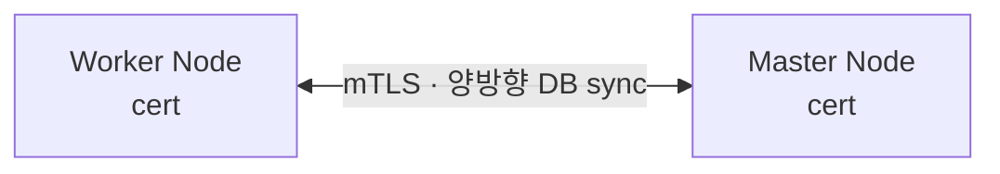
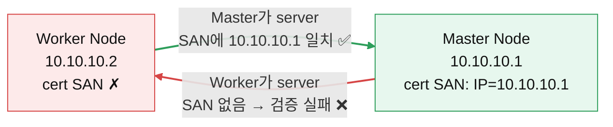

최근 서버의 인증서 교체 작업에서 문제가 있었다.

노드간 clustering을 맺고 있는 환경에서, clustering을 위한 DB certificates가 만료되어 renew를 해야하는 상황이었다. 인증서 교체 이후 클러스터링이 제대로 맺어지지 않았는데, 이참에 인증서 및 분산 시스템의 클러스터링에 대해서 제대로 정리해보자.

### Certificates?
https://cocopam.tistory.com/51 해당 게시글에서도 한번 정리했지만, 인증서의 목적은 딱 하나로 정리할 수 있다.

> 내가 통신하려는 서버가 위조되지 않은 정상적인 서버인가?

![[../../Assets/Pasted image 20260607154029.png]]
위 그림처럼 인증서는 End-Entity → Intermediate CA → Root CA로 이어지는 **체인(Chain of Trust)** 구조를 가진다. public한 환경에서 브라우저는 이 체인 최상단의 Root CA가 신뢰 저장소에 내장된 공인 CA일 때만 인증서를 신뢰하도록 기본 보안 정책이 지정되어있다.

하지만 인증서는 web(https)환경 외에 다양한 용도로 사용될 수 있다.

- **서버간 통신 암호화 및 인증 (mTLS)**
- radius 인증
- ssh 통신 암호화 및 인증 등등

이번 문제가 되었던 케이스는 클러스터링 시, 서버간 DB에 접근을 진행하는데, 이 때, 인증서 때문에 문제가 발생했다.

### DB connection

postgres 기준으로, DB 커넥션의 경우 보통 TCP 5432 포트를 사용해서 DB에 원격으로 접근한다.

1. DB 서버 TCP connection 수립
2. **SSL/TLS 세션 수립 (옵션)**
3. username / password 확인
4. DB connection 수립

DB connection 간 데이터 암호화 및 서버 신뢰 확인을 위해, 서버는 자신의 인증서(공개키 포함)를 클라이언트에게 전달한다. 클라이언트는 이 인증서로 "정상적인 서버인가"를 검증하고, 이후 키 교환을 통해 양측이 동일한 세션키를 도출한다.

> 정확히는 인증서가 세션키를 "생성"하는 게 아니다. 인증서로 서버 신원을 검증한 뒤, pre-master secret과 랜덤 값을 키 교환해 세션키를 파생시킨다. (TLS handshake 상세는 [[SSL 인증서]] 참고)

이때 2번 단계에서 certificates invalid가 발생했다.
### 클러스터링 DB certificates



이때, 각 노드들은 각각의 DB 인증서를 가지게되는데, 해당 인증서들은 공인 인증서가 아닌, 자체 서명된 사설 인증서를 사용하게 된다.

> 여기서 신뢰 구조가 두 갈래로 나뉜다.
> - **노드마다 독립적인 self-signed 인증서**: 각 노드는 통신하는 모든 상대 노드의 인증서를 자기 신뢰 저장소(postgres라면 `sslrootcert`)에 일일이 등록해야 함 → 노드가 늘수록 관리 부담↑
> - **사설 CA 1개로 각 노드 인증서를 서명**: 모든 노드가 이 사설 CA 하나만 신뢰하면 됨 → 노드 추가/교체가 훨씬 수월
>
> 규모가 커지면 후자(사설 CA)를 권장한다. 뒤에 나올 etcd도 이 방식이다.

자체 인증서를 생성할 때, 인증서엔 다음 내용들이 담기게된다.

#### CA (Certificate Authority)
인증서를 발급해주는 신뢰 기관

- DigiCert
- Let’s Encrypt
- GlobalSign

인증서엔 **Issuer(발급자)** 필드가 있어서 "누가 이 인증서에 서명했는지"를 담는다. 공인 인증서라면 이 자리에 DigiCert 같은 CA가 들어간다.

흔히 오해하는 부분인데, **자체 서명(self-signed) 인증서라고 해서 이 Issuer가 비어있는 게 아니다.** 위 인증서 체인 그림의 Root 인증서처럼 Issuer(발급자)와 Subject(주체)가 동일하고, 자기 자신의 private key로 서명한다 (`Issuer == Subject`).

즉 차이는 "비어있다"가 아니라 **이 인증서를 보증해주는 제3자(공인 CA)가 없다**는 점이다. 그래서 공인 CA처럼 OS/브라우저 신뢰 저장소에 기본 내장되어 있지 않고, 이 인증서(또는 이를 서명한 사설 CA)를 통신 상대방이 **명시적으로 신뢰 저장소에 등록**해줘야 한다. 서버간 폐쇄망 통신에선 공인 CA를 거칠 이유가 없으니 이 방식을 주로 쓴다.

#### CN (Common Name)
인증서가 누구의 것인지 확인하는 필드

```
CN=db.company.com
or
CN=10.10.10.11
````

어떤 서버의 인증을 담당하는지 나타내는 필드로, 과거엔 여기에 DNS/IP 같은 호스트네임을 담아 서버를 검증했다.

다만 **지금은 호스트네임 검증에 CN을 거의 쓰지 않고 아래 SAN을 사용한다.** SAN이 있으면 libpq·브라우저 모두 CN을 무시하고 SAN만 본다. SAN이 **없을 때** 동작이 갈리는데, libpq는 CN으로 fallback하지만 최신 브라우저(Chrome 58+)는 fallback 없이 인증서를 거부한다.
#### SAN
CN은 단 하나의 서버만 등록이 가능하다.

최근 서버들은 다양한 호스트네임 및 IP을 가질 수 있기에 다양한 필드를 담는 경우가 필요하다.

때문에 최근 인증서에서 서버 검증은 이 SAN 필드를 활용한다. 특히 이번처럼 **IP(10.10.10.x)로 노드끼리 붙는 경우, SAN의 `iPAddress` 항목이 사실상 필수**다 (IP에 대한 CN 매칭은 클라이언트마다 동작이 일정치 않음). 예를 들어


```
CN=db.company.com

SAN:
DNS=db.company.com
DNS=postgres.company.com
DNS=database.company.com
IP=10.10.10.11
````

여러 IP or DNS를 등록해서 사용 가능하다.

```bash
openssl req \
  -x509 \
  -newkey rsa:2048 \
  -sha256 \
  -days 365 \
  -nodes \
  -keyout server.key \
  -out server.crt \
  -subj "/CN=db.example.com" \
  -addext "subjectAltName=DNS:db.example.com,IP:10.10.10.11"
```

`-subj`로 CN만 넣고 `-addext`로 SAN을 빠뜨리면, 위에서 설명한 호스트네임 검증 단계에서 바로 깨진다. (`-addext`는 OpenSSL 1.1.1+ 필요)

생성한 인증서의 SAN은 아래로 확인할 수 있다.

```bash
openssl x509 -in server.crt -noout -text | grep -A1 "Subject Alternative Name"
```

#### clustering 시 서버 신뢰 불가

다시 돌아와서, 각 서버에 SAN에 본인이 등록이 없다면 어떤일이 발생할까

클러스터링은 노드끼리 양방향으로 붙기 때문에, 한쪽만 인증서를 검사하는 일반 HTTPS와 달리 **mTLS(mutual TLS)** 를 쓴다. 즉 connection을 거는 쪽(client)과 받는 쪽(server)이 **서로의 인증서를 검증**한다.

여기서 핵심은, **호스트네임/SAN 검증은 그 순간 'server로 동작하는 쪽'의 인증서에 대해서만 일어난다**는 점이다. client는 자기가 접속한 주소(IP)와 server 인증서의 SAN이 일치하는지 확인할 뿐, 반대로 server가 client의 SAN을 호스트네임으로 검증하진 않는다 (client 인증서는 보통 CA 체인 신뢰 여부만 본다).



- 각 노드는 양방향으로 DB connection을 맺고 DB sync를 진행함
- **Worker → Master**: 이때 Master가 server. Master 인증서 SAN에 `10.10.10.1`이 있으니 검증 통과 → 접근 가능
- **Master → Worker**: 이때 Worker가 server. Worker 인증서엔 SAN이 없으니 호스트네임 검증 실패 → 접근 불가

이렇게 **한쪽 방향만 깨지는 비대칭 장애**가 나타난다. 양방향 sync가 핵심인 클러스터링에선 한쪽만 끊겨도 결국 클러스터가 정상화되지 않는다.

#### 어디까지 검증할까 — postgres `sslmode`

위에서 "SAN 검증 실패"가 실제로 connection을 깨뜨리는지는 클라이언트의 `sslmode` 설정에 달려있다. postgres는 검증 수준을 단계별로 제공한다.

| sslmode | 암호화 | CA 체인 검증 | 호스트네임(SAN) 검증 |
| --- | :---: | :---: | :---: |
| `disable` | ❌ | ❌ | ❌ |
| `require` | ✅ | ❌ | ❌ |
| `verify-ca` | ✅ | ✅ | ❌ |
| `verify-full` | ✅ | ✅ | ✅ |

즉 **SAN 불일치는 `verify-full`에서만 connection을 깨뜨린다.** 

`verify-ca`까지는 CA 체인만 맞으면 통과하고, `require`는 암호화만 하고 신원 검증을 아예 안 한다. 
그래서 같은 인증서라도 클러스터링이 `sslmode`를 어떻게 잡았느냐에 따라 멀쩡할 수도, 깨질 수도 있다. (앞의 "strict하게 설정"이 바로 이 `sslmode` 단계 선택이다.)


### 그래서 왜 renew 후에 깨졌나

처음 상황으로 돌아오면, 인증서를 renew한 뒤 클러스터링이 안 맺어졌다. DB 연결 시, `sslmode`  가 `vertify-full` 이어서 SAN에 도메인이 비어있어서 문제가 발생했다.


- **`verify-full`인 경우** → 새로 발급한 인증서에 **SAN(특히 노드 IP)이 빠졌을 가능성**이 크다. 기존 인증서엔 있었는데 renew 스크립트가 `-addext`를 누락하게 되었다.
- 위 둘과 무관하게, **단순 만료/노드 간 시계 불일치**도 검증을 깨뜨린다.


### 유사 케이스 — k8s etcd

k8s의 etcd도 멤버(서버)끼리 위와 똑같이 mTLS로 통신한다. etcd는 용도별로 인증서를 나눠 쓴다.

- **peer 인증서** (`peer.crt`/`peer.key`): etcd 멤버 ↔ 멤버 통신용. 멤버끼리 양방향으로 붙으므로 서로의 인증서를 검증함
- **server 인증서**: kube-apiserver 같은 client → etcd 통신용
- 모두 보통 클러스터 전용 **사설 CA(`etcd/ca.crt`)** 로 서명하고, 각 멤버는 이 CA 하나만 신뢰함 (앞서 말한 "사설 CA 1개" 방식)

여기서도 핵심은 동일하다. **각 멤버의 peer 인증서 SAN에 자신의 peer URL(IP/호스트네임)이 들어있어야** 한다. 멤버를 추가하거나 IP가 바뀌었는데 SAN을 갱신하지 않으면, 위 클러스터링 사례와 똑같이 일부 방향의 mTLS 검증이 실패하면서 멤버가 클러스터에 합류하지 못한다.

```bash
# etcd 멤버 기동 시 (요지)
etcd \
  --peer-cert-file=peer.crt \
  --peer-key-file=peer.key \
  --peer-trusted-ca-file=etcd/ca.crt \
  --peer-client-cert-auth=true \   # peer 인증서 검증(mTLS) 활성화
  ...
```

kubeadm으로 띄운 클러스터라면 이 인증서들은 보통 `/etc/kubernetes/pki/etcd/` 아래에 있고, `kubeadm certs check-expiration`으로 각 인증서 만료일을 한 번에 확인할 수 있다.