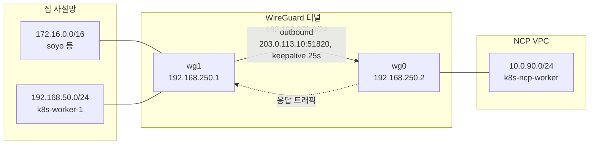
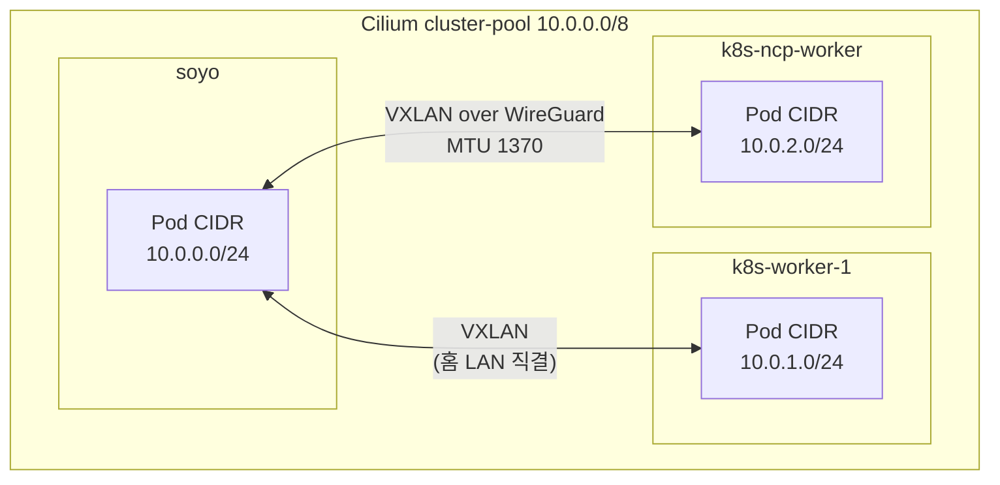
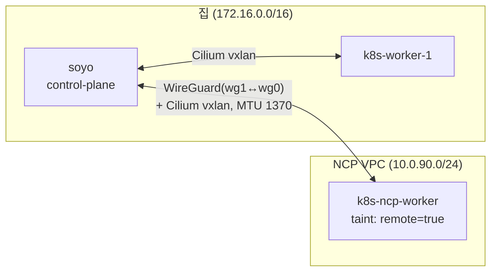

## 배경

기존에 집에 PC 두 대로 on-premise 환경에서 k8s 클러스터를 구축해두었다.

추가로 리소스가 필요한 경우가 종종 있었는데, 그때마다 서버를 구매하기엔 부담돼서 public cloud 환경의 server를 필요할 때마다 증설할 수 있는 방법을 찾아보기로 했다.

## Cloud로 전부 안 옮기나?

사실 모든 리소스를 public cloud로 옮기는 게 가장 편하긴 하다. 전력, HW fault 같은 이슈 관리를 cloud에게 맡기면 편하다.

다만 그렇기에 기존 인프라 리소스를 모두 대체하기엔 비용이 너무 비싸다.

기존 home infra
- Storage -> block storage, object storage
- PC 2ea -> Server instance
- Public IP -> Elastic IP

> 그래서 기존 인프라를 유지한 상태로, scale-out이 용이한 방향으로 구성을 진행한다.

## 요구사항

**사설망 통신**

내부 환경에서는 172 대역의 사설 대역을 사용하고, gateway 겸 SNAT를 통과해 외부와 통신함

NCP 서버가 워커로 붙으려면 이 사설 대역과 양방향 통신이 되어야 하는데, 외부에서 먼저 들어올 경로가 없으니 IPsec 같은 터널이 필요함

**기존 K8s Cluster와 통합**

클러스터에 이미 올라가 있는 아래 컴포넌트들과 새 노드가 문제없이 맞물려야 함

- Internal DNS
- Storage
- cilium CNI
- monitoring stack

## 구성 방안

일단 가능한 방향부터 생각해봤다.

### NCP 관리형 IPsec VPN

NCP는 VPC용 관리형 IPsec VPN Gateway 상품을 제공한다. 다만 온프레미스 데이터센터급 연동을 상정한 구성이라, 집 쪽에도 고정 공인 IP를 가진 IPsec 피어 장비가 있어야 한다. (해당 내용은 AWS와 같은 외부 클라우드 서비드와 동일)

공인 IP는 고정이지만, 지금 공유기는 포트포워딩만 해주는 수준이라 IPsec 피어 역할을 할 전용 게이트웨이가 없다. 게이트웨이 이중화 같은 기능도 워커 노드 하나 붙이는 용도로는 과했다. 그래서 기각.

### 기존 WireGuard(wg-easy) 재사용 시도

집에는 이미 `soyo`에서 [[Cloudflare Tunnel을 활용한 k8s Ingress 대체|외부 접속용]] wg-easy 컨테이너가 떠있었다. 여기에 NCP 서버를 피어로 추가하면 될 줄 알았는데, 확인해보니 불가능했다.

```bash
docker exec wg-easy iptables -t nat -S POSTROUTING
# -A POSTROUTING -s 10.8.0.0/24 -o eth0 -j MASQUERADE
```

wg-easy는 브리지 네트워크 안에서 도는 컨테이너라 VPN 클라이언트 트래픽을 전부 **MASQUERADE(SNAT)** 함. 개인이 노트북으로 집에 들어올 땐 문제없지만, k8s 노드 간 통신은 불가능하다.

- soyo → NCP 방향(`kubectl exec`, kubelet 10250) 라우팅이 없음(NAT는 단방향)
- NCP → 클러스터 방향도 SNAT 때문에 kubelet/Cilium이 보는 소스 IP가 실제 노드 IP와 달라짐

컨테이너를 개조해서 우회할 수도 있었지만, 재시작마다 규칙이 날아가고 업데이트에 깨지기 쉬워서 포기했다. wg-easy는 개인 VPN 용도로 그대로 두고, 클러스터 전용 네이티브 WireGuard 인터페이스를 하나 더 올리기로 했다.

### WireGuard 터널 구성



NCP 서버는 공인 IP를 갖고 있어서 리스너로 두고, soyo가 클라이언트로 접속하는 방향으로 잡았다.

- 공유기 포트포워딩을 새로 열 필요 없음 (soyo가 outbound로 붙으니까)
- 집 공인 IP가 유동이어도 `PersistentKeepalive`로 알아서 재연결됨
- `wg1`이 soyo 호스트 네임스페이스에 그대로 있어서 홈 LAN ↔ NCP 노드가 NAT 없이 라우팅됨

```ini
# NCP: /etc/wireguard/wg0.conf
[Interface]
Address = 192.168.250.2/24
PrivateKey = <ncp-private-key>
ListenPort = 51820

[Peer]
PublicKey = <soyo-public-key>
AllowedIPs = 192.168.250.1/32, 172.16.0.0/16, 192.168.50.0/24
```

```ini
# soyo: /etc/wireguard/wg1.conf
[Interface]
Address = 192.168.250.1/24
PrivateKey = <soyo-private-key>

[Peer]
PublicKey = <ncp-public-key>
Endpoint = 203.0.113.10:51820
AllowedIPs = 192.168.250.0/24
PersistentKeepalive = 25
```

NCP 콘솔의 ACG(방화벽)는 집 공인 IP에서만 `UDP/51820`, `TCP/22`를 열어뒀다.

#### Pod 네트워크 (Cilium CNI)

여기에 Cilium CNI까지 얹으면 파드 대역은 이렇게 나뉜다.



WireGuard 터널은 물리 대역(172/192/10.0.90)만 이어주고, 그 위에서 Cilium이 파드 대역(10.0.0.0/8)을 한 번 더 VXLAN으로 캡슐화해서 올리는 구조다.

### kubeadm join

터널이 붙은 뒤엔 평범한 kubeadm 워커 조인. 다만 API 서버 엔드포인트는 WireGuard IP가 아니라 원래 advertise 주소(`172.16.1.10:6443`)를 그대로 써야 kubeadm 인증서 SAN 검증에 안 걸린다.

```bash
# soyo에서 토큰 발급
kubeadm token create --print-join-command

# NCP 노드에서 실행, kubelet node-ip는 WireGuard IP로 고정
echo 'KUBELET_EXTRA_ARGS="--node-ip=192.168.250.2"' > /etc/default/kubelet
kubeadm join 172.16.1.10:6443 --token ... --discovery-token-ca-cert-hash ...
```

### Terraform으로 IaC화

NCP 서버를 매번 콘솔에서 만들다 보니, 다음번 스케일아웃 때는 코드로 관리하려고 했다. NCP는 공식 Terraform 프로바이더(`NaverCloudPlatform/ncloud`)를 제공한다.

```hcl
resource "ncloud_subnet" "k8s_worker" {
  vpc_no         = data.ncloud_vpc.main.vpc_no
  subnet         = var.subnet_cidr   # 10.0.90.0/24
  zone           = "KR-1"
  network_acl_no = data.ncloud_vpc.main.default_network_acl_no
  subnet_type    = "PUBLIC"
}

resource "ncloud_access_control_group_rule" "k8s_worker" {
  access_control_group_no = ncloud_access_control_group.k8s_worker.id

  inbound {
    protocol   = "UDP"
    ip_block   = "${var.home_public_ip}/32"
    port_range = "51820"
  }
  # ...
}

resource "ncloud_server" "k8s_worker" {
  subnet_no            = ncloud_subnet.k8s_worker.id
  server_image_number  = local.ubuntu_base_image_number  # ubuntu-24.04-base
  server_spec_code     = data.ncloud_server_specs.worker.server_spec_list[0].server_spec_code
  login_key_name       = ncloud_login_key.k8s_worker.key_name
}
```

VPC/서브넷 CIDR을 데이터소스로 조회해서 겹치지 않는 대역을 계산하고, `terraform plan`으로 미리 확인한 뒤 apply하는 흐름이라 다음 서버 증설부터는 콘솔 클릭 없이 진행 가능함.

## Troubleshooting

### 서브넷 CIDR이 Cilium 파드 대역과 충돌

NCP VPC에 서버를 처음 올릴 때 서브넷을 딱히 신경 쓰지 않고 기존에 파둔 `10.0.1.0/24`에 그대로 붙였는데, 여기서 문제가 터졌다.

```bash
kubectl -n kube-system get cm cilium-config -o yaml | grep cluster-pool
# cluster-pool-ipv4-cidr: 10.0.0.0/8
# cluster-pool-ipv4-mask-size: "24"

kubectl get ciliumnodes -o custom-columns='NAME:.metadata.name,PODCIDRS:.spec.ipam.podCIDRs'
# k8s-worker-1   [10.0.1.0/24]   <- NCP VPC 서브넷과 완전히 동일
```

Cilium은 원격 파드 대역으로 가는 라우트를 호스트 라우팅 테이블에 직접 설치함(`ip route`에 `10.0.1.0/24 via ... dev cilium_host`). 
이 상태로 NCP 노드를 그 서브넷에 붙이면, NCP 노드 입장에서 자기 VPC 게이트웨이로 가야 할 패킷이 **파드 라우트로 잘못 들어가서 통신 자체가 끊긴다**.

해결은 단순했다. 파드 대역과 절대 겹치지 않는 `10.0.90.0/24`로 새 서브넷을 파서 서버를 옮겼다. Cilium `cluster-pool`이 `/8`을 쓴다면, 클라우드 쪽 사설 서브넷도 그 안에서 뽑히는 경우가 많아서 미리 겹치는지 확인이 필요하다.

### Cilium CrashLoopBackOff

서브넷을 옮기고 조인했더니 Cilium 파드가 계속 `CrashLoopBackOff`에 빠졌다.

```
level=error msg="Unable to contact k8s api-server" ipAddr=https://10.96.0.1:443
error="dial tcp 10.96.0.1:443: i/o timeout"
```

API 서버 서비스 IP(`10.96.0.1`)로 가는 트래픽인데 타임아웃이 난다. tcpdump로 까보니 원인은 라우팅 순서였다.

- NCP 노드에서 서비스 IP로 나가는 패킷은 **DNAT되기 전에** 라우팅 결정이 먼저 일어나서, 소스 주소가 NCP 노드의 실제 IP(`10.0.90.6`)로 찍힌 채 나간다
- 이 패킷이 WireGuard 터널을 타고 soyo에 도착하는데, soyo의 `wg1` 설정에는 `AllowedIPs`에 `192.168.250.0/24`만 있어서 `10.0.90.6`발 패킷을 거부(drop)하고 있었다

```ini
# 수정 전
AllowedIPs = 192.168.250.0/24

# 수정 후: NCP 서브넷 대역을 추가해야 서비스 트래픽이 통과한다
AllowedIPs = 192.168.250.0/24, 10.0.90.0/24
```

`AllowedIPs`는 출발지 대역이자 목적지 대역으로 동시에 쓰인다. 클러스터 서비스/파드 트래픽처럼 소스 IP가 여러 대역을 오가는 경우, 상대 노드의 전체 서브넷을 열어줘야 한다.

### MTU

Cloud Server들은 대부분 VM과 오버레이 네트워크(VPC) 위에서 동작한다. 여기에 WireGuard 터널을 얹고, 다시 Cilium VXLAN까지 얹히면서(오버레이 위에 오버레이) MTU를 낮춰야 했다.

- WireGuard 기본 MTU: 1420
- VXLAN 헤더 오버헤드: 50바이트
- 계산상 여유치: `1420 - 50 = 1370`

```bash
kubectl -n kube-system patch cm cilium-config -p '{"data":{"mtu":"1370"}}'
kubectl -n kube-system rollout restart ds/cilium
```

파드 두 개(on-prem 쪽 / NCP 쪽)를 띄워서 페이로드 크기를 변경해가면서 테스트 진행

```bash
kubectl exec home-nettest -- ping -c 2 -s 1292 -W 2 $NCP_POD_IP   # 0% loss
kubectl exec home-nettest -- ping -c 2 -s 1293 -W 2 $NCP_POD_IP   # 100% loss
```

실측 임계값은 payload 1292바이트(IP+ICMP 헤더 28바이트 포함 총 1320바이트). 

설정한 파드 인터페이스 MTU(1370)보다 50바이트 낮은데, 이 차이가 **Cilium VXLAN 오버헤드와 정확히 일치**한다. 
파드 간 트래픽이 노드 사이 구간에서 Cilium 자체 VXLAN 캡슐화를 한 번 더 타면서 유효 MTU가 그만큼 줄어든다. TCP는 MSS 협상 덕에 문제없지만, **ICMP나 UDP처럼 협상 없이 나가는 트래픽은 이 값을 넘으면 드롭**되니 실측 검증이 필요하다.

### Harbor 레지스트리 TLS

사설 Harbor(`harbor.home.internal`)는 자체 서명 인증서를 쓰고 있어서, 기존 노드들은 `containerd`의 `certs.d/hosts.toml`로 `skip_verify`를 설정해뒀다.

```toml
# soyo (containerd 2.2.1) — 정상 동작
server = "https://harbor.home.internal"
[host."https://harbor.home.internal"]
  capabilities = ["pull", "resolve"]
  skip_verify = true
```

NCP 노드(Ubuntu 24.04 기본 저장소 containerd, 1.7.x)에 똑같이 설정했는데 계속 인증서 오류가 났다.

```
x509: certificate is valid for ...traefik.default, not harbor.home.internal
```

containerd 1.7 계열은 `certs.d` 기반 `hosts.toml`의 `skip_verify`가 **CRI 경로에서 제대로 안 먹는** 이슈가 있다. 결국 레거시 방식인 `config.toml`의 `registry.configs` 섹션으로 우회했다.

```toml
[plugins."io.containerd.grpc.v1.cri".registry.configs."harbor.home.internal".tls]
  insecure_skip_verify = true
```

같은 클러스터라도 노드마다 containerd 버전이 다르면 레지스트리 신뢰 설정 방식이 달라질 수 있다. `crictl pull`로 실제 이미지를 당겨서 성공까지 확인.

## 노드 격리

NCP 노드는 스토리지(NFS)나 MetalLB에 의존하는 워크로드를 **태울 수 없다**. NFS는 터널을 타고 왕복하면 느리고, MetalLB L2 광고는 애초에 홈 LAN 밖으로 안 나간다. 그래서 기본적으로는 아무것도 스케줄되지 않게 막아뒀다.

```bash
kubectl taint nodes k8s-ncp-worker node.home-infra/remote=true:NoSchedule
kubectl label nodes k8s-ncp-worker \
  node.home-infra/location=ncp \
  topology.kubernetes.io/zone=ncp-kr1
```

모니터링(cadvisor, node-exporter)처럼 모든 노드에 반드시 떠야 하는 DaemonSet에는 toleration을 추가해서 예외를 뒀다.

```yaml
spec:
  template:
    spec:
      tolerations:
        - key: node.home-infra/remote
          operator: Exists
          effect: NoSchedule
```

## 검증

```bash
kubectl get nodes
# k8s-ncp-worker   Ready    <none>          v1.30.14
# k8s-worker-1     Ready    <none>          v1.30.14
# soyo             Ready    control-plane   v1.30.14
```

- 파드 간 레이턴시: soyo ↔ NCP 파드 왕복 약 5ms (인터넷 경유치고 나쁘지 않다)
- Harbor 이미지 pull: `imagePullSecret` + 위 TLS 설정으로 정상 pull, 파드 `Running` 확인
- 모니터링 커버리지: `cadvisor`/`node-exporter`가 3개 노드 전부에 떠서 Grafana에서 동일하게 조회됨



## 끝

관리형 IPsec VPN 상품 없이도, 이미 떠있는 서버 하나 + 네이티브 WireGuard로 하이브리드 워커를 붙일 수 있었다. 다만 "클러스터 확장"보다는 "터널로 이어붙인 원격 연산 노드"에 가깝다. 스토리지, LoadBalancer, 레지스트리 신뢰 관계는 전부 홈 인프라 쪽에 남고, NCP 노드는 taint로 격리된 worker node로 사용하려고한다. ~~이걸로 로컬 LLM agent 돌려야지~~

다음에 노드를 더 늘린다면 Terraform 모듈에 서버 개수만 늘리면 된다.
