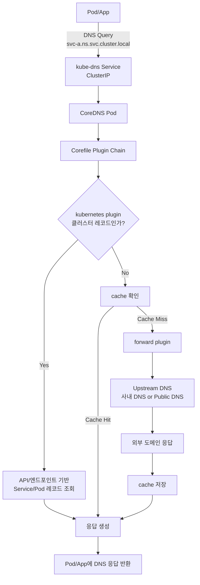
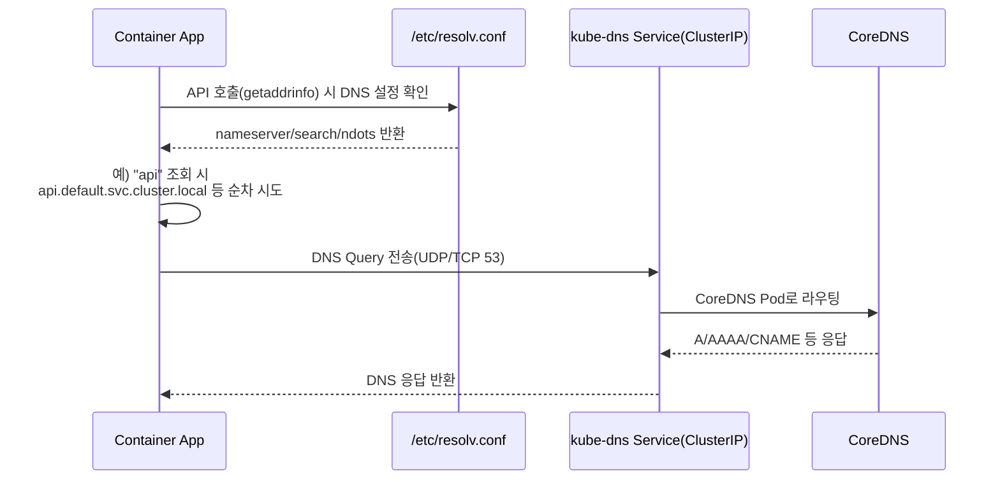
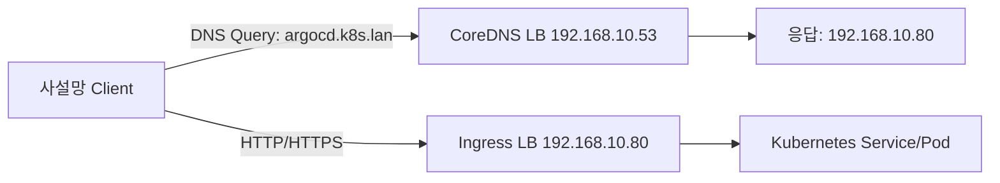

## Core DNS
![[../../Assets/Pasted image 20260222150751.png]]

### CoreDNS란?

CoreDNS는 Kubernetes 클러스터의 **기본 DNS 서버**다. 예전에는 kube-dns가 이 역할을 했지만, 1.13부터 CoreDNS가 기본 클러스터 DNS로 채택

- **클러스터 내 서비스 디스커버리**: `서비스이름.네임스페이스.svc.cluster.local` 형태로 Pod·Service를 이름으로 조회
- **Pod DNS 자동 설정**: 각 Pod의 `resolv.conf`에 CoreDNS ClusterIP가 들어가서, 앱이 도메인만으로 다른 서비스를 찾음
- **Headless Service / StatefulSet**: `pod-name.service-name.ns.svc.cluster.local` 같은 스테이트풀 Pod DNS 레코드를 제공

### 동작 방식

- 보통 **kube-system** 네임스페이스에 `coredns` Deployment로 떠 있으며, **control plane 노드**에도 스케줄링(테인트/톨러레이션 설정에 따라 다름).
- ClusterIP Service(`kube-dns`)로 노출되고, kubelet이 모든 Pod의 DNS 설정에 이 주소를 넣는다.
- 설정은 **ConfigMap**(예: `coredns`)으로 관리되며, `Corefile` 형식으로 플러그인을 조합한다.
  - `forward`: 외부 도메인을 상위 DNS(예: 8.8.8.8, 사내 DNS)로 전달
  - `cache`: DNS 캐시
  - `loop`, `reload`, `health` 등으로 안정성 확보

#### CoreDNS 작동 로직 (Mermaid)



#### Pod 내부 `resolv.conf` 기준 DNS 질의 로직

Pod 내부 컨테이너는 `/etc/resolv.conf`를 보고 DNS 질의를 보낸다.

일반적으로 Kubernetes Pod의 `resolv.conf`는 아래와 비슷하다.

```conf
nameserver 10.96.0.10
search default.svc.cluster.local svc.cluster.local cluster.local
options ndots:5
```

- `nameserver`: `kube-dns` Service ClusterIP(CoreDNS)
- `search`: 짧은 이름 조회 시 자동으로 붙는 도메인 suffix
- `ndots`: 점(`.`) 개수 기준으로 FQDN 우선 여부를 결정



### Kubernetes에서 Service를 IP 대신 도메인으로 쓰는 이유

- **Pod IP는 자주 바뀜**: Pod는 재시작/재스케줄링 시 IP가 바뀔 수 있어, IP를 직접 참조하면 애플리케이션 설정이 쉽게 깨진다.
- **Service 이름은 안정적**: `my-api.default.svc.cluster.local` 같은 DNS 이름은 유지되고, 실제 백엔드 Pod 목록만 Kubernetes가 동적으로 갱신한다.
- **환경 이식성 확보**: 클러스터/환경(dev, staging, prod)마다 IP 대역이 달라도, 동일한 서비스 이름으로 배포 구성을 재사용할 수 있다.
- **운영 단순화**: IP 하드코딩 없이 Service + DNS 기반으로 서비스 디스커버리와 트래픽 분산을 Kubernetes에 위임할 수 있다.

> 참고: 외부 인터넷 통신 시에도 DNS 조회는 CoreDNS를 거칠 수 있지만, 실제 데이터 트래픽(HTTP/TCP)은 조회된 IP로 직접 통신한다.

### 사설망에 노출할 때

클러스터 안에서만 쓰이던 CoreDNS를 **사설망에 노출**하면, 같은 사설망의 VM·BMS·다른 클러스터에서도 Kubernetes 관련 도메인을 조회할 수 있다. 나는 아래처럼 구성했다.

#### 1) CoreDNS를 사설망 IP로 노출

내 환경은 MetalLB를 사용하고 있어서, CoreDNS를 `LoadBalancer` 타입 Service로 별도 노출했다.

```yaml
apiVersion: v1
kind: Service
metadata:
  name: coredns-lan
  namespace: kube-system
spec:
  type: LoadBalancer
  loadBalancerIP: 192.168.10.53
  selector:
    k8s-app: kube-dns
  ports:
    - name: dns-udp
      port: 53
      protocol: UDP
      targetPort: 53
    - name: dns-tcp
      port: 53
      protocol: TCP
      targetPort: 53
```

- 방화벽/보안그룹에서 `UDP/TCP 53`을 사설망 대역에 대해 허용
- 클라이언트가 직접 이 DNS를 쓰거나, 사내 DNS(BIND/AD DNS)에 `k8s.lan` 조건부 포워더로 연결

#### 2) 외부 접근용 도메인 Zone 추가

`cluster.local`은 기본적으로 클러스터 내부 서비스 디스커버리에 쓰고, 사설망 클라이언트 접근은 별도 Zone(`k8s.lan`)으로 분리했다.

```corefile
k8s.lan:53 {
    errors
    health
    ready
    hosts /etc/coredns/k8s.hosts {
      fallthrough
    }
    cache 30
    reload
}
```

`k8s.hosts`에는 사설망에서 접근 가능한 IP(주로 Ingress/LoadBalancer IP)를 매핑했다.

```txt
192.168.10.80 argocd.k8s.lan grafana.k8s.lan
192.168.10.81 harbor.k8s.lan
```

#### 3) 서비스는 사설망에서 라우팅 가능한 IP로 노출

중요한 점은 DNS만 열어서는 접근이 끝나지 않는다는 것이다.

- `*.svc.cluster.local` 조회 결과는 보통 `ClusterIP`
- `ClusterIP`는 외부 사설망에서 라우팅되지 않는 경우가 많음
- 그래서 실제 접근 대상 서비스는 `Ingress` 또는 `LoadBalancer`(필요 시 `NodePort`)로 노출해야 함

즉, **DNS(CoreDNS)는 이름 해석**, **실제 접근성은 Service 노출 방식과 라우팅**이 결정한다.



#### 4) 검증

사설망 클라이언트에서 아래 순서로 확인했다.

```bash
dig @192.168.10.53 argocd.k8s.lan +short
nslookup harbor.k8s.lan 192.168.10.53
curl -I http://argocd.k8s.lan
```

- DNS 응답 IP가 의도한 LB/Ingress IP인지 확인
- 해당 IP로 실제 L4/L7 접속이 되는지 확인
