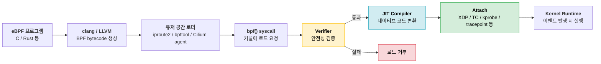
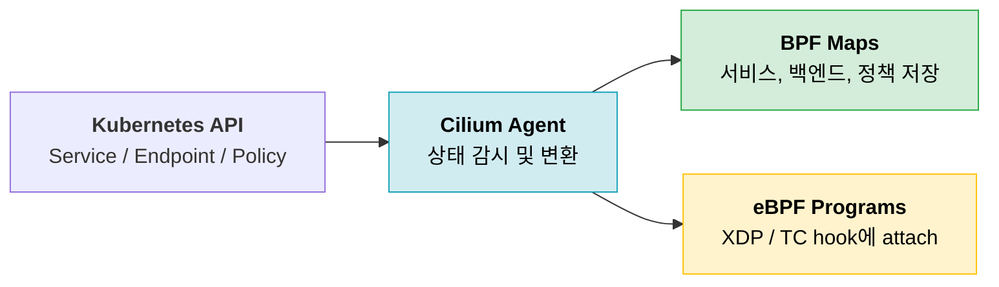
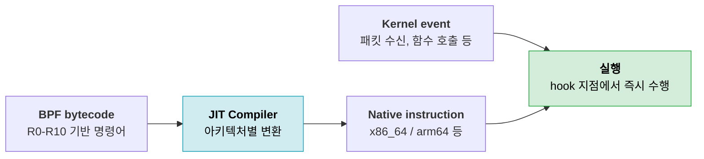
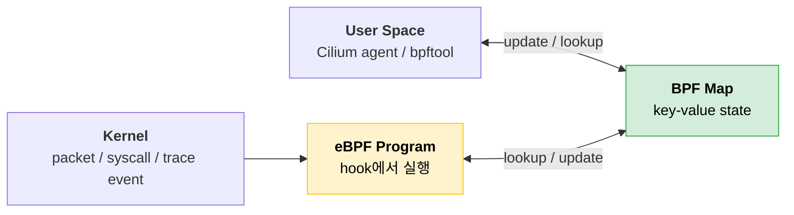
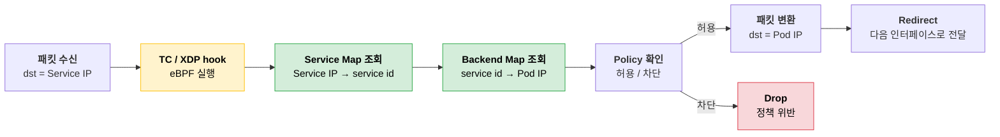

# eBPF 동작 과정

## eBPF란?

**eBPF(extended Berkeley Packet Filter)** 는 커널 내부의 특정 지점에 작은 프로그램을 붙여 실행할 수 있게 해주는 기술이다.

커널 코드를 직접 수정하거나 커널 모듈을 로드하지 않아도, 네트워크 패킷 처리, 시스템 콜 추적, 성능 분석, 보안 정책 같은 로직을 커널 안에서 실행할 수 있다.

기존의 classic BPF는 패킷 필터링을 위한 제한적인 VM에 가까웠다. eBPF는 이를 일반적인 커널 내부 실행 환경으로 확장한 형태다.

- 2개 레지스터에서 10개 레지스터로 확장
- 32비트 중심에서 64비트 레지스터 기반으로 확장
- 커널 helper 함수 호출 지원
- verifier를 통한 안전성 검증
- JIT 컴파일을 통한 네이티브 코드 실행
- BPF Maps를 통한 커널-유저 공간 데이터 공유

---

## 전체 동작 흐름

eBPF 프로그램은 보통 C로 작성되고, LLVM/clang을 통해 BPF 바이트코드로 컴파일된다. 이후 유저 공간의 로더가 `bpf()` 시스템 콜을 통해 커널에 프로그램을 로드한다.



핵심은 **로드 시점에 검증하고, 실행 시점에는 이미 검증된 프로그램만 빠르게 실행**한다는 점이다.

---

## 1. 프로그램 작성과 컴파일

개발자는 eBPF 프로그램을 C 같은 언어로 작성한다. 예를 들어 XDP 프로그램이라면 패킷이 NIC 드라이버에서 올라오는 지점에 붙고, tracepoint 프로그램이라면 커널 이벤트 발생 지점에 붙는다.

작성된 코드는 일반 실행 파일이 아니라 **BPF instruction set**을 대상으로 컴파일된다.

```bash
clang -target bpf -O2 -c xdp_prog.c -o xdp_prog.o
```

생성된 `.o` 파일 안에는 eBPF 바이트코드와 map 정의, attach에 필요한 메타데이터가 들어간다.

> eBPF는 커널 문서에서 **general purpose RISC instruction set**으로 설명된다.  
> 즉, 단순한 패킷 필터 문법이 아니라 커널 안에서 실행될 수 있는 작은 명령어 집합이다.

---

## 2. 커널 로드

유저 공간 프로그램은 `bpf()` 시스템 콜을 사용해 eBPF 프로그램과 BPF Map을 커널에 로드한다.

대표적인 로더는 다음과 같다.

- `bpftool`
- `iproute2`
- `libbpf` 기반 애플리케이션
- Cilium agent

Cilium에서는 agent가 Kubernetes Service, Endpoint, NetworkPolicy 정보를 읽고, 이를 BPF Map과 eBPF 프로그램으로 커널에 반영한다.



---

## 3. Verifier 검증

커널은 eBPF 프로그램을 바로 실행하지 않는다. 먼저 **verifier**가 프로그램이 안전한지 검사한다.

검증은 크게 두 단계로 진행된다.

### 1단계: 제어 흐름 검증

프로그램의 제어 흐름 그래프를 확인한다.

- 도달할 수 없는 명령어가 있는지
- 잘못된 jump가 있는지
- 종료되지 않을 수 있는 흐름이 있는지
- 허용되지 않은 loop가 있는지

이 단계에서 커널은 프로그램이 예측 가능한 흐름으로 종료될 수 있는지 확인한다.

### 2단계: 명령어 단위 시뮬레이션

verifier는 첫 번째 명령어부터 가능한 모든 경로를 따라가며 레지스터와 스택 상태를 추적한다.

- 초기 상태에서 `R1`은 context pointer
- 초기화되지 않은 레지스터 read 금지
- stack 범위를 벗어난 접근 금지
- packet, map, stack pointer의 타입 추적
- pointer arithmetic 제한
- helper 함수 호출 시 인자 타입 검증

예를 들어 아직 값이 쓰이지 않은 레지스터를 읽으면 거부된다.

```text
bpf_mov R0 = R2
bpf_exit
```

`R2`는 초기화된 적이 없기 때문에 verifier가 로드를 거부한다.

또한 kernel helper 함수를 호출한 뒤에는 `R1`-`R5`가 다시 읽을 수 없는 상태가 된다. 반환값은 `R0`에 들어가고, `R6`-`R9`는 호출 이후에도 보존된다.

> eBPF가 커널 안에서 실행될 수 있는 이유는 "아무 프로그램이나 실행"하기 때문이 아니라, **실행 전에 커널이 프로그램의 안전성을 증명하려고 시도**하기 때문이다.

---

## 4. eBPF 레지스터와 호출 규약

classic BPF는 `A`, `X` 두 개의 레지스터와 숨겨진 frame pointer를 사용했다. eBPF는 이를 10개의 레지스터와 읽기 전용 frame pointer로 확장했다.

| 레지스터 | 용도 |
|----------|------|
| `R0` | helper 함수 반환값, 프로그램 최종 반환값 |
| `R1` | 첫 번째 인자, 프로그램 시작 시 context pointer |
| `R2`-`R5` | helper 함수 인자 |
| `R6`-`R9` | callee-saved 레지스터 |
| `R10` | 읽기 전용 frame pointer |

eBPF 프로그램은 시작할 때 하나의 인자 `ctx`를 받는다. 이 값은 `R1`에 들어있고, attach된 hook 종류에 따라 의미가 달라진다.

- XDP: 패킷 메타데이터
- TC: `skb` 관련 context
- tracepoint: tracepoint별 context
- kprobe: 함수 호출 context

커널 helper 함수를 호출할 때는 `R1`-`R5`에 인자를 넣고 `bpf_call`을 수행한다. 반환값은 `R0`에 저장된다.

```text
bpf_mov R2, 2
bpf_mov R3, 3
bpf_call foo
bpf_exit
```

64비트 아키텍처에서는 eBPF 레지스터가 하드웨어 레지스터에 1:1로 매핑될 수 있다. 이 구조 덕분에 JIT 컴파일러가 불필요한 move instruction을 줄이고, helper 호출도 일반 함수 호출에 가깝게 변환할 수 있다.

---

## 5. JIT 컴파일과 실행

verifier를 통과한 eBPF 프로그램은 두 가지 방식으로 실행될 수 있다.

- interpreter가 BPF instruction을 해석하며 실행
- JIT compiler가 CPU 아키텍처의 네이티브 instruction으로 변환 후 실행

대부분의 64비트 환경에서는 JIT 컴파일을 통해 실행된다.



커널 문서에서 eBPF는 JIT 시 하드웨어 레지스터와 1:1 매핑될 수 있도록 설계되었다고 설명한다. 이 설계는 eBPF가 커널 안에서 실행되면서도 성능 손실을 줄이는 핵심 이유다.

---

## 6. Attach 지점에서 이벤트 처리

eBPF 프로그램은 단독으로 실행되지 않는다. 특정 hook 지점에 attach된 뒤, 해당 이벤트가 발생할 때 실행된다.

| Attach 지점 | 실행 시점 | 대표 용도 |
|-------------|-----------|-----------|
| XDP | NIC 드라이버에서 패킷 수신 직후 | DDoS 방어, 빠른 drop/redirect |
| TC | 커널 네트워크 스택의 ingress/egress | 라우팅, 정책, 트래픽 제어 |
| kprobe / kretprobe | 커널 함수 진입/반환 | 커널 동작 추적 |
| tracepoint | 커널에 정의된 trace 이벤트 | 안정적인 관측 |
| uprobes | 유저 공간 함수 진입/반환 | 애플리케이션 추적 |
| cgroup hook | cgroup 단위 네트워크/시스템 제어 | 컨테이너 정책 |

Cilium의 핵심 경로는 주로 **XDP**와 **TC**다. 패킷이 iptables chain을 순회하기 전에 eBPF 프로그램이 먼저 실행되어 drop, redirect, load balancing, policy enforcement를 처리할 수 있다.

---

## 7. BPF Maps로 상태 공유

eBPF 프로그램 자체는 짧고 제한적이다. 대신 상태는 **BPF Maps**에 저장한다.

BPF Map은 커널에 존재하는 key-value 저장소이며, 유저 공간과 eBPF 프로그램이 함께 접근할 수 있다.



Cilium에서는 Service IP, backend Pod, connection tracking, network policy 같은 정보가 BPF Map에 저장된다.

iptables가 긴 chain을 순서대로 순회하는 것과 달리, eBPF는 map lookup으로 필요한 상태를 바로 찾는다.

```text
패킷 도착
→ Service IP를 key로 BPF Map 조회
→ backend Pod 선택
→ 패킷 목적지 변경
→ 다음 네트워크 경로로 redirect
```

이 방식 때문에 서비스 수가 늘어나도 패킷마다 수천 개 규칙을 순회하지 않아도 된다.

---

## 패킷 처리 예시: Cilium Service Load Balancing



이 흐름에서 중요한 점은 패킷 처리 로직이 커널 네트워크 경로 안에서 바로 실행된다는 것이다.

유저 공간 프록시로 패킷을 올렸다가 다시 내리지 않아도 되고, iptables처럼 규칙 목록을 순회하지 않아도 된다.

---

## classic BPF와 eBPF의 차이

| 항목 | classic BPF | eBPF |
|------|-------------|------|
| 주 용도 | 패킷 필터링 | 네트워크, 관측, 보안, tracing |
| 레지스터 | `A`, `X` 중심 | `R0`-`R10` |
| 레지스터 폭 | 32비트 중심 | 64비트 |
| 함수 호출 | 제한적 | `bpf_call`로 helper 호출 |
| 실행 방식 | interpreter 중심 | verifier + JIT |
| 상태 저장 | 제한적 scratch memory | BPF Maps |
| attach 범위 | 주로 socket filter | XDP, TC, kprobe, tracepoint 등 |

커널 문서의 핵심은 eBPF가 classic BPF를 단순히 "조금 확장"한 것이 아니라, **현대 CPU ABI와 JIT에 맞게 다시 설계된 실행 모델**이라는 점이다.

---

## 정리

eBPF의 작동 과정은 다음처럼 요약할 수 있다.

```text
작성 → 컴파일 → 커널 로드 → verifier 검증 → JIT 컴파일 → hook attach → 이벤트 발생 시 실행 → BPF Map으로 상태 조회/갱신
```

eBPF는 커널 안에서 실행되지만, verifier가 실행 전에 안전성을 검사하고 JIT가 네이티브 코드에 가깝게 변환한다.

그래서 Cilium 같은 시스템은 커널을 수정하지 않고도 패킷 처리 경로에 직접 개입할 수 있고, Kubernetes Service, NetworkPolicy, Observability를 iptables보다 더 유연하고 빠르게 구현할 수 있다.

---

## 참고

- [The Linux Kernel - Classic BPF vs eBPF](https://docs.kernel.org/bpf/classic_vs_extended.html)
- [The Linux Kernel - eBPF verifier](https://docs.kernel.org/bpf/verifier.html)
