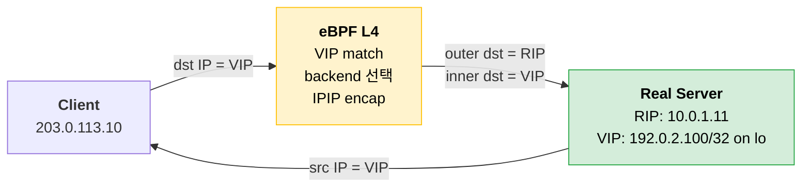
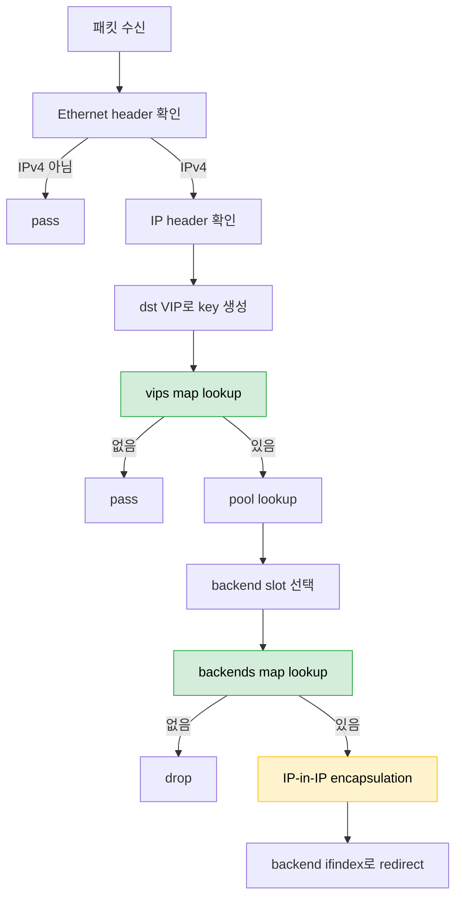

# eBPF로 VIP + L3 DSR 구현 PoC

## 목표

Hardware L4 장비의 기본 기능 중 **VIP + L3 DSR(Direct Server Return)** 을 eBPF로 구현해본다.

이번 PoC에서는 Port 기반 Virtual Server 매칭을 제외한다. 즉, TCP/UDP Port를 보지 않고 **목적지 VIP만 기준으로 backend Real Server를 선택**한다.

- Client는 VIP로 요청
- eBPF L4 노드는 목적지 VIP를 확인
- backend Real Server를 선택
- 원본 IP 패킷을 IP-in-IP로 encapsulation
- Real Server는 decapsulation 후 VIP 목적지 패킷을 로컬로 처리
- 응답은 L4 노드를 거치지 않고 Client에게 직접 반환

```text
request:
Client → VIP → eBPF L4 → IPIP encapsulation → Real Server

response:
Real Server → Client
```

NAT, conntrack, reverse NAT, L4 Port 매칭은 구현하지 않는다.

---

## L3 DSR이란?

DSR은 Real Server가 응답을 Load Balancer를 거치지 않고 직접 Client에게 보내는 방식이다.

```text
NAT mode:
Client → L4 → Real Server
Client ← L4 ← Real Server

DSR mode:
Client → L4 → Real Server
Client ← Real Server
```

**L3 DSR**은 L4 장비가 원본 패킷을 Real Server까지 전달할 때 IP-in-IP 같은 L3 encapsulation을 사용하는 방식이다.

```text
Before:
[IP: Client IP → VIP][TCP/UDP/ICMP...]

After:
[Outer IP: L4 Node IP → Real Server IP][Inner IP: Client IP → VIP][TCP/UDP/ICMP...]
```

inner packet은 그대로 유지된다.

```text
inner.src = Client IP
inner.dst = VIP
```

Real Server는 outer IP header를 제거한 뒤, inner packet의 목적지인 VIP를 로컬 주소로 처리한다.

---

## 전체 흐름



Client 입장에서는 VIP와 통신한다.

```text
Client → VIP
Client ← VIP
```

Real Server IP는 Client에게 노출되지 않는다.

---

## 구현 범위

### 구현할 것

- IPv4 패킷 처리
- 목적지 VIP 기반 매칭
- backend Real Server 선택
- IP-in-IP encapsulation
- backend 방향 인터페이스로 redirect
- backend별 packet/byte counter

### 구현하지 않을 것

- TCP/UDP Port 기반 매칭
- DNAT/SNAT
- reverse NAT
- conntrack
- L2 MAC rewrite 기반 DSR
- health check
- TLS offload
- L7 routing
- IPv6
- HA failover

> 이번 PoC에서는 "VIP 목적지 패킷을 L3 encapsulation으로 Real Server에 전달하고, Real Server가 직접 응답할 수 있는가"만 본다.

---

## 전제 조건

L3 DSR은 L2 DSR보다 Real Server가 같은 L2 segment에 있어야 한다는 제약이 약하다. 대신 Real Server가 tunnel decapsulation을 할 수 있어야 한다.

### 1. L4 노드가 VIP의 진입점이어야 한다

Client 또는 upstream router는 VIP 트래픽을 L4 노드로 보내야 한다.

```text
VIP route 또는 ARP
→ L4 node
```

### 2. L4 노드에서 Real Server IP로 라우팅 가능해야 한다

eBPF 프로그램은 outer IP destination을 Real Server IP로 설정한다.

```text
outer.dst = Real Server IP
```

따라서 L4 노드는 Real Server IP로 패킷을 보낼 수 있어야 한다.

### 3. Real Server에도 VIP가 있어야 한다

decapsulation 후 inner packet의 목적지는 VIP다. Real Server는 VIP를 로컬 주소로 가지고 있어야 한다.

```bash
ip addr add 192.0.2.100/32 dev lo
```

### 4. Real Server는 VIP ARP에 응답하면 안 된다

VIP의 진입점은 L4 노드여야 한다. Real Server가 VIP에 대해 ARP 응답하면 Client 트래픽이 L4를 우회할 수 있다.

```bash
sysctl -w net.ipv4.conf.all.arp_ignore=1
sysctl -w net.ipv4.conf.all.arp_announce=2
sysctl -w net.ipv4.conf.lo.arp_ignore=1
sysctl -w net.ipv4.conf.lo.arp_announce=2
```

### 5. Real Server가 IPIP decapsulation을 처리해야 한다

Linux에서는 `tunl0` 같은 IPIP tunnel interface를 사용할 수 있다.

```bash
ip tunnel add tunl0 mode ipip local <real-server-ip> remote any
ip link set tunl0 up
```

---

## eBPF Hook 위치

PoC에서는 **TC ingress**를 사용한다.

```text
client-facing interface ingress
→ eBPF 실행
→ 목적지 VIP 매칭
→ backend 선택
→ IP-in-IP encapsulation
→ backend 방향 interface로 redirect
```

XDP로도 구현할 수 있지만, 처음에는 `__sk_buff` 기반의 TC가 구현과 디버깅이 쉽다. 특히 `bpf_skb_adjust_room()`으로 outer IP header를 추가하는 구조를 실험하기 좋다.

---

## BPF Map 설계

Port 매칭을 제외했기 때문에 key는 VIP만 사용한다.

### VIP Map

```c
struct vip_key {
    __u32 vip;       // network byte order
};

struct vip_value {
    __u32 pool_id;
};
```

### Pool Map

backend 개수와 round-robin counter만 저장한다.

```c
struct pool_value {
    __u32 backend_count;
    __u32 rr_counter;
};
```

### Backend Map

L3 DSR에서는 Real Server IP와 egress ifindex가 필요하다.

```c
struct backend_key {
    __u32 pool_id;
    __u32 slot;
};

struct backend_value {
    __u32 rip;       // Real Server IP, network byte order
    __u32 ifindex;   // backend 방향 interface
};
```

전체 map은 다음 정도면 충분하다.

| Map | Key | Value | 용도 |
|-----|-----|-------|------|
| `vips` | `vip_key` | `vip_value` | VIP 매칭 |
| `pools` | `pool_id` | `pool_value` | backend 개수, RR counter |
| `backends` | `backend_key` | `backend_value` | Real Server IP/ifindex 조회 |
| `stats` | `backend_key` | packet/byte counter | 관측용 |

---

## 패킷 처리 흐름



이때 inner IP packet은 그대로 유지한다.

```text
inner IP src = Client IP
inner IP dst = VIP
```

Port를 보지 않기 때문에 VIP로 들어오는 모든 IPv4 트래픽이 같은 pool로 들어간다.

---

## eBPF 의사 코드

```c
SEC("tc")
int l3_dsr_ingress(struct __sk_buff *skb)
{
    void *data = (void *)(long)skb->data;
    void *data_end = (void *)(long)skb->data_end;

    struct ethhdr *eth = data;
    if ((void *)(eth + 1) > data_end)
        return TC_ACT_OK;

    if (eth->h_proto != bpf_htons(ETH_P_IP))
        return TC_ACT_OK;

    struct iphdr *iph = data + sizeof(*eth);
    if ((void *)(iph + 1) > data_end)
        return TC_ACT_OK;

    struct vip_key key = {
        .vip = iph->daddr,
    };

    struct vip_value *vip = bpf_map_lookup_elem(&vips, &key);
    if (!vip)
        return TC_ACT_OK;

    struct pool_value *pool = bpf_map_lookup_elem(&pools, &vip->pool_id);
    if (!pool || pool->backend_count == 0)
        return TC_ACT_SHOT;

    __u32 slot = pool->rr_counter % pool->backend_count;
    pool->rr_counter++;

    struct backend_key bkey = {
        .pool_id = vip->pool_id,
        .slot = slot,
    };

    struct backend_value *backend = bpf_map_lookup_elem(&backends, &bkey);
    if (!backend)
        return TC_ACT_SHOT;

    encap_ipip(skb, LB_NODE_IP, backend->rip);
    update_stats(&bkey, skb->len);

    return bpf_redirect(backend->ifindex, 0);
}
```

실제 구현에서는 `pool->rr_counter++`를 그대로 쓰기보다 atomic operation이나 per-cpu counter를 고려해야 한다. PoC에서는 단순 round-robin으로 시작한다.

---

## IP-in-IP Encapsulation

L3 DSR에서는 원본 IP packet 앞에 outer IP header를 추가한다.

```text
Before:
[Ethernet][Inner IP: Client → VIP][payload]

After:
[Ethernet][Outer IP: L4 Node → Real Server][Inner IP: Client → VIP][payload]
```

outer IP header의 protocol은 `IPPROTO_IPIP`이다.

```text
outer.src = L4 node IP
outer.dst = Real Server IP
outer.proto = IPIP

inner.src = Client IP
inner.dst = VIP
```

TC eBPF에서는 대략 다음 helper 흐름을 사용한다.

```c
bpf_skb_adjust_room(
    skb,
    sizeof(struct iphdr),
    BPF_ADJ_ROOM_NET,
    0
);

// 새로 생긴 공간에 outer IP header 작성
// outer IP checksum 계산
// backend 방향 ifindex로 redirect
```

inner packet은 수정하지 않으므로 TCP/UDP checksum은 바꾸지 않는다. 새로 추가한 outer IP header checksum만 올바르게 계산하면 된다.

---

## 테스트 토폴로지

```text
client
  203.0.113.10
    |
upstream network
    |
lb node
  client-facing: 203.0.113.1
  server-facing: 10.0.1.1
  VIP entry: 192.0.2.100
    |
routed network
    |
real server
  rip: 10.0.1.11
  lo: 192.0.2.100/32
  tunl0: IPIP decap
```

Client는 VIP로 요청한다.

```bash
curl http://192.0.2.100/
```

L4 노드에서는 VIP 패킷이 들어오고, IPIP 패킷이 Real Server로 나가야 한다.

```bash
tcpdump -ni <client-iface> host 192.0.2.100
tcpdump -ni <server-iface> proto 4
```

Real Server에서는 IPIP outer packet과 decap된 VIP packet을 확인한다.

```bash
tcpdump -ni <server-iface> proto 4
tcpdump -ni tunl0 host 192.0.2.100
```

Client 쪽에서는 응답 source가 VIP로 보여야 한다.

```bash
tcpdump -ni <client-iface> host 192.0.2.100
```

---

## Real Server 설정

### 1. VIP를 loopback에 설정

```bash
ip addr add 192.0.2.100/32 dev lo
```

### 2. VIP ARP 응답 억제

```bash
sysctl -w net.ipv4.conf.all.arp_ignore=1
sysctl -w net.ipv4.conf.all.arp_announce=2
sysctl -w net.ipv4.conf.lo.arp_ignore=1
sysctl -w net.ipv4.conf.lo.arp_announce=2
```

### 3. IPIP tunnel 활성화

```bash
ip tunnel add tunl0 mode ipip local <real-server-ip> remote any
ip link set tunl0 up
```

### 4. rp_filter 비활성화

DSR에서는 요청과 응답 경로가 비대칭이다. 테스트 환경에서는 `rp_filter`를 꺼두는 편이 안전하다.

```bash
sysctl -w net.ipv4.conf.all.rp_filter=0
sysctl -w net.ipv4.conf.default.rp_filter=0
```

### 5. 애플리케이션 실행

애플리케이션은 VIP 또는 모든 주소에서 listen한다.

```bash
python3 -m http.server 80
```

---

## 관측 포인트

### L4 노드

```bash
tc filter show dev <client-iface> ingress
bpftool map dump pinned /sys/fs/bpf/l3-dsr/vips
bpftool map dump pinned /sys/fs/bpf/l3-dsr/backends
bpftool map dump pinned /sys/fs/bpf/l3-dsr/stats
```

확인할 것:

- VIP 패킷이 eBPF 프로그램에 매칭되는지
- backend slot이 선택되는지
- outer IP header가 추가되는지
- IPIP 패킷이 Real Server IP로 나가는지

### Real Server

```bash
tcpdump -ni <server-iface> proto 4
tcpdump -ni tunl0 host 192.0.2.100
ss -lntp
```

확인할 것:

- outer destination이 Real Server IP인지
- inner destination은 VIP 그대로인지
- decap 이후 애플리케이션이 요청을 받는지

### Client

```bash
curl -v http://192.0.2.100/
tcpdump -ni <client-iface> host 192.0.2.100
```

확인할 것:

- 연결 대상은 VIP
- 응답 source도 VIP
- Real Server IP가 Client에게 보이지 않음

---

## 주의할 점

### 1. Port를 보지 않으면 VIP 단위로만 분산된다

이번 PoC는 Port를 제외한다. 따라서 같은 VIP로 들어오는 HTTP, HTTPS, ICMP, 다른 TCP Port 트래픽이 모두 같은 VIP pool의 대상이 된다.

실제 L4 장비처럼 Virtual Server를 `VIP:Port` 단위로 나누려면 key에 Port와 protocol을 다시 넣어야 한다.

### 2. Real Server가 VIP를 가져야 한다

inner IP destination이 VIP 그대로이므로, Real Server가 VIP를 로컬 주소로 가지고 있지 않으면 decap 후 패킷을 처리하지 않는다.

### 3. Real Server는 VIP ARP에 응답하면 안 된다

VIP로 들어오는 요청은 반드시 L4 노드를 먼저 거쳐야 한다. Real Server가 VIP ARP에 응답하면 load balancing이 깨진다.

### 4. MTU를 고려해야 한다

IP-in-IP encapsulation은 outer IP header만큼 패킷 크기를 늘린다.

PoC에서는 작은 HTTP 응답으로 시작하고, 이후에는 MSS clamping 또는 MTU 조정을 고려한다.

### 5. L4 노드는 response를 보지 못한다

DSR에서는 응답이 Real Server에서 Client로 직접 나간다.

따라서 L4 노드는 response byte, TCP 종료 상태, backend 응답 실패 등을 직접 관측하기 어렵다.

PoC의 통계는 request 기준 packet/byte counter로 제한한다.

---

## L2 DSR과 비교

| 항목 | L2 DSR | L3 DSR |
|------|--------|--------|
| 전달 방식 | Ethernet MAC rewrite | IP-in-IP encapsulation |
| Real Server 위치 | 같은 L2 segment 필요 | L3 라우팅 가능하면 됨 |
| IP header 변경 | inner IP 변경 없음 | inner IP 변경 없음, outer IP 추가 |
| TCP/UDP checksum | 변경 불필요 | 변경 불필요 |
| 추가 오버헤드 | 낮음 | outer IP header만큼 증가 |
| Real Server 설정 | VIP loopback, ARP 억제 | VIP loopback, ARP 억제, IPIP decap |

L3 DSR은 L2 인접성 제약을 줄이는 대신, tunnel decapsulation과 MTU 고려가 추가된다.

---

## 단계별 구현 계획

### Step 1. VIP 매칭만 확인

- TC ingress에 eBPF attach
- Ethernet/IPv4 파싱
- VIP map lookup
- 매칭된 packet counter 증가
- 패킷은 그대로 pass

### Step 2. backend 선택

- pool/backend map 추가
- 단일 backend 선택
- stats map으로 선택 여부 확인

### Step 3. IP-in-IP encapsulation

- `bpf_skb_adjust_room()`으로 outer IP header 추가
- outer src = L4 node IP
- outer dst = Real Server IP
- outer protocol = IPIP
- inner packet은 수정하지 않음

### Step 4. redirect

- backend 방향 interface로 `bpf_redirect()`
- Real Server tcpdump에서 `proto 4` 패킷 확인

### Step 5. DSR 응답 확인

- Real Server에 VIP loopback과 `tunl0` 설정
- Client에서 VIP로 요청
- Client tcpdump에서 응답 source가 VIP인지 확인

---

## 정리

이번 PoC는 Hardware L4의 기능 중 **VIP + L3 DSR**만 구현한다. Port 기반 Virtual Server 매칭은 제외하고, VIP 단위로 backend를 선택한다.

핵심 흐름은 다음과 같다.

```text
Client가 VIP로 요청
→ eBPF가 목적지 VIP 매칭
→ backend Real Server 선택
→ 원본 IP packet 앞에 outer IP header 추가
→ IPIP로 Real Server에 전달
→ Real Server가 decap 후 VIP packet 처리
→ Real Server가 Client에게 직접 응답
```

NAT, conntrack, reverse NAT가 빠지기 때문에 eBPF dataplane은 단순해진다. 대신 Real Server의 VIP loopback, ARP 억제, IPIP decapsulation, MTU를 맞추는 것이 L3 DSR의 핵심 전제다.

---

## 참고

- [The Linux Kernel - BPF Documentation](https://docs.kernel.org/bpf/)
- [The Linux Kernel - eBPF verifier](https://docs.kernel.org/bpf/verifier.html)
- [The Linux Kernel - Helper functions](https://docs.kernel.org/bpf/helpers.html)
