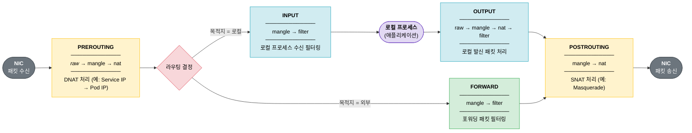
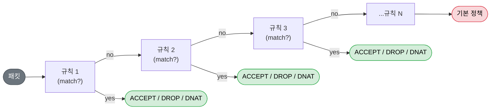

# 왜 eBPF인가? iptables와의 차이

## 배경: 리눅스 네트워킹의 전통적인 방식

리눅스에서 네트워크 패킷 필터링은 오랫동안 **iptables**가 담당해왔다. Netfilter 프레임워크 위에서 동작하는 iptables는 방화벽 규칙, NAT, 패킷 조작 등 사실상 모든 네트워크 정책을 처리해왔다.

쿠버네티스도 초기부터 iptables를 활용했다. `kube-proxy`가 Service IP를 각 Pod IP로 DNAT하는 방식으로 동작했고, 클러스터가 작을 때는 아무런 문제가 없었다.

## iptables 패킷 처리 흐름

iptables는 커널의 **Netfilter** 프레임워크에 5개의 훅(hook) 포인트를 등록해 패킷을 처리한다.



> 각 훅에서 **해당 테이블의 chain을 순서대로 순회**하며 매칭되는 규칙을 찾는다.  
> 서비스가 많아질수록 규칙 수가 선형으로 증가하고, 패킷마다 이 탐색을 반복한다.

### chain 순회 방식



규칙이 N개면 최악의 경우 N번 비교 — **O(n) 탐색**.

### iptables CLI 예시

**규칙 조회**

```bash
# 모든 체인의 규칙 목록 (패킷/바이트 카운터 포함)
iptables -L -v -n
```
```
Chain INPUT (policy ACCEPT 0 packets, 0 bytes)
 pkts bytes target     prot opt in     out     source               destination
 125K   18M ACCEPT     all  --  *      *       0.0.0.0/0            0.0.0.0/0            state RELATED,ESTABLISHED
    0     0 ACCEPT     icmp --  *      *       0.0.0.0/0            0.0.0.0/0
    0     0 ACCEPT     all  --  lo     *       0.0.0.0/0            0.0.0.0/0
  203 12180 ACCEPT     tcp  --  *      *       0.0.0.0/0            0.0.0.0/0            state NEW tcp dpt:22
 3472  208K DROP       all  --  *      *       0.0.0.0/0            0.0.0.0/0

Chain FORWARD (policy DROP 0 packets, 0 bytes)
 pkts bytes target     prot opt in     out     source               destination

Chain OUTPUT (policy ACCEPT 84 packets, 8520 bytes)
 pkts bytes target     prot opt in     out     source               destination
```

```bash
# 규칙 번호 포함 출력
iptables -L INPUT --line-numbers
```
```
Chain INPUT (policy ACCEPT)
num  target     prot opt source               destination
1    ACCEPT     all  --  anywhere             anywhere             state RELATED,ESTABLISHED
2    ACCEPT     icmp --  anywhere             anywhere
3    ACCEPT     all  --  anywhere             anywhere
4    ACCEPT     tcp  --  anywhere             anywhere             state NEW tcp dpt:ssh
5    DROP       all  --  anywhere             anywhere
```

```bash
# 실제 적용된 규칙을 iptables-save 형식으로 출력
iptables-save
```
```
# Generated by iptables-save v1.8.7 on Wed Apr 29 10:00:00 2026
*filter
:INPUT ACCEPT [0:0]
:FORWARD DROP [0:0]
:OUTPUT ACCEPT [84:8520]
-A INPUT -m state --state RELATED,ESTABLISHED -j ACCEPT
-A INPUT -p icmp -j ACCEPT
-A INPUT -i lo -j ACCEPT
-A INPUT -p tcp -m state --state NEW -m tcp --dport 22 -j ACCEPT
-A INPUT -j DROP
COMMIT
*nat
:PREROUTING ACCEPT [0:0]
:INPUT ACCEPT [0:0]
:OUTPUT ACCEPT [0:0]
:POSTROUTING ACCEPT [0:0]
-A POSTROUTING -o eth0 -j MASQUERADE
COMMIT
```

**규칙 추가**

```bash
# 특정 IP에서 오는 패킷 차단 (INPUT 체인 끝에 추가)
iptables -A INPUT -s 192.168.1.100 -j DROP

# 80 포트 허용 (체인 앞에 삽입, -I)
iptables -I INPUT 1 -p tcp --dport 80 -j ACCEPT

# DNAT: 외부 8080 → 내부 80으로 포워딩 (kube-proxy가 하는 일)
iptables -t nat -A PREROUTING -p tcp --dport 8080 -j DNAT --to-destination 10.0.0.5:80

# SNAT: 나가는 패킷의 출발지 IP를 eth0의 IP로 변경 (Masquerade)
iptables -t nat -A POSTROUTING -o eth0 -j MASQUERADE
```

**규칙 삭제**

```bash
# 규칙 번호로 삭제
iptables -D INPUT 3

# 규칙 내용으로 삭제 (-A와 동일한 형식, -D로 변경)
iptables -D INPUT -s 192.168.1.100 -j DROP

# 특정 체인의 규칙 전체 삭제
iptables -F INPUT

# 모든 테이블 규칙 초기화
iptables -F && iptables -t nat -F && iptables -t mangle -F
```

> **쿠버네티스에서 실제 생성되는 규칙 확인**
> 
> ```bash
> # kube-proxy가 생성한 nat 규칙만 필터링
> iptables -t nat -L -n | grep -E 'KUBE|Chain'
> ```
> ```
> Chain PREROUTING (policy ACCEPT)
> Chain INPUT (policy ACCEPT)
> Chain OUTPUT (policy ACCEPT)
> Chain POSTROUTING (policy ACCEPT)
> Chain KUBE-MARK-DROP (1 references)
> Chain KUBE-MARK-MASQ (20 references)
> Chain KUBE-NODEPORTS (1 references)
> Chain KUBE-POSTROUTING (1 references)
> Chain KUBE-SEP-2FHBVKZOLXDXMTVN (1 references)   # 개별 Pod endpoint
> Chain KUBE-SEP-4VBLKZOLXDXM7KQN (1 references)
> Chain KUBE-SEP-RVXJZ7OLXDXMABCD (1 references)
> Chain KUBE-SERVICES (2 references)
> Chain KUBE-SVC-ERIFXISQEP7F7OF4 (2 references)   # Service 1개당 체인 1개
> Chain KUBE-SVC-NPX46M4PTMTKRN6Y (2 references)
> Chain KUBE-SVC-TCOU7JCQXEZGVUNU (2 references)
> ...
> ```
> 서비스가 많은 클러스터에서는 `KUBE-SVC-*`, `KUBE-SEP-*` 체인이 **서비스·엔드포인트 수에 비례해 수천 개** 생성된다.

---

## iptables의 한계

### 1. O(n) 규칙 순회

iptables는 규칙을 **연결 리스트(chain)** 형태로 저장한다. 패킷이 들어오면 해당되는 규칙을 찾을 때까지 순서대로 탐색한다.

- 서비스 100개 → 규칙 수백 개
- 서비스 10,000개 → 규칙 수만 개
- 패킷마다 규칙을 처음부터 순회 → **레이턴시와 CPU 사용량이 서비스 수에 비례해서 증가**

실제로 쿠버네티스 대규모 클러스터에서는 iptables 규칙이 10만 개를 넘기도 하며, 규칙 업데이트 자체도 lock을 잡고 전체를 재작성하기 때문에 수 초의 중단이 발생할 수 있다.

### 2. 상태 저장의 부재

iptables는 기본적으로 stateless하다. conntrack(연결 추적)으로 상태를 보완하지만, 이 또한 별도의 커널 테이블로 관리되며 대규모 트래픽에서는 conntrack 테이블 고갈이 심각한 문제가 된다.

### 3. 가시성의 부재

iptables는 규칙에 맞는 패킷이 카운트되는 것 외에 **무슨 일이 일어나고 있는지 거의 알 수 없다**. 특정 연결이 왜 드롭되었는지, 어느 규칙에서 막혔는지 추적하기 어렵다.

### 4. 유연성의 한계

커널 코드를 수정하지 않고는 새로운 네트워크 기능을 추가하기 어렵다. Netfilter 훅에 맞는 방식으로만 동작해야 한다.

---

## eBPF란 무엇인가

**eBPF(extended Berkeley Packet Filter)** 는 커널을 수정하거나 모듈을 로드하지 않고도, **커널 내부에서 안전하게 프로그램을 실행**할 수 있는 기술이다.

원래 BPF는 패킷 필터링을 위한 단순한 VM이었지만, eBPF로 확장되면서:

- 더 큰 레지스터(64비트)와 풍부한 명령어 세트
- 커널의 다양한 이벤트에 attach 가능 (XDP, TC, kprobe, tracepoint 등)
- **verifier**를 통한 안전성 보장 — 무한 루프, 메모리 경계 위반 차단
- 커널-유저 공간 간 데이터 공유를 위한 **BPF Maps**

### eBPF 프로그램이 동작하는 방식

```
사용자 코드 (C) → clang/LLVM → BPF 바이트코드 → verifier → JIT 컴파일 → 커널 실행
```

검증을 통과한 프로그램은 JIT 컴파일되어 네이티브 코드 수준으로 실행된다.

---

## eBPF가 iptables보다 나은 이유

### 1. XDP: 패킷을 가장 빠른 시점에 처리

**XDP(eXpress Data Path)** 는 NIC 드라이버 레벨, 즉 커널 네트워크 스택에 진입하기 전에 패킷을 처리한다.

```
NIC → XDP hook (eBPF) → (pass/drop/redirect) → 커널 네트워크 스택 → iptables → 애플리케이션
```

불필요한 패킷은 스택에 올라오기 전에 버릴 수 있어 **DDoS 방어, 로드밸런싱** 등에서 극적인 성능 향상이 가능하다.

### 2. O(1) 룩업: BPF Maps

iptables의 chain 순회 대신, eBPF는 **해시맵이나 LPM 트리** 형태의 BPF Maps를 사용한다.

- 서비스 10만 개도 O(1)에 가까운 시간으로 룩업
- 규칙 업데이트도 atomic하게 처리 가능 — 전체 재작성 불필요

Cilium은 이를 이용해 `kube-proxy`를 완전히 대체하고, Service IP 변환을 BPF 레벨에서 처리한다.

### 3. 커널 수정 없이 확장 가능

eBPF 프로그램은 런타임에 커널에 로드된다. 네트워크 정책, 모니터링, 암호화 등을 **커널 업그레이드 없이** 배포할 수 있다.

### 4. 풍부한 가시성 (Observability)

eBPF는 커널의 어느 지점에나 attach할 수 있기 때문에, 패킷의 생애주기 전반에 걸쳐 **세밀한 데이터를 수집**할 수 있다.

- 어떤 프로세스(PID)가 어떤 소켓을 열었는가
- 패킷이 어느 지점에서 드롭되었는가
- 연결 레이턴시, 재전송 횟수 등 TCP 지표

Cilium의 **Hubble**이 이를 활용해 서비스 메시 없이도 L7 수준의 네트워크 가시성을 제공한다.

---

## 비교 요약

| 항목 | iptables | eBPF |
|------|----------|------|
| 패킷 처리 위치 | Netfilter 훅 (커널 스택 내부) | XDP (NIC 레벨) 또는 TC |
| 규칙 탐색 복잡도 | O(n) | O(1) (해시맵) |
| 규칙 업데이트 | 전체 테이블 lock & 재작성 | Atomic 업데이트 |
| 가시성 | 카운터 수준 | 패킷/흐름/프로세스 단위 |
| 확장성 | Netfilter 훅에 종속 | 커널 전반에 attach 가능 |
| 대규모 클러스터 적합성 | 낮음 (규칙 수 증가 시 성능 저하) | 높음 |

---

## 왜 Cilium은 eBPF를 선택했는가

Cilium은 처음부터 eBPF를 핵심으로 설계되었다. `kube-proxy`를 대체함으로써:

- **kube-proxy replacement**: Service 트래픽을 BPF Maps로 처리, iptables 완전 제거
- **네트워크 정책**: L3/L4뿐 아니라 L7(HTTP, gRPC) 정책도 eBPF로 구현
- **Transparent encryption**: WireGuard/IPsec을 eBPF로 통합
- **Hubble**: eBPF 기반 분산 네트워크 관측 플랫폼

iptables는 수십 년 전 설계된 도구다. 단일 서버에서 방화벽 규칙 몇 개를 관리하기엔 충분하지만, 수천 개의 Pod가 동적으로 생성·삭제되는 쿠버네티스 환경에서는 근본적인 한계가 있다.

eBPF는 커널을 수정하지 않고도 커널 수준의 성능과 유연성을 제공한다. 이것이 바로 Cilium을 비롯한 현대적인 클라우드 네이티브 네트워킹 솔루션이 eBPF를 선택하는 이유다.

---

## 참고

- [eBPF.io](https://ebpf.io) — eBPF 공식 문서
- [Cilium: Why eBPF?](https://cilium.io/blog/2021/05/11/cni-benchmark/) — Cilium CNI 벤치마크
- [The Linux Kernel - BPF](https://www.kernel.org/doc/html/latest/bpf/index.html)
- Brendan Gregg, *BPF Performance Tools* (2019)
