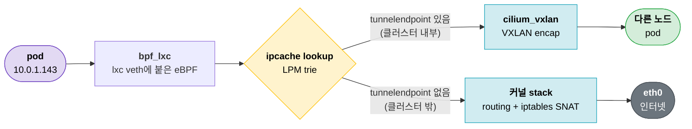
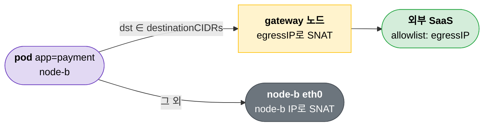

1편에서 VPN의 split tunnel을 정리했다. 사설 대역만 터널로 보내고 나머지는 로컬 인터넷으로 바로 내보내는 구조였다.

k8s pod 네트워크에서도 같은 일이 일어난다. pod가 다른 노드의 pod로 가는 트래픽은 overlay 터널로, 클러스터 밖으로 나가는 트래픽은 노드의 로컬 인터페이스로 그냥 내보낸다. Cilium 기준으로 까보면서 정리해보자.

---

## k8s 클러스터

VPN과 다른 점은 대역을 사람이 적지 않는다는 것이다. pod는 수시로 생기고 사라지니, 각 노드의 CNI agent가 k8s API를 watch하면서 route와 BPF map을 실시간으로 채운다.


```text
cluster-pool 10.0.0.0/8, 노드당 /24

node-a   node IP 172.16.1.21       pod CIDR 10.0.0.0/24
node-b   node IP 192.168.121.166   pod CIDR 10.0.1.0/24
node-c   node IP 192.168.200.2     pod CIDR 10.0.2.0/24   ← 원격 리전, WireGuard로 합류
```

---

## pod 간 통신은 VXLAN 터널로

1편의 WireGuard에서 `10.8.0.3 → 172.16.200.20`을 VPN 서버 공인 IP로 감싸던 것 비슷하다. 바깥 IP가 node IP로 바뀌었을 뿐이다 (VXLAN이라 암호화 x).




---

## 노드 routing table

node-b의 routing table을 보면 1편에서 본 split tunnel과 같은 모양이다.

```bash
$ ip -4 route        # node-b
default via 192.168.121.1 dev eth0                                    ← 클러스터 밖
10.0.0.0/24 via 10.0.1.247 dev cilium_host src 10.0.1.247 mtu 1320    ← node-a pod CIDR
10.0.1.0/24 via 10.0.1.247 dev cilium_host src 10.0.1.247             ← 자기 pod CIDR
10.0.2.0/24 via 10.0.1.247 dev cilium_host src 10.0.1.247 mtu 1320    ← node-c pod CIDR
192.168.121.0/24 dev eth0 scope link src 192.168.121.166
```

- 다른 노드 pod CIDR에만 `mtu 1320`이 붙어 있다. 클러스터 MTU 1370에서 VXLAN header 50 byte를 뺀 값이다. 터널을 타는 대역이라 그만큼 줄여둔다.
- `cilium_host`는 Cilium이 만든 노드 쪽 gateway 인터페이스다. 노드(host)에서 시작한 트래픽은 대략 이 route를 타고 터널로 들어간다.

> pod CIDR → 터널, default → eth0. VPN 클라이언트의 `AllowedIPs`와 같은 구조다.

---

## 실제 결정은 BPF map이 한다

그런데 pod에서 나온 패킷은 이 routing table까지 가기 전에 갈 곳이 이미 정해진다. 

pod의 veth(`lxc*`)에 붙은 eBPF 프로그램이 **ipcache**를 lookup해서, 목적지에 tunnel endpoint가 있으면 바로 encap해서 `cilium_vxlan`으로 redirect해버린다. 커널 routing table은 안 거친다.

```c
// bpf/lib/eps.h (Cilium v1.18.0)
struct {
	__uint(type, BPF_MAP_TYPE_LPM_TRIE);        // longest prefix match
	__type(key, struct ipcache_key);             // prefix
	__type(value, struct remote_endpoint_info);  // identity, tunnel endpoint ...
	...
} cilium_ipcache_v2 __section_maps_btf;
```

```c
// bpf/bpf_lxc.c, handle_ipv4_from_lxc() 요약
info = lookup_ip4_remote_endpoint(ip4->daddr, cluster_id);   // ipcache LPM lookup
...
#if defined(TUNNEL_MODE)
	if (info && info->flag_has_tunnel_ep) {
		ret = encap_and_redirect_lxc(ctx, info, ...);        // VXLAN encap → cilium_vxlan으로 redirect
		...
		return ret;
	}
#endif
	...
	goto pass_to_stack;    // 터널 대상이 아니면 커널 stack으로 (routing table, iptables)
```

ipcache 내용은 `cilium-dbg`로 볼 수 있다.

```text
$ cilium-dbg bpf ipcache list      # node-b, encryptkey 컬럼 생략
IP PREFIX/ADDRESS    IDENTITY
10.0.0.34/32         identity=63454  tunnelendpoint=172.16.1.21    flags=hastunnel   ← node-a의 pod
10.0.0.0/24          identity=2      tunnelendpoint=172.16.1.21    flags=hastunnel   ← node-a pod CIDR 전체
10.0.2.0/24          identity=2      tunnelendpoint=192.168.200.2  flags=hastunnel   ← node-c pod CIDR 전체
10.0.1.143/32        identity=63454  tunnelendpoint=0.0.0.0        flags=<none>      ← 자기 노드 pod
0.0.0.0/0            identity=2      tunnelendpoint=0.0.0.0        flags=<none>      ← 그 외 전부 (world)
```

---

## Egress traffic SNAT

터널을 안 타는 트래픽은 커널 stack으로 넘어가서 노드 IP로 SNAT된 뒤 eth0으로 나간다. pod IP는 클러스터 밖에선 모르는 IP라서 노드가 SNAT해줘야 응답이 돌아온다.

```text
$ iptables -t nat -S CILIUM_POST_nat      # node-b
-A CILIUM_POST_nat -s 10.0.1.0/24 ! -d 10.0.1.0/24 ! -o cilium_+ -m comment --comment "cilium masquerade non-cluster" -j MASQUERADE
```

"이 노드 pod에서 나왔고, 터널 인터페이스(`cilium_+`)로 안 나가면 SNAT"이다. VPN에서는 터널 종단(VPN 서버)이 하던 NAT를, 여기서는 각 노드가 직접 한다.

"어디까지를 클러스터 내부로 보고 SNAT 안 할지"를 정하는 설정은 CNI마다 다르다.

| CNI | 설정 | 의미 |
|---|---|---|
| Cilium | `ipv4NativeRoutingCIDR` | native routing에서 이 대역은 SNAT 없이 보낸다 |
| Cilium (BPF masquerade) | `ipMasqAgent.enabled` + `nonMasqueradeCIDRs` | 이 대역은 SNAT 안 한다 |
| Calico | IPPool `natOutgoing: true` | Calico IP pool 밖으로 나갈 때만 SNAT |

> VPN의 "어디까지 터널로 보낼까"가 여기서는 "어디까지 SNAT 없이 보낼까"가 된다.

---

## Egress Gateway: 필요한 트래픽만 full tunnel처럼

노드마다 SNAT하니까 pod의 egress IP는 **pod가 뜬 노드 IP**가 된다. pod가 다른 노드로 옮겨가면 egress IP도 바뀌고, 외부 SaaS에 걸어둔 IP allowlist가 깨진다. VPN에서 full tunnel을 쓰던 이유(egress IP 고정)가 여기서 다시 나온다.

Egress Gateway는 **특정 pod**가 **특정 목적지**로 갈 때만 gateway 노드로 몰아서 고정 IP로 SNAT한다. split tunnel과 full tunnel 사이 어딘가다.



```yaml
apiVersion: cilium.io/v2
kind: CiliumEgressGatewayPolicy
metadata:
  name: payment-to-pg
spec:
  selectors:
  - podSelector:
      matchLabels:
        app: payment
  destinationCIDRs:          # ≒ AllowedIPs
  - "203.0.113.0/24"
  excludedCIDRs:             # ≒ Exclude private IPs
  - "203.0.113.128/25"
  egressGateway:
    nodeSelector:
      matchLabels:
        egress-gateway: "true"
    egressIP: 198.51.100.10  # gateway 노드 인터페이스에 붙어 있는 IP
```

Cilium Egress Gateway는 `egressGateway.enabled`, `bpf.masquerade`, `kubeProxyReplacement`가 모두 켜져 있어야 한다. 위 예시 클러스터처럼 iptables masquerade에 kube-proxy를 쓰면 바로는 못 쓴다.

---

## CoreDNS: 클러스터 단위 split DNS

DNS도 똑같다. pod의 `/etc/resolv.conf`는 CoreDNS를 가리키고, CoreDNS가 도메인별로 갈 곳을 나눈다. 1편에서 macOS `/etc/resolver`로 하던 걸 클러스터 전체에 한 번에 거는 셈이다.

```corefile
.:53 {
    kubernetes cluster.local in-addr.arpa ip6.arpa {   # *.cluster.local → CoreDNS가 직접 응답
        pods insecure
        fallthrough in-addr.arpa ip6.arpa
    }
    forward . /etc/resolv.conf                         # 그 외 → 노드의 resolver
    cache 30
}
corp.internal:53 {                                     # *.corp.internal → 사설 DNS
    errors
    cache 30
    forward . 172.16.200.53
}
```

| 도메인 | macOS (VPN 클라이언트) | k8s pod |
|---|---|---|
| 사설 도메인 | `/etc/resolver/corp.internal` | `corp.internal:53 { forward . 172.16.200.53 }` |
| 클러스터 내부 | 없음 | `kubernetes cluster.local` plugin |
| 그 외 | 로컬 인터넷의 DNS | `forward . /etc/resolv.conf` (노드 resolver) |

---

## 정리: VPN ↔ k8s 대응

| 개념 | VPN (WireGuard) | k8s (Cilium) |
|---|---|---|
| 터널 | WireGuard (UDP 51820, 암호화) | VXLAN (UDP 8472, 암호화 없음) |
| 어디로 encap할지 | `AllowedIPs` (prefix → peer) | ipcache (prefix → tunnel endpoint) |
| 누가 채우나 | 사람이 설정 파일에 | Cilium agent가 k8s API를 watch하며 |
| 터널 밖 트래픽 | 로컬 gateway로 | 노드 IP로 SNAT 후 eth0 |
| egress IP 고정 | full tunnel | Egress Gateway (`destinationCIDRs`) |
| 도메인별 DNS 분기 | `/etc/resolver`, `resolvectl` | CoreDNS server block |
| 대역 충돌 | 로컬 LAN과 사설망 대역이 겹침 | pod CIDR와 노드/VPC 대역이 겹침 |

> 내부 대역만 터널로, 나머지는 가까운 출구로. VPN이나 k8s나 같다.

---

## 참고

- [WireGuard: Cryptokey Routing](https://www.wireguard.com/#cryptokey-routing) - `AllowedIPs`가 route이자 ACL인 이유
- [WireGuard allowedips.c (Linux kernel)](https://git.kernel.org/pub/scm/linux/kernel/git/torvalds/linux.git/tree/drivers/net/wireguard/allowedips.c) - `AllowedIPs`를 trie로 lookup하는 구현
- [Cilium: Routing (encapsulation / native routing)](https://docs.cilium.io/en/stable/network/concepts/routing/)
- [Cilium: Masquerading](https://docs.cilium.io/en/stable/network/concepts/masquerading/) - `ipv4NativeRoutingCIDR`, ip-masq-agent
- [Cilium: Cluster Scope IPAM](https://docs.cilium.io/en/stable/network/concepts/ipam/cluster-pool/)
- [Cilium: Egress Gateway](https://docs.cilium.io/en/stable/network/egress-gateway/egress-gateway/) - `CiliumEgressGatewayPolicy`, 필요 조건
- [Cilium source: bpf/lib/eps.h (v1.18.0)](https://github.com/cilium/cilium/blob/v1.18.0/bpf/lib/eps.h) - `cilium_ipcache_v2` LPM trie 정의
- [Cilium source: bpf/bpf_lxc.c (v1.18.0)](https://github.com/cilium/cilium/blob/v1.18.0/bpf/bpf_lxc.c) - `handle_ipv4_from_lxc()`의 ipcache lookup과 encap
- [Calico: IP pool (natOutgoing)](https://docs.tigera.io/calico/latest/reference/resources/ippool)
- [Kubernetes: Customizing DNS Service](https://kubernetes.io/docs/tasks/administer-cluster/dns-custom-nameservers/) - CoreDNS stub domain
