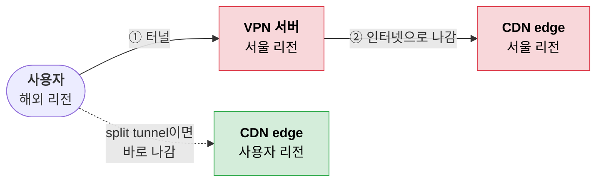
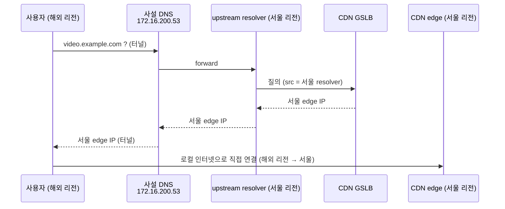
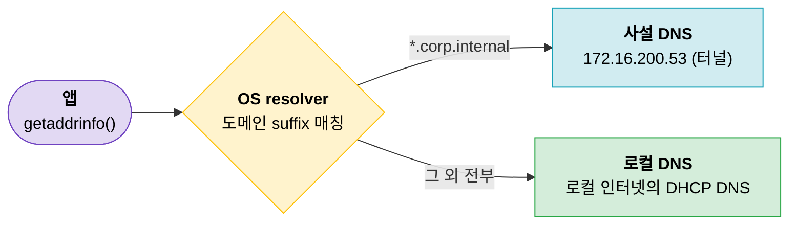

외부에서 사설망(`172.16.0.0/16`)에 WireGuard로 붙어 쓰고 있었는데, 기존엔 모든 트래픽을 모두 터널로 보내고 있어서 지연이 발생했다.

이를 해결하기 위한 사설 대역만 터널로 보내는 split tunnel, 그리고 DNS까지 나누는 split DNS를 정리해보자.

---

## VPN은 기본적으로 전부 터널로 보낸다

밖에서 사설망에 붙을 때는 보통 IPsec이나 WireGuard로 IP 패킷을 한 번 더 감싸서(encap) 보낸다.

```text
inner (원래 패킷)   [ IP 10.8.0.3 → 172.16.200.20 | TCP 443 | payload ]
                                   │ encrypt + encap
                                   ▼
outer (실제 전송)   [ IP 192.168.0.4 → <VPN 서버 공인 IP> | UDP 51820 | WG header | ███ 암호화된 inner ███ ]
```


이때 클라이언트의 default route를 터널로 잡아서 **모든 트래픽**을 터널 종단으로 보내는 게 full tunnel이다. 회사 VPN이 대부분 이렇게 되어 있다.

| 이유           | 설명                                                           |
| ------------ | ------------------------------------------------------------ |
| 보안 모니터링      | 모든 트래픽이 회사 방화벽/프록시를 지나가니 한 곳에서 보고 막을 수 있다                    |
| egress IP 고정 | 외부 SaaS가 회사 공인 IP로 allowlist를 걸어둔 경우, 어디서 접속하든 회사 IP로 나가야 한다 |
| 운영이 단순       | "사설은 어디까지인가"를 관리할 필요 없이 `0.0.0.0/0` 하나면 끝난다                  |

> full tunnel = 내 default gateway가 터널 종단이 된다.

---

## trade off: 인터넷 트래픽이 사설망을 돌아 나간다

문제는 사설망과 상관없는 인터넷 트래픽도 터널 종단을 찍고 나간다는 것이다. 예를 들어 VPN 서버는 서울 리전에 있는데, 해외 리전 사용자가 full tunnel로 붙어 있으면:



- 해외 리전 → 서울 → (CDN) → 서울 → 해외 리전으로 왕복이 한 번 더 붙는다
- GSLB/CDN이 "가까운 서버"를 고르는 기준이 사용자 위치가 아니라 **VPN 서버의 공인 IP 위치**가 된다
- 모든 사용자의 인터넷 트래픽을 **VPN 서버 회선과 서버 하나**가 다 받아내야 한다

> 모니터링이나 egress IP 고정이 목적이 아니라면 이걸 감수할 이유는 별로 없다.

---

## Split tunnel

사설 대역만 터널로 보내고 나머지는 로컬 gateway로 그냥 내보낸다. 핵심은 routing table의 **longest prefix match**다.

```text
routing table (split tunnel)
  172.16.0.0/16   → utun6 (WireGuard)
  10.8.0.0/24     → utun6 (WireGuard)
  0.0.0.0/0       → 192.168.0.1 (en0, 사용자 로컬 인터넷 gateway)

lookup 172.16.200.20   /16, /0 둘 다 매칭 → 더 긴 /16 승   → utun6
lookup 10.8.0.1        /24, /0 둘 다 매칭 → 더 긴 /24 승   → utun6
lookup 142.250.196.14  /0 만 매칭                         → en0
```

터널로 보낼 대역은 사설망이 실제로 쓰는 대역이다. 사내망이면 `10.0.0.0/8` 같은 대역, 여기서는 `172.16.0.0/16`이다.

참고로 full tunnel도 사실 longest match로 동작한다. `wg-quick`은 `0.0.0.0/0`을 받으면 기존 default를 지우지 않고 `0.0.0.0/1` + `128.0.0.0/1` 두 개로 쪼개서 넣는다. 둘 다 `/0`보다 길어서 기존 default를 이겨버린다.

```text
full tunnel (wg-quick)
  0.0.0.0/1       → wg0      ┐ 합치면 전체 IPv4
  128.0.0.0/1     → wg0      ┘ /1 > /0 이라 항상 이김
  0.0.0.0/0       → 192.168.0.1 (남아는 있지만 안 쓰임)
```

### 그럼 이건 서버에서 설정하나?

> split 정책은 서버가 내려줘야 하는 거 아닌가?

VPN마다 다르다. WireGuard는 서버가 클라이언트에 route를 push하는 기능 자체가 없다.

| VPN | 어떤 대역을 터널로 보낼지 누가 정하나 |
|---|---|
| WireGuard | **클라이언트**의 `[Peer] AllowedIPs` |
| OpenVPN | 서버가 `push "route ..."`로 내려준다 (클라이언트가 `route-nopull`로 무시 가능) |
| IPsec (IKEv2) | 양쪽이 traffic selector를 협상해서 정한다 |
| Cloudflare WARP, Tailscale 등 | 관리 콘솔에서 정책을 정하면 클라이언트에 배포된다 |

WireGuard의 `AllowedIPs`는 위치에 따라 의미가 다르다 (WireGuard 문서에서는 이걸 cryptokey routing이라고 부른다).

| 위치 | 나가는 패킷 | 들어오는 패킷 |
|---|---|---|
| 클라이언트의 `[Peer]` (= 서버) | dst가 이 대역이면 이 peer로 보낸다 (**route 추가**) | src가 이 대역인 것만 받는다 |
| 서버의 `[Peer]` (= 클라이언트) | dst가 이 대역이면 이 클라이언트로 보낸다 | src가 이 대역인 것만 받는다 (보통 `10.8.0.3/32`) |

서버 쪽은 클라이언트 터널 IP 하나만 허용하고, IP forwarding과 NAT(masquerade)만 되어 있으면 된다. 지금 full tunnel로 사설망에 이미 붙고 있다면 서버는 건드릴 게 없다.

> split tunnel = 클라이언트 `AllowedIPs`를 좁히는 것. 이게 전부다.

### 클라이언트 설정

```ini
[Interface]
PrivateKey = <client-private-key>
Address = 10.8.0.3/24
DNS = 172.16.200.53            # 아래 DNS 섹션에서 다시 다룬다
MTU = 1420

[Peer]
PublicKey = <server-public-key>
PresharedKey = <psk>
Endpoint = <VPN 서버 공인 IP>:51820
# AllowedIPs = 0.0.0.0/0, ::/0          ← before: full tunnel
AllowedIPs = 172.16.0.0/16, 10.8.0.0/24 # ← after: 사설망 + wg 대역만
PersistentKeepalive = 25
```

- `10.8.0.0/24`는 WireGuard 서버(`10.8.0.1`)나 다른 peer에 붙을 때 필요하다. 안 쓰면 빼도 된다.
- 터널 안에서 IPv6를 쓰면 wg 대역의 IPv6 prefix도 같이 넣는다. `::/0`을 빼면 IPv6 인터넷도 로컬로 나간다.
- macOS WireGuard 앱의 `Exclude private IPs` 체크박스는 반대 방향 옵션이다. full tunnel에서 사설 대역만 **빼는** 거라 여기선 안 쓴다.
- "전부 터널로 보내되 특정 대역만 빼고 싶다"면 `AllowedIPs`에 빼기 연산이 없어서 여집합을 직접 계산해야 한다. 아래 참고의 AllowedIPs calculator를 쓰면 편하다.

### 확인

macOS에서 터널을 켜면 `utun` 인터페이스가 생기고, routing table이 터널 방향으로 나눠진 걸 볼 수 있다.

```bash
$ ifconfig
en0: flags=8863<UP,BROADCAST,SMART,RUNNING,SIMPLEX,MULTICAST> mtu 1500
	inet 192.168.0.4 netmask 0xffffff00 broadcast 192.168.0.255
...
utun6: flags=8051<UP,POINTOPOINT,RUNNING,MULTICAST> mtu 1420
	inet 10.8.0.3 --> 10.8.0.3 netmask 0xffffff00
	inet6 fdcc:ad94:bacf:61a4::cafe:3 prefixlen 112

$ netstat -nr -f inet
Destination        Gateway            Flags               Netif Expire
default            192.168.0.1        UGScg                 en0      ← 실제로 쓰이는 default
default            link#24            UCSIg               utun6      ← I = interface-scoped
10.8/24            10.8.0.3           UGSc                utun6
10.8.0.3           10.8.0.3           UH                  utun6
127                127.0.0.1          UCS                   lo0
172.16             link#24            UCS                 utun6      ← 172.16.0.0/16 → 터널
```

- `172.16`은 `172.16.0.0/16`의 축약 표기다.
- utun6에도 default가 보이지만 `I` 플래그(interface-scoped)가 붙어 있다. utun6에 명시적으로 bind한 소켓만 쓰는 route라 일반 lookup에는 안 걸린다.

목적지별로 실제 어디로 나가는지는 `route get`으로 바로 보인다.

```bash
$ route -n get 172.16.200.20 | grep interface
  interface: utun6     # 터널
$ route -n get 8.8.8.8 | grep interface
  interface: en0       # 로컬 gateway
```

---

## 그럼 DNS는?

사설망에서 도메인 기반으로 서비스를 굴리다 보면 사설 DNS를 두게 된다. 예를 들어 사설 DNS(`172.16.200.53`)가 `corp.internal` zone을 들고 있고, 나머지 도메인은 upstream resolver로 forward한다.

```text
grafana.corp.internal   → 172.16.200.20   (사설 DNS가 직접 응답)
youtube.com             → forward → upstream resolver
```

그래서 클라이언트에 `DNS = 172.16.200.53`을 넣는데, 이러면 **모든** DNS 질의가 터널을 타고 사설 DNS로 간다 (macOS/iOS WireGuard 앱은 `DNS =`를 넣으면 시스템 DNS 전체를 그걸로 바꿔버린다). route는 split 했는데 DNS는 여전히 full tunnel인 셈이다.



트래픽은 사설망을 안 거치지만 **목적지를 고르는 기준이 여전히 사설망 위치**다. GSLB는 질의를 보낸 resolver 위치(혹은 EDNS Client Subnet)를 보고 가까운 edge를 고르는데, 여기선 둘 다 서울 리전 기준이라 해외 리전 사용자가 서울 edge로 붙게 된다.

> 경로는 split 됐는데 DNS가 사설망에 있으면 GSLB 입장에서 사용자는 여전히 서울 리전에 있다.

### Split DNS

route처럼 DNS도 나눈다. `corp.internal`만 사설 DNS로, 나머지는 사용자 로컬 인터넷의 DNS로 보낸다.



WireGuard 설정 파일만으로는 이게 안 되니 OS의 per-domain resolver 기능을 쓴다. 공통으로 WireGuard 설정의 `DNS =` 줄은 지운다.

| OS | 방법 |
|---|---|
| macOS | `/etc/resolver/<도메인>` 파일 |
| Linux (systemd-resolved) | `resolvectl`로 인터페이스에 routing domain(`~도메인`) 지정 |
| Windows | NRPT (Name Resolution Policy Table) |

**macOS**

```bash
sudo mkdir -p /etc/resolver
echo "nameserver 172.16.200.53" | sudo tee /etc/resolver/corp.internal
```

```bash
$ scutil --dns | grep -A3 'corp.internal'
  domain   : corp.internal
  nameserver[0] : 172.16.200.53
  flags    : Request A records, Request AAAA records

$ dscacheutil -q host -a name grafana.corp.internal
name: grafana.corp.internal
ip_address: 172.16.200.20
```

`dig`, `nslookup`은 `/etc/resolv.conf`를 직접 읽고 시스템 resolver를 안 거친다. `/etc/resolver` 설정을 확인할 땐 `dscacheutil`이나 `ping`, 브라우저로 본다.

**Linux (wg-quick + systemd-resolved)**

```ini
[Interface]
...
# DNS = 172.16.200.53   ← 지운다 (넣으면 전체 DNS를 가져간다)
PostUp = resolvectl dns %i 172.16.200.53; resolvectl domain %i ~corp.internal
```

`%i`는 wg-quick이 인터페이스 이름(`wg0`)으로 바꿔준다. `~`가 붙은 도메인은 search domain이 아니라 "이 도메인 질의는 이 인터페이스 DNS로 보내라"는 routing domain이다.

```bash
$ resolvectl status wg0
Link 5 (wg0)
    Current Scopes: DNS
       DNS Servers: 172.16.200.53
        DNS Domain: ~corp.internal
```

**Windows**

```powershell
Add-DnsClientNrptRule -Namespace ".corp.internal" -NameServers "172.16.200.53"
```

| 항목 | full tunnel | split tunnel | split tunnel + split DNS |
|---|---|---|---|
| 인터넷 트래픽 | 사설망 경유 | 로컬로 바로 | 로컬로 바로 |
| DNS 질의 | 사설 DNS | 사설 DNS (터널) | `corp.internal`만 사설 DNS, 나머지 로컬 |
| GSLB가 보는 사용자 위치 | VPN 서버 리전 | VPN 서버 리전 | 사용자 리전 |
| 공용 Wi-Fi에서 보호 범위 | 전부 암호화 | 사설 대역만 | 사설 대역만 (DNS 질의도 로컬에 노출) |
| VPN 서버 회선 부담 | 전부 | 사설 트래픽만 | 사설 트래픽만 |

> route는 `AllowedIPs`로, DNS는 OS resolver로 나눈다. 둘 다 해야 사설만 사설망으로 가고 나머지는 사용자 로컬 인터넷으로 나간다.

---

### K8S에서의 cont


## 참고

- [WireGuard: Cryptokey Routing](https://www.wireguard.com/#cryptokey-routing) - `AllowedIPs`가 route이자 ACL인 이유
- [WireGuard: Routing & Network Namespace Integration](https://www.wireguard.com/netns/) - `0.0.0.0/1` + `128.0.0.0/1`로 default route를 덮는 방식
- [WireGuard Whitepaper](https://www.wireguard.com/papers/wireguard.pdf)
- [wg-quick(8) man page](https://git.zx2c4.com/wireguard-tools/about/src/man/wg-quick.8) - `DNS`, `PostUp`, `%i`
- [WireGuard AllowedIPs Calculator (Pro Custodibus)](https://www.procustodibus.com/blog/2021/03/wireguard-allowedips-calculator/) - 특정 대역을 뺀 AllowedIPs 계산
- [Arch Wiki: WireGuard](https://wiki.archlinux.org/title/WireGuard)
- [wg-easy](https://github.com/wg-easy/wg-easy) - 웹 UI로 WireGuard 서버/peer 관리
- [IPsec 정리 (cocopam)](https://cocopam.tistory.com/48)
- [OpenVPN 2.4 Reference Manual](https://openvpn.net/community-resources/reference-manual-for-openvpn-2-4/) - `push "route"`, `route-nopull`
- [Cloudflare WARP: Split Tunnels](https://developers.cloudflare.com/cloudflare-one/connections/connect-devices/warp/configure-warp/route-traffic/split-tunnels/) - 상용 제품에서 include/exclude 모드로 split tunnel을 다루는 방식
- [RFC 1918: Address Allocation for Private Internets](https://datatracker.ietf.org/doc/html/rfc1918) - 사설 대역 정의
- [RFC 7871: Client Subnet in DNS Queries (ECS)](https://datatracker.ietf.org/doc/html/rfc7871) - GSLB가 클라이언트 위치를 추정하는 방법
- [macOS resolver(5) man page](https://www.manpagez.com/man/5/resolver/) - `/etc/resolver` 파일 형식
- [systemd-resolved and VPNs](https://systemd.io/RESOLVED-VPNS/) - routing domain(`~domain`)으로 split DNS 구성
- [resolvectl(1)](https://www.freedesktop.org/software/systemd/man/latest/resolvectl.html)
- [Add-DnsClientNrptRule (Microsoft Learn)](https://learn.microsoft.com/en-us/powershell/module/dnsclient/add-dnsclientnrptrule) - Windows NRPT
- [Tailscale: DNS (split DNS)](https://tailscale.com/kb/1054/dns)
