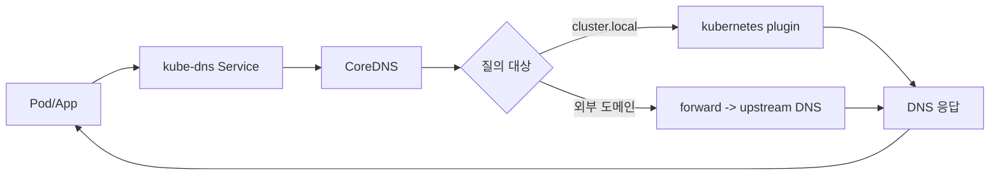
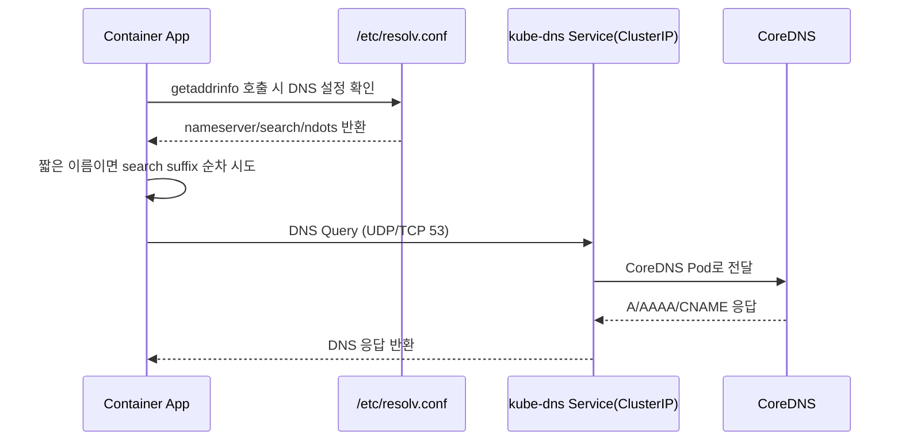
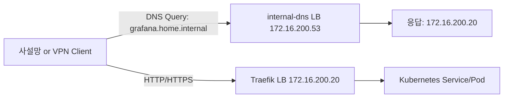

### 배경

k8s 서비스를 사설망에서 접근할 때,
매번 MetalLB IP를 직접 확인해서 써야 했다.

또 Traefik Host 기반 reverse proxy를 쓰고 있어서,
접근하려는 도메인을 서비스마다 수동 매핑해야 했다.

서비스가 늘어날수록 관리 포인트가 계속 늘어났고,
이름 해석/매핑 역할을 CoreDNS로 넘기는 방식으로 정리했다.

### CoreDNS가 하는 일

CoreDNS는 Kubernetes 기본 DNS 서버다.

![[Pasted image 20260222150751.png]]

- 서비스 디스커버리: `service.namespace.svc.cluster.local`
- Pod DNS 자동 구성: Pod의 `/etc/resolv.conf`에 `kube-dns` 주소 주입
- Stateful 워크로드 DNS: headless service 기반 Pod 레코드 제공

현재 클러스터 기준 기본 DNS 엔드포인트는 아래다.

- `kube-system/kube-dns` (ClusterIP: `10.96.0.10`)

### 기본 동작 방식

CoreDNS는 보통 `kube-system` 네임스페이스의 Deployment로 동작하고,
ConfigMap(`Corefile`)에 정의한 플러그인 체인으로 질의를 처리한다.

자주 쓰는 플러그인은 다음과 같다.

- `kubernetes`: cluster.local 레코드 처리
- `forward`: 외부 도메인을 상위 DNS로 전달
- `cache`: 질의 결과 캐시

#### CoreDNS 작동 로직 (Mermaid)



#### Pod 내부 `resolv.conf` 기준 질의 로직

컨테이너는 `/etc/resolv.conf`를 보고 DNS 질의를 보낸다.

일반적인 Pod 설정 예시는 아래와 같다.

```conf
nameserver 10.96.0.10
search default.svc.cluster.local svc.cluster.local cluster.local
options ndots:5
```

- `nameserver`: DNS 서버 주소 (`kube-dns`)
- `search`: 짧은 이름 조회 시 붙는 suffix
- `ndots`: 절대도메인(FQDN)로 볼지 판단하는 기준



참고로 외부 인터넷 접속 시에도 DNS 조회는 CoreDNS를 거칠 수 있지만,
실제 HTTP/TCP 트래픽은 조회된 IP로 직접 통신한다.

### 왜 Service를 IP 대신 도메인으로 쓰는가

핵심은 "변하는 값은 숨기고, 고정된 이름으로 접근"하기 위해서다.

- Pod IP는 재시작/재스케줄링 때 자주 바뀜
- Service 이름은 고정이고, 뒤의 Pod 집합만 동적으로 교체됨
- 환경(dev/stg/prod) 간 IP 대역이 달라도 이름은 동일하게 유지 가능

그래서 앱 설정에는 IP 하드코딩보다 DNS 이름을 쓰는 게 운영이 훨씬 쉽다.

## 사설망에 Core DNS 활용하기

구성은 크게 두 층으로 나눴다.

1. 클러스터 내부 기본 DNS: `kube-dns` (`10.96.0.10`)
2. 사설망 클라이언트용 DNS: `internal-dns` (`172.16.200.53`)

즉, 내부용과 외부(사설망)용 역할을 분리했다.

#### 1) 사설망 전용 CoreDNS 노출

`internal-dns` 네임스페이스에 전용 CoreDNS를 배치하고,
Service를 LoadBalancer로 노출했다.

- Service: `internal-dns/internal-dns`
- Type: `LoadBalancer`
- LB IP: `172.16.200.53`
- Port: `53/UDP`, `53/TCP`

#### 2) 사설망 Zone(`home.internal`) 구성

사설망에서 쓸 이름은 `home.internal` 존으로 분리했다.

`internal-dns-corefile` 핵심 설정:

```corefile
home.internal:53 {
  log
  errors
  file /etc/coredns/zones/home.internal.db home.internal
  header {
    response set ra
  }
}

.:53 {
  log
  errors
  health
  ready
  cache 30
  forward . 1.214.68.2 61.41.153.2
}
```

- 여기서 foward dns 주소는 통신사(유플러스) dns 주소

`internal-dns-zone`의 주요 레코드:

```zone
$ORIGIN home.internal.
ns1     IN A 172.16.200.53
traefik IN A 172.16.200.20
hubble  IN A 172.16.200.20
n8n     IN A 172.16.200.20
grafana IN A 172.16.200.20
```

#### 3) 공유기 DHCP에서 DNS 배포

각 클라이언트 수동 설정을 피하려고,
공유기 DHCP Option 6의 DNS를 `172.16.200.53`으로 설정했다.

![[Pasted image 20260222153908.png]]

- Primary DNS: `172.16.200.53`
- Secondary DNS: 필요 시 내부 DNS만 추가

#### 4) MetalLB 대역 정적 라우팅

내 환경의 MetalLB 풀은 아래 두 IP를 사용한다.

- `172.16.200.20/32` (Traefik LB)
- `172.16.200.53/32` (internal-dns LB)

![[Pasted image 20260222153934.png]]

다른 서브넷에서도 접근되도록 공유기에 정적 라우팅을 추가했다.

- 대상 대역: `172.16.200.0/24` (또는 `/32` host route 2개)
- 다음 홉: MetalLB를 광고하는 노드(`soyo`)의 LAN IP

현재 `L2Advertisement`가 `soyo`에 고정되어 있어,
다음 홉도 해당 노드를 기준으로 잡았다.

#### 5) WireGuard VPN에서도 사설 DNS 사용

외부에서 WireGuard로 붙을 때도 내부 도메인을 쓰기 위해,
클라이언트 설정에 DNS를 명시했다.

```ini
[Interface]
Address = <vpn-client-ip>/32
PrivateKey = <client-private-key>
DNS = 172.16.200.53

[Peer]
PublicKey = <server-public-key>
Endpoint = <vpn-endpoint>:51820
AllowedIPs = 172.16.200.0/24
PersistentKeepalive = 25
```

- 핵심: `DNS = 172.16.200.53`
- Split tunnel이면 DNS/LB 대역이 `AllowedIPs`에 포함되어야 함
- Full tunnel이면 DNS 질의도 자동으로 VPN 경로 사용

#### 6) 전체 흐름 요약



정리하면,
DNS는 `172.16.200.53`에서 이름만 해석하고,
실제 서비스 트래픽은 `172.16.200.20`으로 들어간다.

#### 7) 검증

사설망 클라이언트/VPN 클라이언트에서 아래 순서로 확인했다.

```bash
dig +short @172.16.200.53 grafana.home.internal
dig +short @172.16.200.53 traefik.home.internal
dig +short @172.16.200.53 google.com
nslookup grafana.home.internal
wg show
```

확인 포인트는 다음이다.

- `home.internal` 질의가 `172.16.200.20`으로 응답되는지
- 외부 도메인도 forward를 통해 정상 조회되는지
- DHCP/WireGuard 경로에서도 동일한 DNS 결과가 나오는지

![[Pasted image 20260222154016.png]]
