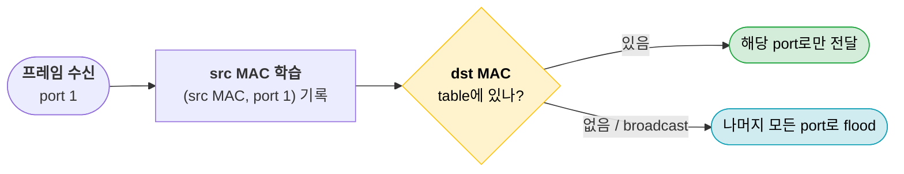
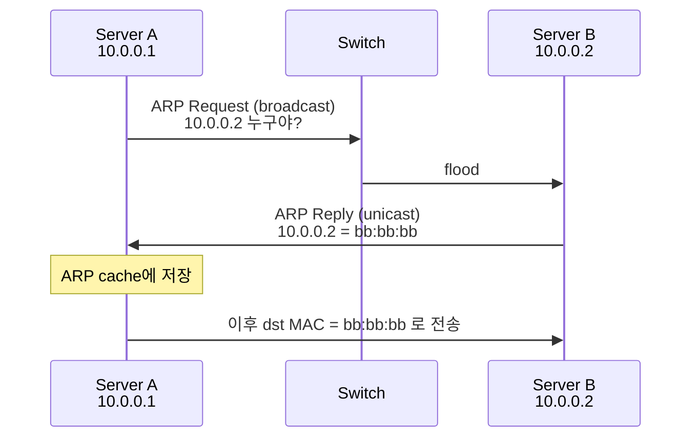
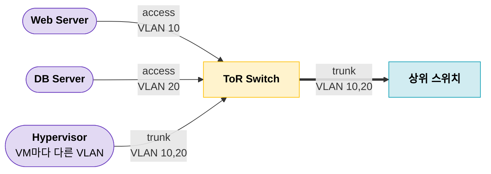
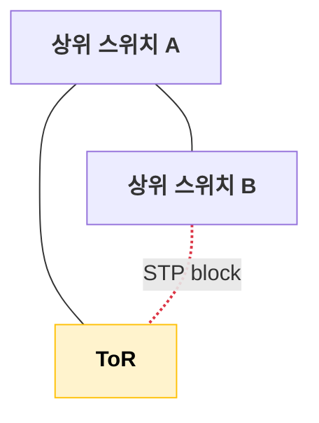
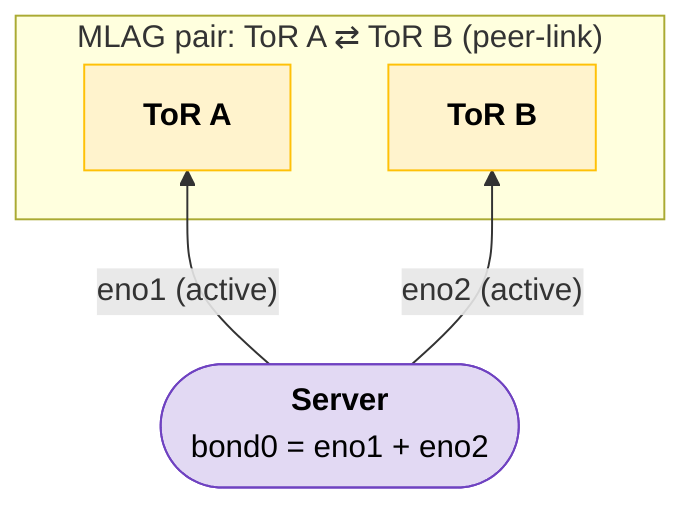

1편에서 랙에 서버와 스위치를 놓고 케이블까지 다 꽂았다. 근데 아직 이 장비들끼리 통신은 안 된다.

2편은 L2, 같은 망 안에서 프레임을 주고받는 부분이다.

---

## L2, 뭘 알아야 하나

수업에선 L2를 Ethernet 프레임, MAC 주소, 오류 검출(CRC) 정도로 배운다. 실무에서 L2를 만질 일은 크게 세 가지다.

- 스위치가 프레임을 어떻게 보내는지 (MAC learning, ARP)
- 망을 어떻게 쪼개는지 (VLAN)
- 링크와 스위치를 어떻게 이중화하는지 (STP, LACP, MLAG)

---

## 스위치는 어떻게 프레임을 보내나

L2에서 주고받는 단위는 Ethernet 프레임이다.

```text
+---------+---------+-----------+--------------+-----+
| Dst MAC | Src MAC | EtherType | Payload      | FCS |
|   6B    |   6B    |    2B     | 46 ~ 1500B   | 4B  |
+---------+---------+-----------+--------------+-----+
```

Payload 최대 1500B가 흔히 말하는 MTU다. (DC 안에선 9000B jumbo frame도 많이 쓴다)

스위치는 처음부터 누가 어느 포트에 있는지 알지 못한다. 프레임이 들어올 때마다 배운다.



> 스위치는 src MAC으로 배우고, dst MAC을 보고 보낸다.

---

## ARP: IP로 MAC 찾기

서버는 상대를 IP로 알고 있는데, 프레임을 보내려면 MAC이 필요하다. 이걸 이어주는 게 ARP다.



상대가 다른 대역이면 상대 MAC이 아니라 gateway MAC을 찾는다.

```text
dst IP       ARP target
10.0.0.2     10.0.0.2     같은 대역 -> 직접
8.8.8.8      10.0.0.254   다른 대역 -> gateway로
```

그래서 밖으로 나가는 프레임은 이렇게 생겼다.

```text
dst MAC = gateway MAC   (바로 다음 hop, hop마다 바뀐다)
dst IP  = 8.8.8.8       (최종 목적지, 안 바뀐다)
```

> MAC은 바로 다음 hop, IP는 최종 목적지다.

### GARP

on-prem에서 서비스 VIP를 keepalived(VRRP)로 이중화하면 ARP가 바로 골치 아파진다. master가 죽고 VIP가 backup으로 넘어가도, 주변 장비 ARP cache엔 옛날 MAC이 남아 있다.

그래서 VIP를 가져간 쪽이 GARP(Gratuitous ARP)를 broadcast로 쏴서 직접 알린다.

```text
Before : 10.0.0.100 (VIP) -> aa:aa:aa  (Server A, master)
GARP   : "10.0.0.100 is at bb:bb:bb"   (Server B가 broadcast)
After  : 10.0.0.100 (VIP) -> bb:bb:bb  (Server B, 새 master)
```

---

## VLAN: 망 쪼개기

> 스위치 하나에 다 물려 있으면 뭐가 문제지?

ARP 같은 broadcast는 같은 L2 망 전체에 뿌려진다. 웹 서버, DB, 관리망이 한 망에 있으면 broadcast도 다 같이 맞고, L2로 서로 다 보인다. 그렇다고 용도마다 스위치를 따로 사기엔 돈이 아깝다.

그래서 스위치 하나를 논리적으로 여러 개로 쪼갠다. 이게 VLAN이다.



> VLAN 하나 = broadcast domain 하나. 보통 subnet 하나와 1:1로 맞춘다.

스위치끼리는 프레임에 VLAN 번호를 붙여서 보낸다. (802.1Q tag)

```text
untagged : [Dst MAC][Src MAC]                [EtherType][Payload][FCS]
tagged   : [Dst MAC][Src MAC][  802.1Q tag  ][EtherType][Payload][FCS]
                             |              |
                             TPID(0x8100) + PCP + DEI + VID(12bit) = 4B
```

| 항목 | Access port | Trunk port |
| --- | --- | --- |
| 연결 대상 | 일반 서버 | 스위치 ↔ 스위치, 하이퍼바이저 |
| VLAN 수 | 1개 | 여러 개 |
| 프레임 | untagged (스위치가 tag를 붙이고 뗀다) | tagged |

스위치 설정으로 보면 이 정도다. (Cisco NX-OS 기준)

```text
interface Ethernet1/1
  switchport mode access
  switchport access vlan 10

interface Ethernet1/49
  switchport mode trunk
  switchport trunk allowed vlan 10,20
```

VID가 12bit라 쓸 수 있는 VLAN은 1 ~ 4094, 4094개가 한계다. 고객마다 VLAN을 하나씩 나눠주는 CSP라면 금방 바닥난다. 나중에 VXLAN(24bit, 약 1600만 개)이 나오는 이유다.

---

## Loop와 STP

> ToR를 상위 스위치 두 대에 이중으로 붙이면 되는 거 아닌가?

물리적으로 이중화하는 순간 루프가 생긴다.



ToR가 ARP broadcast 하나를 A, B로 flood하면, A는 B로, B는 다시 ToR로 넘기고 이게 계속 돈다.

```text
ToR -> A -> B -> ToR -> A -> B -> ...
```

> L2 프레임엔 TTL이 없다. 루프가 하나라도 생기면 broadcast가 끝없이 돌면서 망 전체가 죽는다. (broadcast storm)

STP는 스위치끼리 정보를 주고받아서 루프를 만드는 포트 하나를 막아버린다. 루프는 사라지는데 대신 이런 문제가 남는다.

- 비싸게 깐 uplink 절반이 그냥 논다
- 장애가 나면 block을 푸는 데 시간이 걸린다 (802.1D 기준 30~50초, RSTP도 수 초)

> STP는 루프를 막아줄 뿐, 대역폭은 못 늘린다.

---

## LAG, MLAG: 링크 놀리지 않고 이중화하기

LAG(Link Aggregation)는 물리 링크 여러 개를 논리 링크 하나로 묶는다. STP 입장에선 링크가 하나로 보이니 block할 게 없다. 묶음을 양쪽이 협상하는 프로토콜이 LACP(802.3ad)다.

근데 LAG는 장비 1대 ↔ 1대 사이에서만 묶인다. 상대 스위치가 한 대면 그 스위치가 죽을 때 같이 끝난다. SPOF

그래서 스위치 두 대를 상대에게 한 대처럼 보이게 만든 게 MLAG다. (Cisco는 vPC, 벤더마다 이름이 다르다)



- 이렇게 스위치 A,B가 둘중 하나만 죽거나 점검을 진행할때도 서버는 문제없이 통신이 가능하다

서버는 두 링크를 bond로 묶어서 LACP로 붙는다. 서버 입장에선 스위치 한 대랑 LAG를 맺은 것과 똑같다.

```yaml
# /etc/netplan/01-bond.yaml
network:
  version: 2
  ethernets:
    eno1: {}
    eno2: {}
  bonds:
    bond0:
      interfaces: [eno1, eno2]
      parameters:
        mode: 802.3ad              # LACP
        lacp-rate: fast
        transmit-hash-policy: layer3+4
```

| 항목 | STP | LAG (LACP) | MLAG |
| --- | --- | --- | --- |
| 링크 | 하나는 block | 전부 active | 전부 active |
| 상대 스위치 장애 | block 풀릴 때까지 대기 | 상대가 1대라 같이 끊김 | 남은 1대로 계속 |
| 묶는 범위 | - | 장비 1대 ↔ 1대 | 장비 1대 ↔ 2대 |

묶었다고 대역폭이 그냥 두 배가 되진 않는다. 트래픽을 flow 단위로 hash해서 링크를 고른다.

```text
flow 1  10.0.0.1:50001 -> 10.0.0.9:443  -> hash -> eno1
flow 2  10.0.0.1:50002 -> 10.0.0.9:443  -> hash -> eno2
flow 3  10.0.0.1:50003 -> 10.0.0.9:443  -> hash -> eno1
```

> 묶어도 한 flow는 한 링크로만 간다. 10G 두 개를 묶어도 연결 하나는 10G가 최대다.


