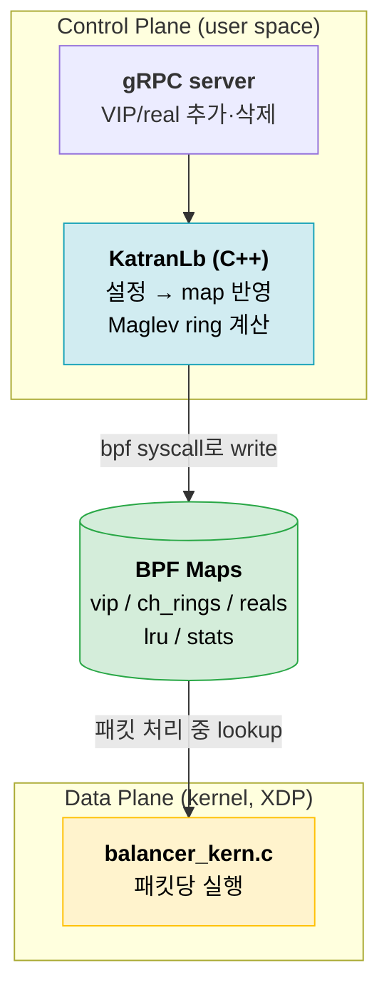
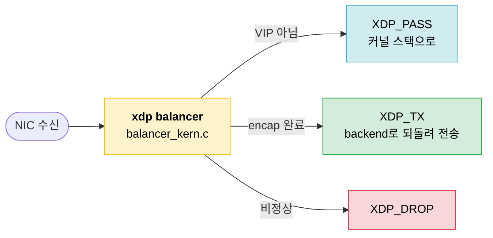
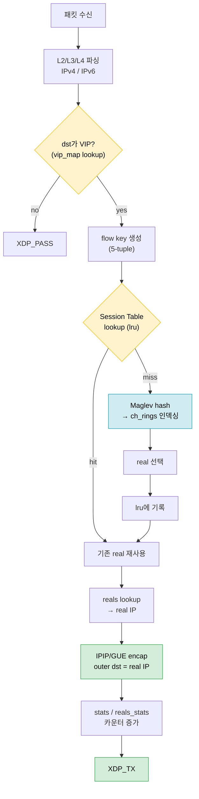
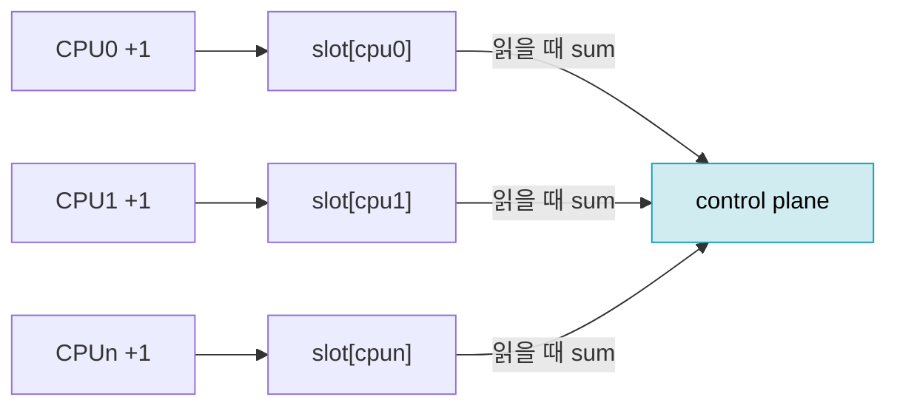
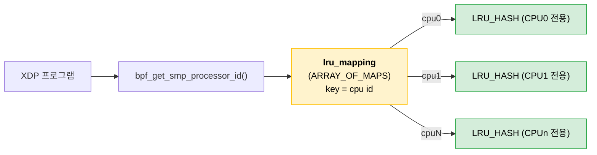
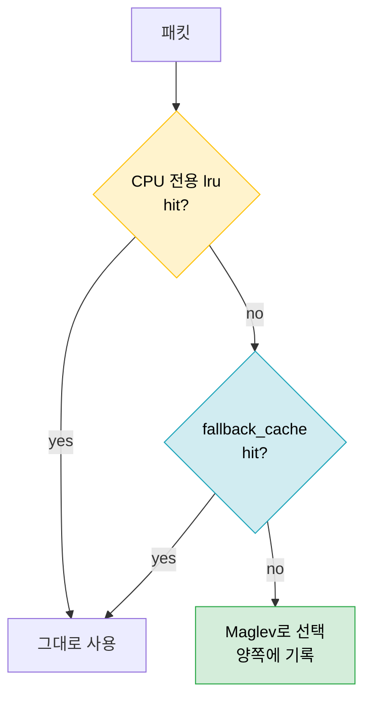
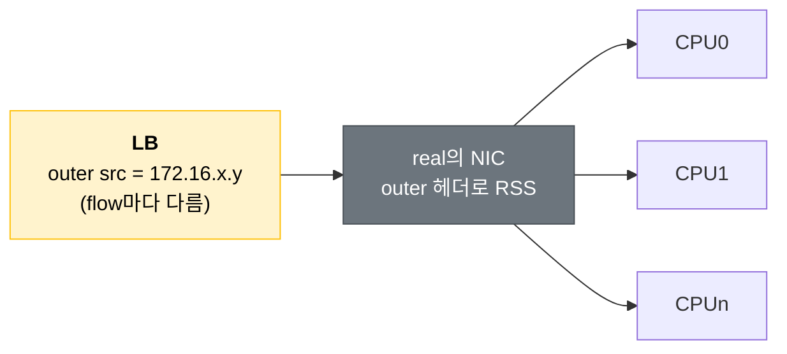
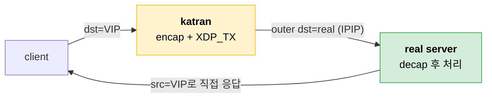

이전 포스트에서 정리한 XDP, DSR/IPIP, RSS, Session Table, Maglev가 실제로 어떻게 구현되는지 **Katran** 코드를 까보면서 확인해보자.

## Katran Overview



Katran은 크게 두 컴포넌트로 이루어진다.

### Data Plane

메인 로드밸런싱 로직을 처리하는 부분이다.

NIC 드라이버의 XDP hook에 붙어서, 패킷이 커널 네트워크 스택에 올라가기 전에 곧바로 NIC으로 TX 해버린다.
![[Pasted image 20260704145603.png]]

BPF Map을 확인해 로드밸런싱이 필요한 패킷만 IPIP encap 하고, 나머지는 커널 스택으로 올려보낸다.

### Control Plane
user space 애플리케이션으로, backend 추가/삭제 같은 설정 변경을 담당한다.

설정이 바뀌면 BPF map을 업데이트해서, data plane이 로드밸런싱할 backend 목록을 바꾼다.


> 둘은 **BPF Map을 사이에 두고만 만난다**. control plane은 map을 쓰고, data plane은 map을 읽는다.

> BPF Maps??

eBPF는 커널 안에서 코드를 실행할 수 있게 해주고, 커널과 user space 양쪽에서 접근 가능한 자료구조인 Map을 제공한다. Katran이 쓰는 map type들은 아래 섹션에서 정리한다.

|     | Control Plane          | Data Plane            |
| --- | ---------------------- | --------------------- |
| 위치  | user space (C++)       | kernel (XDP)          |
| 언어  | C++ / libbpf           | C → BPF bytecode      |
| 빈도  | 설정 변경 시                | 패킷마다                  |
| 역할  | map 작성, ring 계산, 통계 수집 | lookup, 선택, encap, 전송 |
| 상태  | 갖지 않음(전부 map)          | 갖지 않음(전부 map)         |


---
## 무중단 XDP hook 부착


## XDP hook

진입점은 NIC 드라이버에 attach된 XDP 프로그램 하나다. 반환값으로 패킷의 운명이 정해진다.



> DSR이므로 응답 경로는 없다. LB가 하는 건 요청을 encap해서 `XDP_TX`로 backend에 쏘는 것까지다. 응답은 Real Server가 Client로 직접 보낸다.

---

## Dataplane 패킷 처리 flow

배경 1편의 Session Table → Maglev 흐름이 여기서 그대로 코드가 된다.



```text
parse → VIP? → 연결 있으면 재사용 / 없으면 Maglev로 선택 → encap → XDP_TX
```

> 정상 트래픽의 절대다수는 **lru hit** 경로로 빠진다. Maglev 계산은 새 연결(또는 lru miss)일 때만 탄다.

> Session Table이 왜 필요할까?

운영 중인 LB에서는 backend 목록이 수시로 바뀐다. (health check fail, scale out 등)

backend가 바뀌어도 기존 연결의 패킷은 원래 가던 backend로 계속 가야 한다. (TCP처럼 stateful한 통신일수록 더욱)

물론 뒷단의 Maglev 해시도 5-tuple 기반이라 웬만하면 같은 backend가 나오지만, ring이 다시 계산되면 일부 flow는 다른 backend로 옮겨간다. 그래서 앞단에서 session table을 먼저 확인해 더 확실하게 sticky한 session을 보장한다.

---

## eBPF map 종류

Katran의 map은 크게 **포워딩용**과 **통계용**으로 나뉜다. (실제 `balancer_maps.h` 기준)

### 포워딩 (lookup으로 backend를 찾는다)

| Map | 타입 | 저장 내용 |
| --- | --- | --- |
| `vip_map` | `HASH` | VIP → vip 메타(번호, flag) |
| `ch_rings` | `ARRAY` | **Maglev ring**: (vip, hash) → real index |
| `reals` | `ARRAY` | real index → real 서버 IP/flag |
| `lru_mapping` | `ARRAY_OF_MAPS` | **CPU별 Session Table**(아래에서 자세히) |
| `fallback_cache` | `LRU_HASH` | per-CPU lru가 빗나갈 때의 공용 백업 |
| `ctl_array` | `ARRAY` | mac 등 제어값 |

### 통계 (전부 `PERCPU_ARRAY`)

| Map | 타입 | 저장 내용 |
| --- | --- | --- |
| `stats` | `PERCPU_ARRAY` | VIP 단위 패킷/바이트 |
| `reals_stats` | `PERCPU_ARRAY` | real 단위 패킷/바이트 |
| `lru_miss_stats` | `PERCPU_ARRAY` | lru miss 카운트 |

> **통계가 전부 `PERCPU_ARRAY`인 이유**: CPU마다 자기 복사본에 락 없이 더하기만 하면 된다. 합산은 user space(control plane)가 읽을 때 한 번에 한다. 패킷당 atomic/lock이 없다.



---

## PER-CPU session table

여기가 Katran 설계에서 제일 재밌는 부분이다.

연결 추적 테이블은 **CPU마다 따로** 둔다. 그런데 이름만 보면 `LRU_PERCPU_HASH`를 쓸 것 같은데, 실제로는 **`ARRAY_OF_MAPS` 안에 CPU별 `LRU_HASH`를 하나씩** 넣는 구조다.



```text
cpu = bpf_get_smp_processor_id();
lru = lookup(lru_mapping, cpu);   // 이 CPU 전용 LRU_HASH
real = lookup(lru, flow_key);     // 그 안에서 연결 조회
```

### 왜 CPU별로 쪼개나

이전 포스트에서 설명한 **RSS** 때문이다.

NIC이 5-tuple을 해시해 연결을 CPU에 고정하므로, **한 연결의 패킷은 항상 같은 CPU = 같은 inner LRU**로 온다. 그래서 CPU끼리 테이블을 공유할 필요가 없다.


### 왜 `LRU_PERCPU_HASH`가 아닌가

| 구조 | key | value | 문제/이점 |
| --- | --- | --- | --- |
| `LRU_PERCPU_HASH` | 모든 CPU 공유 | **CPU마다 별도** | 한 연결의 value가 CPU 수만큼 복제 → 메모리 ×N, 의미상 불필요 |
| `ARRAY_OF_MAPS` + `LRU_HASH` (Katran) | 바깥에서 CPU별 분리 | 단일 값 | 이미 CPU 전용이라 value 복제 불필요, "한 연결 → 한 real"이 그대로 단일 값 |

- 바깥(`ARRAY_OF_MAPS`)에서 이미 **CPU별로 인스턴스가 분리**돼 있다 → 안쪽까지 per-CPU일 이유가 없다.
- `LRU_PERCPU_HASH`라면 key는 공유하면서 value를 CPU 수만큼 들고 있어, 정작 그 연결을 만지는 CPU는 하나인데 **메모리만 N배** 쓴다.
- 우리가 원하는 값은 "이 연결이 가야 할 real **하나**"다. 일반 `LRU_HASH`의 단일 value가 정확히 그 의미다.

### 그래도 빗나가면? fallback_cache

RSS 가정이 항상 성립하는 건 아니다. 큐 재해시, CPU 수 초과, `XDP_REDIRECT`로 CPU가 바뀌는 경우가 있다. 그래서 **공용 `fallback_cache (LRU_HASH)`** 를 하나 더 둔다.



> per-CPU 테이블은 **속도(락 없음)** 를 위해, fallback은 **정확성(연결이 다른 CPU로 가도 유지)** 을 위해 둔다.

---

## Maglev 해시

lru miss일 때 타는 경로다. ring 자체는 **control plane(C++)이 미리 계산**해서 `ch_rings`에 써두고, data plane은 패킷당 **배열 인덱싱 한 번**만 한다.

### ring 생성 (control plane)

`MaglevHash::generateHashRing`(`MaglevHash.cpp`)이 만든다. real마다 MurmurHash3로 `offset`/`skip`을 뽑아 **자기만의 slot 선호 순서**를 만들고, 라운드로빈으로 빈 slot을 하나씩 가져간다.

```c
// MaglevBase.cpp — real마다 고유한 순회 순서
offset = MurmurHash3(real.hash, seed_a) % ring_size;
skip   = MurmurHash3(real.hash, seed_b) % (ring_size - 1) + 1;
// i번째 선호 slot = (offset + i * skip) % ring_size
```

ring_size 7로 줄인 예시 (실제 기본값은 `RING_SIZE 65537`, 소수):

```text
B0: offset=3, skip=4  →  선호 순서: 3, 0, 4, 1, 5, 2, 6
B1: offset=0, skip=2  →  선호 순서: 0, 2, 4, 6, 1, 3, 5
B2: offset=3, skip=1  →  선호 순서: 3, 4, 5, 6, 0, 1, 2

라운드마다 각자 "선호 순서상 아직 빈 slot"을 하나씩 가져간다.

round 1:  B0→3    B1→0    B2→(3 점유라 패스)→4
round 2:  B0→(0,4 점유)→1    B1→2    B2→5
round 3:  B0→(5,2 점유)→6    ... 7칸 다 참 → 종료

slot   :  0   1   2   3   4   5   6
backend:  B1  B0  B1  B0  B2  B2  B0
```

여기서 B2가 죽어서 빠지면 (남은 B0, B1로 다시 fill):

```text
slot     :  0   1   2   3   4   5   6
B2 제거 전:  B1  B0  B1  B0  B2  B2  B0
B2 제거 후:  B1  B0  B1  B0  B0  B0  B1
            =   =   =   =   x   x   x

= 유지   x 변경 (B2 몫 2칸 + 덤으로 1칸)
```

> real이 빠져도 남은 real들의 `offset`/`skip`은 그대로라 선호 순서가 안 바뀐다. 그래서 빠진 real 몫 위주로만 재배치되고 나머지는 거의 그대로다. 기본값인 65537칸 ring에서는 엉뚱하게 옮겨가는 slot이 대략 1% 수준이다.

원 논문과 달리 Katran은 **weight**도 지원한다. 첫 라운드에서 weight 수만큼 slot을 연달아 가져가는 방식이다(`generateHashRing`의 inner loop).

### ring 조회 (data plane)

계산된 ring은 `programHashRing`(`KatranLb.cpp`)이 `key = vip_num * ring_size + pos` 형태로 batch write한다. data plane 쪽은:

```c
// balancer.bpf.c — get_packet_dst()
hash = jhash(src ip, src/dst ports) % RING_SIZE;
key  = RING_SIZE * vip_num + hash;

real_id = *bpf_map_lookup_elem(&ch_rings, &key);  // slot → real id
real    =  bpf_map_lookup_elem(&reals, &real_id); // real id → IP
```

> 해시 입력에 **dst(VIP)가 없다**. VIP 구분은 `vip_num * RING_SIZE` offset이 대신한다. 즉 `ch_rings`는 모든 VIP의 ring을 이어붙인 1차원 `ARRAY` 하나다.

---

## IPIP encap

real이 정해졌으면 원본 패킷은 건드리지 않고 **앞에 outer IP 헤더만 덧붙여서** real로 쏜다.

```text
before (client → VIP):
  [ ETH ][ IP src=client, dst=VIP ][ TCP ][ payload ]

after encap (LB → real):
  [ ETH* ][ outer IP src=172.16.x.y, dst=real, proto=IPIP ][ IP src=client, dst=VIP ][ TCP ][ payload ]
            ^ 새로 붙인 20 byte                               ^ 원본 그대로

  ETH*: dst = 다음 홉(라우터) mac (ctl_array에서), src = LB 자신의 mac
```

`encap_v4`(`pckt_encap.h`)에서 하는 일은 사실 이게 전부다.

```c
bpf_xdp_adjust_head(xdp, -sizeof(struct iphdr));   // 패킷 앞에 20 byte 확보
memcpy(new_eth->h_dest, cval->mac, 6);             // 다음 홉 mac
memcpy(new_eth->h_source, old_eth->h_dest, 6);     // 원래 받던 mac = LB 자신

ip_src = create_encap_ipv4_src(sport, client_ip);  // outer src 생성 (아래)
create_v4_hdr(iph, tos, ip_src, real->dst, len, IPPROTO_IPIP);
```

### outer src가 LB IP가 아니다?

```c
// encap_helpers.h — RFC1918 172.16/16 + flow에서 유도한 하위 16bit
__u32 ip_suffix = bpf_htons(port) << 16 ^ src;
return (0xFFFF0000 & ip_suffix) | IPIP_V4_PREFIX;  // 172.16.x.y
```

outer src를 LB IP 하나로 고정하면, real server 입장에서 모든 tunneled 패킷이 같은 (src, dst) 쌍이 된다. IPIP에는 port가 없어서 real의 NIC RSS가 IP로만 해시하는데, 그러면 **전부 한 CPU로 몰린다**.



> client의 (ip, port)를 outer src에 XOR로 심어서, **real server에서도 RSS가 퍼지게** 만든다. LB에서 통했던 "flow당 CPU 고정"이 real에서도 그대로 성립한다.

IPv6도 같은 방식으로 RFC 6666 discard prefix(`0100::/64`)에 flow 정보를 심는다. UDP 기반 **GUE encap**도 옵션(`GUE_ENCAP`)으로 지원하는데, 이때는 outer UDP source port가 같은 역할을 한다.

real server에서는 ipip tunnel device가 outer 헤더를 벗겨내면 dst=VIP인 원본 패킷이 나온다 (VIP는 real의 loopback에 붙어 있다). 응답은 real이 src=VIP로 client에 직접 보낸다. 이게 앞에서 말한 DSR이다.



---

## 참고

- [facebookincubator/katran](https://github.com/facebookincubator/katran) — 소스
- [Open-sourcing Katran (Meta Engineering)](https://engineering.fb.com/2018/05/22/open-source/open-sourcing-katran-a-scalable-network-load-balancer/)
- [The Linux Kernel - BPF map types](https://docs.kernel.org/bpf/maps.html)
- [Maglev: A Fast and Reliable Software Network Load Balancer (Google, NSDI '16)](https://research.google/pubs/maglev-a-fast-and-reliable-software-network-load-balancer/)
