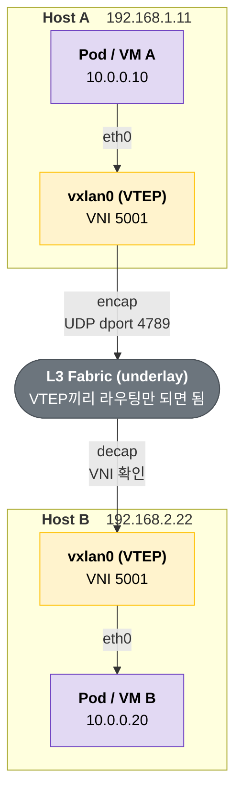
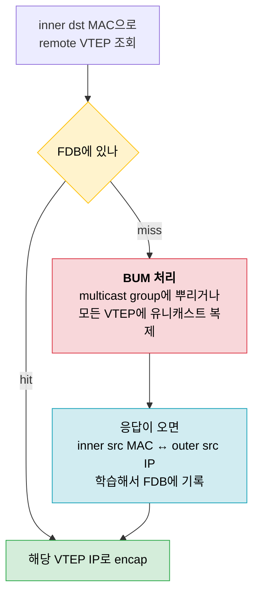
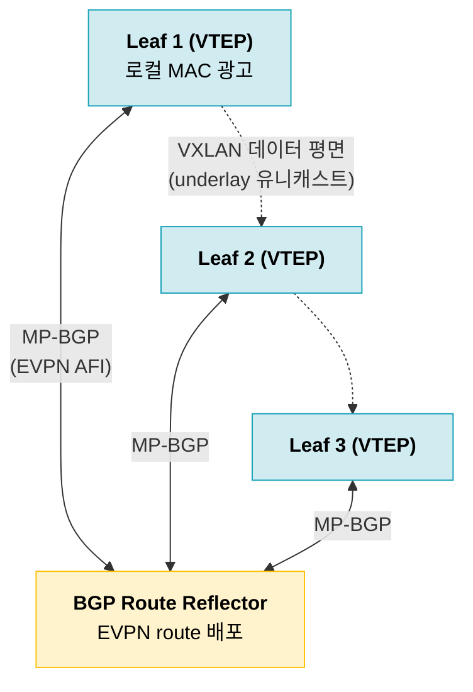
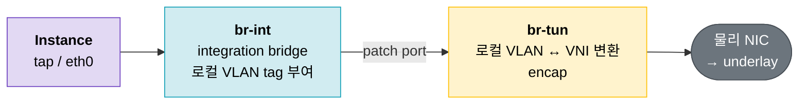
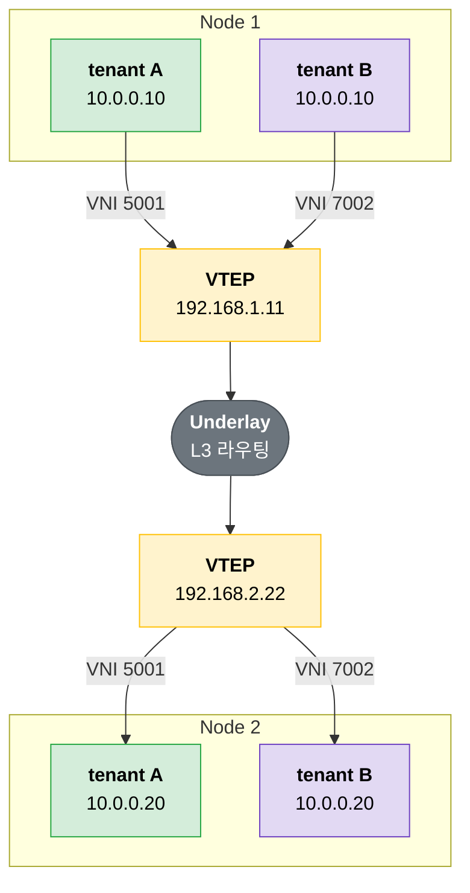

cilium이나 openstack neutron 문서를 보다보면 pod to pod 통신, VM 가상화 네트워크를 vxlan으로 구성한다는 설정들을 볼 수 있다. vxlan이 뭐고, 왜 둘 다 비슷한 구조를 쓰는지 확인해보자

![[Pasted image 20260912213947.png]]

![[Pasted image 20260912214111.png]]

---

## 배경

전통적으로 하나의 서버에서 여러 서비스(vm or baremetal server)를 제공하려면 두가지 방식이 있다.

1. IP 대역을 분리해서 방화벽으로 제어 (l3)
2. vlan을 나눠 broadcast 도메인 분리 (l2)

| 방식                | 격리 단위          | 걸리는 부분                    |
| ----------------- | -------------- | ------------------------- |
| IP 대역 분리 + 방화벽 (L3) | subnet         | 워크로드가 옮겨가면 IP가 바뀐다        |
| VLAN (L2)         | broadcast 도메인  | 4094개가 상한, 같은 스위치 아래에서만 통한다 |

하지만 이 방식은 확장에서나, 현대 서비스엔 적합하지 않다.

container 기반 서비스는 container가 다른 서버로 옮겨다니고, 증설을 하려면 새 서버가 물리적으로 같은 스위치 아래 같은 네트워크에 물려 있어야 한다.

때문에 이를 해결하기 위해 나온 네트워크 가상화를 위한 프로토콜이 vxlan이다.

> Data centers are often required to host multiple tenants, each with
> their own isolated network domain.  Since it is not economical to
> realize this with dedicated infrastructure, network administrators
> opt to implement isolation over a shared network.  In such scenarios,
> a common problem is that each tenant may independently assign MAC
> addresses and VLAN IDs leading to potential duplication of these on
> the physical network.
>
> An important requirement for virtualized environments using a Layer 2
> physical infrastructure is having the Layer 2 network scale across
> the entire data center or even between data centers for efficient
> allocation of compute, network, and storage resources.  In such
> networks, using traditional approaches like the Spanning Tree
> Protocol (STP) for a loop-free topology can result in a large number
> of disabled links. (RFC 7348)

추가적인 궁금증

> 테넌트마다 VLAN 하나씩 주면 되는 거 아닌가?

물론 그것도 가능하다.

다만 VLAN ID는 12 bit라 4094개가 상한이다. 그리고 VLAN은 결국 같은 L2 도메인 안에서만 통한다. rack이 다르고 L3로 라우팅되는 별도 대역에 있는 서버끼리는 VLAN으로 묶을 방법이 없다.

---

## vxlan

VXLAN (Virtual eXtensible Local Area Network). 큰 개념은 다음과 같다. **L3 통신을 underlay로 깔고 그 위로 L2 통신을 터널화한다.**

기본적인 컨셉은 ipsec 터널과 비슷하다.

![[Pasted image 20260912214316.png]]

어떻게 보면 VLAN처럼 L2 통신의 격리로 보이는데, VLAN과 다른 점은 물리적으로 분리되어 있는 별도 IP 대역에 존재하는(underlay) 노드끼리 같은 L2 통신이 가능하다는 점이다.

encap/decap을 하는 지점을 **VTEP** (VXLAN Tunnel End Point)이라고 부른다. 하이퍼바이저 안이든, 물리 스위치든, 커널 인터페이스든 상관없다.



Pod A와 Pod B는 `10.0.0.0/24` 하나에 같이 붙어있다고 생각하고 ARP를 쏜다. 실제로는 서로 다른 IP 대역의 물리 서버에 올라가 있다.

> VNI랑 outer header는 VTEP만 안다. Pod는 자기가 터널을 타는 줄 모른다.

---

## 패킷 encap

VTEP은 원본 Ethernet frame을 통째로 UDP payload에 집어넣고, 그 앞에 outer header를 덧씌운다.

![[vxlan-frame-format.svg]]

맨 앞 Outer Ethernet/IP/UDP가 underlay를 타기 위한 껍데기고, 그 안에 VXLAN header와 원본 frame이 통째로 들어간다. 붙는 양은 14 + 20 + 8 + 8, 합쳐서 **50 byte**다. 뒤에 나올 MTU 문제가 여기서 나온다.

그 중 VXLAN header 8 byte는 이렇게 생겼다.

![[vxlan-header-fields.svg]]

Flags 8 bit 중 I bit만 1로 세우고(VNI가 유효하다는 표시), 나머지 R bit와 Reserved 필드는 전부 0으로 보내고 받는 쪽은 무시한다.

> 8 byte 중에 실제로 쓰는 건 I bit 1개랑 VNI 24 bit가 전부다. 나머지 39 bit는 다 reserved다.

VNI가 24 bit니까 약 1600만개(16M) segment를 같은 관리 도메인 안에 둘 수 있다.

| 항목     | VLAN                      | VXLAN                      |
| ------ | ------------------------- | -------------------------- |
| 태그 위치  | Ethernet frame 안 (802.1Q) | UDP payload 앞 (outer L3 위) |
| ID 크기  | 12 bit → 4094개            | 24 bit → 약 16M개            |
| 전달 범위  | 같은 L2 도메인 안               | L3로 라우팅되는 곳 어디든            |
| 경로 이중화 | STP가 여분 링크를 죽임            | ECMP로 전부 사용                |
| 요구사항   | trunk 구성된 스위치             | VTEP끼리 IP 도달만 되면 끝         |

> VLAN은 L2 안에서 나누고, VXLAN은 L3 위에 L2를 새로 만든다.

### outer source port

dst port는 4789로 고정인데, src port는 inner packet을 해시해서 dynamic range(49152-65535)에서 뽑아 넣는다. underlay 라우터는 outer 5-tuple만 보고 ECMP 해싱을 하기 때문이다.

```text
flow A (inner 5-tuple X) → sport 51234 ─┐
flow B (inner 5-tuple Y) → sport 60021 ─┼→ underlay ECMP가 서로 다른 링크로 분산
flow C (inner 5-tuple Z) → sport 49800 ─┘
```

> src port를 고정해버리면 VTEP 한 쌍 사이 트래픽이 링크 하나에 전부 몰린다.

---

## Control plane

encap을 하려면 `inner dst MAC` → `remote VTEP IP` 매핑을 알아야 한다. 이 FDB를 누가 채우느냐가 control plane 얘기다.

RFC 7348이 기본으로 설명하는 건 **data plane learning**이다. 모르면 일단 뿌리고, 답이 오면 외운다.



리눅스에서 직접 만들어보면 이렇다.

```bash
# multicast 방식
ip link add vxlan0 type vxlan id 42 group 239.1.1.1 dev eth1 dstport 4789

# MAC → remote VTEP 직접 등록
bridge fdb add to 00:17:42:8a:b4:05 dst 192.19.0.2 dev vxlan0
bridge fdb show dev vxlan0
```

문제는 이 방식이 규모를 못 버틴다는 거다. unknown unicast랑 ARP가 나올 때마다 flooding이 돌고, multicast를 쓰려면 underlay에 멀티캐스트 라우팅을 깔아야 한다. 그래서 실제 운영에서 flood-and-learn을 그대로 쓰는 곳은 드물다.

### BGP EVPN

네트워크 장비 환경에서는 **EVPN**을 올리고 BGP로 MAC/IP 정보를 교환한다. 학습을 데이터 플레인이 아니라 control plane에서 해버린다.

> Control-plane learning is used for MAC (and IP) addresses instead of
> data-plane learning.  The latter requires the flooding of unknown
> unicast and Address Resolution Protocol (ARP) frames; whereas, the
> former does not require any flooding. (RFC 8365)



쓰는 route type은 크게 둘이다.

| Route type                                | 뭘 나르나                       | 효과                        |
| ----------------------------------------- | --------------------------- | ------------------------- |
| Type 2 (MAC/IP Advertisement)             | MAC ↔ IP ↔ 그게 붙어있는 VTEP     | FDB를 미리 채움, ARP 응답을 로컬 처리 |
| Type 3 (Inclusive Multicast Ethernet Tag) | 이 VNI에 참여 중인 VTEP 목록과 터널 타입 | BUM 복제 대상을 자동 발견          |

VNI는 EVPN instance(EVI)에 매핑되고, route target을 VNI에서 auto-derive 하게 만들 수 있다. 네트워크를 하나 더 만들 때 수동으로 붙일 설정이 줄어든다.

| 방식              | MAC 학습         | BUM 처리                                | underlay 요구사항 |
| --------------- | -------------- | ------------------------------------- | ------------- |
| flood and learn | 데이터 플레인        | multicast group                       | 멀티캐스트 라우팅 필요  |
| BGP EVPN        | BGP Type 2     | ingress replication (Type 3로 목록 확보)   | 유니캐스트 라우팅만    |
| 소프트웨어 agent     | agent가 FDB에 주입 | 거의 안 씀 (ARP를 프록시로 끊음)                 | 유니캐스트 라우팅만    |

> 셋 다 하는 일은 같다. FDB를 미리 채워서 flooding을 없앤다. 장비 쪽은 BGP로, k8s나 openstack은 각자 agent로 한다.

---

## cilium과 openstack에서 활용

### cilium

cilium을 tunnel mode(`routing-mode: tunnel`)로 깔면 모든 노드가 서로 터널 mesh를 이룬다. 노드마다 `cilium_vxlan` 인터페이스가 하나 뜨고, 그게 그 노드의 VTEP이다.

![[Pasted image 20260912213947.png]]

- default protocol은 vxlan, default port는 **8472** (geneve로 바꾸면 6081)
- FDB를 flood-and-learn으로 안 채운다. cilium agent가 노드 정보를 알고 eBPF map에 직접 넣는다
- VXLAN header에 **source security identity**를 같이 실어 보낸다. 받는 노드가 identity를 다시 찾지 않고 policy 판정을 바로 한다

| 항목          | Encapsulation (vxlan) | Native routing      |
| ----------- | --------------------- | ------------------- |
| underlay 요구 | 노드끼리 IP 도달만 되면 끝      | PodCIDR 라우팅이 깔려 있어야 |
| 노드 추가       | 자동으로 mesh에 편입         | 라우팅을 따로 배포 (BGP 등)  |
| MTU         | 패킷당 50 byte 손해        | 손해 없음               |
| 주소 공간       | underlay와 독립적으로 할당    | underlay 제약을 받음     |

> underlay를 안 건드리고 pod 네트워크를 얹을 수 있다는 게 tunnel mode를 고르는 이유다.

### openstack neutron

neutron은 ML2 type driver로 vxlan을 쓴다. 테넌트가 네트워크를 하나 만들 때마다 `segmentation_id`(= VNI)가 하나씩 할당된다.

![[Pasted image 20260912214111.png]]

OVS agent 기준으로 브릿지가 두 개 있다.



- **br-int**: instance의 VIF가 전부 여기 꽂힌다. 같은 가상 네트워크에 속한 VIF끼리 **로컬 VLAN tag**를 공유한다. 이 tag는 노드 밖으로 안 나간다
- **br-tun**: 다른 하이퍼바이저로 가는 터널이 여기서 시작하고 끝난다. 로컬 VLAN tag를 VNI로 번역해서 encap한다

![[openstack-ovs-selfservice-vxlan.png]]

> br-int의 VLAN tag는 노드 안에서만 의미 있는 번호다. 노드를 넘는 순간 VNI로 바뀐다.

이래서 VLAN 4094 제약을 피해간다. 노드 안에서는 VLAN 번호를 노드마다 재사용하고, 노드 밖으로 나갈 때만 전역으로 유일한 VNI를 쓴다.

BUM 복제는 **l2population** mechanism driver가 줄여준다. remote MAC/IP를 미리 학습해서 터널 FDB를 채워두고, `arp_responder`를 켜면 ARP 요청을 오버레이로 뿌리지 않고 로컬 스위치가 바로 응답해버린다. EVPN이 하는 일을 neutron은 agent로 한다.

---

## Cloud Service 제공

테넌트마다 VNI만 다르게 주면 IP 대역이 겹쳐도 상관없다.

```text
tenant A:  10.0.0.10 → 10.0.0.20     VNI 5001
tenant B:  10.0.0.10 → 10.0.0.20     VNI 7002
           ^^^^^^^^^   ^^^^^^^^^
           완전히 똑같은 주소인데 섞이지 않는다

underlay에서 실제로 흐르는 건:
  A: [192.168.1.11 → 192.168.2.22][VNI 5001][10.0.0.10 → 10.0.0.20]
  B: [192.168.1.11 → 192.168.2.22][VNI 7002][10.0.0.10 → 10.0.0.20]
                                   ^^^^^^^^ 여기서만 갈린다
```



| 클라우드에서 보이는 것    | vxlan에서 실제로 일어나는 것         |
| --------------- | -------------------------- |
| 테넌트마다 독립된 VPC   | VNI로 분리된 L2 segment        |
| IP 대역을 겹쳐 써도 됨  | inner header가 VTEP 밖으로 안 나간다 |
| VM/pod을 아무 노드에나 | underlay가 L3라 rack 경계를 안 탄다 |
| 마이그레이션해도 IP 유지  | L2가 DC 전역으로 늘어나 있다         |
| 노드 추가 = 용량 추가   | VTEP끼리 IP만 닿으면 mesh에 편입    |

> 테넌트가 보는 토폴로지랑 실제 물리 배치가 따로 논다.

하이퍼스케일러는 각자 만든 encap 포맷과 control plane을 쓴다. 세부 구현은 대부분 공개돼 있지 않지만, L3 underlay 위에 테넌트 ID를 박은 터널을 얹는다는 구조는 같다.

---

## side effect

| side effect | 증상                      | 대응                             |
| ----------- | ----------------------- | ------------------------------ |
| MTU 50 byte | handshake는 되는데 큰 전송이 멈춤 | overlay 1450 또는 underlay jumbo |
| BUM 복제      | 노드 수에 비례해서 flooding     | ARP 프록시, control plane으로 사전 배포 |
| 가시성         | 덤프에 outer header만 보임    | `-T vxlan`, tunnel offload 확인  |
| 암호화 없음      | underlay 접근 = segment 침투 | IPsec / WireGuard 병행           |

### MTU

```text
underlay MTU 1500
  - Outer Eth   14
  - Outer IP    20
  - UDP          8
  - VXLAN        8
  ──────────────────
  overlay MTU 1450
```

VTEP은 VXLAN 패킷을 fragment하면 안 된다(RFC상 MUST NOT). 중간 라우터가 쪼갠 조각은 받는 VTEP이 조용히 버려도 된다.

그래서 증상이 고약하게 나온다. TCP handshake는 멀쩡히 되는데 큰 전송만 멈춘다. PMTUD가 ICMP 차단에 막히면 딱 이런 식이다.

> overlay MTU를 1450으로 낮추거나, underlay에 jumbo frame(9000)을 깔고 1500을 그대로 쓰거나 둘 중 하나다.

### BUM 복제

ARP 한 번이 전체 VTEP으로 복제된다. multicast를 안 쓰면 head-end replication, 즉 VTEP 수만큼 유니캐스트로 똑같은 패킷을 쏜다.

```text
노드 10대 클러스터에서 ARP 1개
  multicast 사용   → 패킷 1개 (대신 underlay에 멀티캐스트 라우팅 필요)
  head-end 복제    → 패킷 9개
```

> 그래서 실제 구현들은 ARP를 오버레이로 안 내보낸다. cilium은 eBPF로, neutron은 `arp_responder`로, 장비는 EVPN Type 2로 로컬에서 끊어버린다.

### 가시성과 offload

tcpdump로 까면 outer header만 보인다. inner를 보려면 풀어야 한다.

```bash
# 4789는 tcpdump가 알아서 vxlan으로 해석한다
tcpdump -i eth0 -nn 'udp port 4789'

# 8472(리눅스 기본)는 직접 지정해줘야 inner까지 보인다
tcpdump -i eth0 -nn -T vxlan 'udp port 8472'
```

`ip link add ... type vxlan`에서 `dstport`를 생략하면 리눅스는 8472를 쓴다. VXLAN 커널 구현이 IANA가 4789를 배정하기 전에 들어갔고, 기존 배포를 안 깨려고 그 값을 그대로 두고 있다. 덤프 뜰 때 포트 두 개를 다 봐야 하는 이유다.

NIC offload도 확인해야 한다. 터널을 인식하는 offload가 꺼져 있으면 encap/decap이랑 세그멘테이션을 전부 CPU가 떠안는다.

```bash
ethtool -k eth0 | grep tnl
# tx-udp_tnl-segmentation: on
# tx-udp_tnl-csum-segmentation: on
```

### 암호화가 없다

VXLAN 자체에는 인증도 암호화도 없다. VNI는 그냥 24 bit 숫자라서, underlay에 패킷을 쏠 수 있는 누군가가 VNI를 맞춰서 보내면 그 segment 안으로 프레임이 들어간다. RFC도 대책을 명시하지 않고 IPsec 같은 걸 위에 얹으라고만 한다.

> A MAC-over-IP mechanism for delivering Layer 2 traffic significantly
> extends this attack surface. (RFC 7348, Security Considerations)

underlay를 신뢰 경계로 잡고, 부족하면 IPsec이나 WireGuard를 겹쳐 쓴다. cilium은 transparent encryption으로 이걸 제공한다.

---

## 참고

- [RFC 7348 - Virtual eXtensible Local Area Network (VXLAN)](https://www.rfc-editor.org/rfc/rfc7348.html)
- [RFC 8365 - A Network Virtualization Overlay Solution Using EVPN](https://www.rfc-editor.org/rfc/rfc8365.html)
- [Virtual eXtensible Local Area Networking documentation - The Linux Kernel](https://docs.kernel.org/networking/vxlan.html)
- [Cilium - Routing (Encapsulation / Native-Routing)](https://docs.cilium.io/en/stable/network/concepts/routing/)
- [OpenStack Neutron - Open vSwitch: Self-service networks](https://docs.openstack.org/neutron/latest/admin/deploy-ovs-selfservice.html)
- [OpenStack Neutron - Open vSwitch L2 Agent (br-int / br-tun)](https://docs.openstack.org/neutron/latest/contributor/internals/openvswitch_agent.html)
- [VXLAN & Linux - Vincent Bernat](https://vincent.bernat.ch/en/blog/2017-vxlan-linux)
